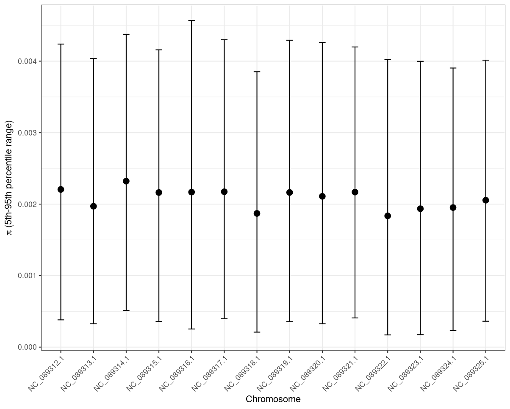
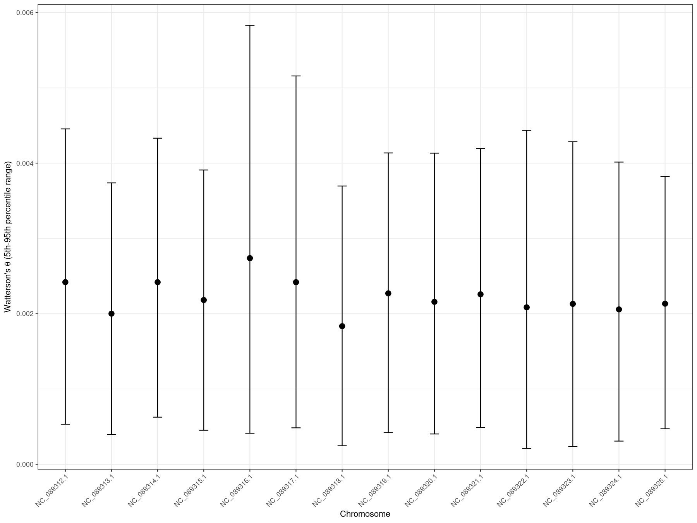

Calculation of standard population genetics metrics using pixy
================
**AUTHOR:** Jason A. Toy  
**DATE:** 2026-03-23 <br><br>


## Prepare dataset

<br>

`pixy` requires a VCF that includes invariant sites in addition to variant sites (this is how it accounts for missing data), so unfortunatly, we have to go back and recall genotypes from gVCFs in `GATK` using `GenotypeGVCFs` and the `--include-non-variant-sites` or `-all-sites` flag.

<br>

### Create sample/population files
Start by creating a few sample/population files we'll need. First up, create a single-column sample list of clone-pruned P. acuta samples from the existing keep file. Also remove any "Extra" samples. This file is for filtering with vcftools/bcftools and will be called 'keep_samples_Pacutaonly_noExtras.samples':
```bash
cd /archive/barshis/barshislab/jtoy/pver_gwas/hologenome_mapped_all/vcf

cut -f2 keep_samples_Pacuta_only.txt > keep_samples_Pacuta_only.samples

grep -v 'X' keep_samples_Pacuta_only.samples > keep_samples_Pacutaonly_noExtras.samples
```
This leaves 135 samples.

<br>

Next, we'll create a few files to use with pixy:
`pixy_all.pop.tsv` for whole-dataset π
`pixy_location.pop.tsv` for per-location π and all pairwise location FST/dxy
`pixy_island.pop.tsv` for Ofu vs. Tutuila π/FST/dxy
```bash
# whole dataset = one population called ALL
awk 'BEGIN{OFS="\t"} {print $2, "ALL"}' keep_samples_Pacuta_only.txt | grep -v 'X' > pixy_all.pop.tsv

# per-location populations
awk 'BEGIN{OFS="\t"} {split($2,a,"_"); print $2, a[2]}' keep_samples_Pacuta_only.txt | grep -v 'X' > pixy_location.pop.tsv

# island populations
awk 'BEGIN{OFS="\t"} {
  split($2,a,"_");
  island = (a[2]=="OFU3" || a[2]=="OFU6") ? "Ofu" : "Tutuila";
  print $2, island
}' keep_samples_Pacuta_only.txt | grep -v 'X' > pixy_island.pop.tsv

# ternary operator is essentially a compact if/else statement: "condition ? value_if_true : value_if_false"
# so if Location is OFU3 or OFU6 assign "Ofu", otherwise assign "Tutuila"
```

### Regenerate all-sites VCFs from existing GenomicsDBs and gVCFs
Create and run a modified `GenotypeGVCFs_array.slurm` script using the `--include-non-variant-sites` or `-all-sites` flag and the `-L` region flag (apparently necessary to prevent issues when calling all sites).
```bash
#!/bin/bash

#SBATCH --job-name=GenotypeGVCFs_pver_allsites_2026-03-23
#SBATCH --output=%A_%a_%x.out
#SBATCH --error=%A_%a_%x.err
#SBATCH --mail-type=ALL
#SBATCH --mail-user=jtoy@odu.edu
#SBATCH --partition=main
#SBATCH --array=1-52%51
#SBATCH --ntasks=1
#SBATCH --mem=100G
#SBATCH --time=5-00:00:00
#SBATCH --cpus-per-task=10

# Load GATK module
module load container_env gatk

# Define paths
BASEDIR=/archive/barshis/barshislab/jtoy
REFERENCE=/cm/shared/courses/dbarshis/barshislab/jtoy/references/genomes/pocillopora_verrucosa/ncbi_dataset/data/GCF_036669915.1/GCF_036669915.1_ASM3666991v2_genom_suffixed.fasta
OUTDIR=$BASEDIR/pver_gwas/hologenome_mapped_all/vcf/allsites_vcf
GENDBBASE=$BASEDIR/pver_gwas/hologenome_mapped_all/genomicsdb
SCAFLIST=/cm/shared/courses/dbarshis/barshislab/jtoy/references/genomes/pocillopora_verrucosa/ncbi_dataset/data/GCF_036669915.1/genome_regions.list
GATK='crun.gatk gatk'

# Create output directory if it doesn't exist
mkdir -p $OUTDIR

# Get the current region and scaffold
REGION_ID=${SLURM_ARRAY_TASK_ID}
GENDB=${GENDBBASE}/region_${REGION_ID}
SCAF=$(sed -n "${REGION_ID}p" $SCAFLIST)

echo "Processing region: region_${REGION_ID}, corresponding to scaffold: $SCAF"
echo "Using GenomicsDB workspace: $GENDB"

# Run GenotypeGVCFs
$GATK --java-options "-Xmx95g" GenotypeGVCFs \
  -R $REFERENCE \
  -V gendb://$GENDB \
  --include-non-variant-sites \
  -L ${SCAF}
  -O $OUTDIR/${SCAF}_genotypes.vcf.gz
```
The longest scaffold took 40.5 hrs to complete.

<br>

Check output to make sure invariant sites are included:
```bash
module load bcftools

crun.bcftools bcftools view -H /archive/barshis/barshislab/jtoy/pver_gwas/hologenome_mapped_all/vcf_allsites/NW_027078162.1_Pverrucosa_allsites_genotypes.vcf.gz | head | less -S
```
```
NW_027078162.1_Pverrucosa       1       .       G       .       .       .       .       GT      ./.     ./.     ./.     ./.     ./. >
NW_027078162.1_Pverrucosa       2       .       G       .       .       .       .       GT      ./.     ./.     ./.     ./.     ./. >
NW_027078162.1_Pverrucosa       3       .       G       .       .       .       .       GT      ./.     ./.     ./.     ./.     ./. >
NW_027078162.1_Pverrucosa       4       .       C       .       .       .       .       GT      ./.     ./.     ./.     ./.     ./. >
NW_027078162.1_Pverrucosa       5       .       G       .       .       .       .       GT      ./.     ./.     ./.     ./.     ./. >
```
Shows that non-variant positions were emitted.

<br>

```bash
crun.bcftools bcftools view -H /archive/barshis/barshislab/jtoy/pver_gwas/hologenome_mapped_all/vcf_allsites/NW_027078162.1_Pverrucosa_allsites_genotypes.vcf.gz | grep '0/0' | head | less -S
```
```
.:. ./.:.:. ./.:.:. ./.:.:. ./.:.:. ./.:.:. ./.:.:. ./.:.:. ./.:.:. ./.:.:. ./.:.:. ./.:.:. ./.:.:. ./.:.:. 0/0:2:6 ./.:.:. ./.:.:. >
.:. ./.:.:. ./.:.:. ./.:.:. ./.:.:. ./.:.:. ./.:.:. ./.:.:. ./.:.:. ./.:.:. ./.:.:. ./.:.:. ./.:.:. ./.:.:. 0/0:2:6 ./.:.:. ./.:.:. >
.:. ./.:.:. ./.:.:. ./.:.:. ./.:.:. ./.:.:. ./.:.:. ./.:.:. ./.:.:. ./.:.:. ./.:.:. ./.:.:. ./.:.:. ./.:.:. 0/0:2:6 ./.:.:. ./.:.:. >
.:. ./.:.:. ./.:.:. ./.:.:. ./.:.:. ./.:.:. ./.:.:. ./.:.:. ./.:.:. ./.:.:. ./.:.:. ./.:.:. ./.:.:. ./.:.:. 0/0:2:6 ./.:.:. ./.:.:. >
.:. ./.:.:. ./.:.:. ./.:.:. ./.:.:. ./.:.:. ./.:.:. ./.:.:. ./.:.:. ./.:.:. ./.:.:. ./.:.:. ./.:.:. ./.:.:. 0/0:2:6 ./.:.:. ./.:.:. >
```
Shows that non-variant positions were actually called.

<br>

### Filter the all-sites VCF for each scaffold

Variant and non-variant sites will need to be filtered separately and then recombined.

- Start with hard filters for quality, depth, and strand bias.
- Then subset to the clone-pruned, P. acuta-only sample set
- Then apply missingness filter (max missingness per site = 20%)

Run this as an array job applying filters to each scaffold separately. Note that VCFtools is installed in a module called `dosage_convertor`.
<br>

`filter_allsites_vcf_for_pixy_array.slurm`:
```bash
#!/bin/bash

#SBATCH --job-name=filter_allsites_vcf_for_pixy_array_2026-03-25
#SBATCH --output=%A_%a_%x.out
#SBATCH --error=%A_%a_%x.err
#SBATCH --mail-type=ALL
#SBATCH --mail-user=jtoy@odu.edu
#SBATCH --partition=main
#SBATCH --array=1-52%30
#SBATCH --ntasks=1
#SBATCH --mem=30G
#SBATCH --time=2-00:00:00
#SBATCH --cpus-per-task=10

set -euo pipefail

module load bcftools

BASEDIR=/archive/barshis/barshislab/jtoy/pver_gwas/hologenome_mapped_all
INDIR=$BASEDIR/vcf_allsites
OUTDIR=$BASEDIR/vcf_allsites/filtered
SAMPLES=$BASEDIR/vcf/keep_samples_Pacutaonly_noExtras.samples
SCAFLIST=/cm/shared/courses/dbarshis/barshislab/jtoy/references/genomes/pocillopora_verrucosa/ncbi_dataset/data/GCF_036669915.1/genome_regions.list

mkdir -p "$OUTDIR"

TASK_ID=${SLURM_ARRAY_TASK_ID}
SCAF=$(sed -n "${TASK_ID}p" "$SCAFLIST")
INVCF="${INDIR}/${SCAF}_allsites_genotypes.vcf.gz"

echo "Processing scaffold: $SCAF"
echo "Input VCF: $INVCF"
echo "Sample list: $SAMPLES"

if [[ ! -f "$INVCF" ]]; then
  echo "ERROR: Input VCF not found: $INVCF" >&2
  exit 1
fi

# 1) Filter for variant SNPs using the same hard filters from variant-only workflow,
#    then subset to clone-pruned, Pacuta-only samples.
crun.bcftools bcftools view \
  -v snps -m2 -M2 \
  "$INVCF" -Ou | \
crun.bcftools bcftools filter \
  -e 'QUAL < 30 || INFO/MQ < 40 || INFO/DP < 792 || INFO/DP > 25286 || INFO/QD < 2.0 || INFO/FS > 60.0 || INFO/SOR > 3.0' \
  -Ou | \
crun.bcftools bcftools view --threads 10 \
  -S "$SAMPLES" -a \
  -Oz -o "${OUTDIR}/${SCAF}.variant.subset.vcf.gz"

crun.bcftools bcftools index "${OUTDIR}/${SCAF}.variant.subset.vcf.gz"

# 2) Pull invariant sites, then subset to clone-pruned Pacuta-only samples.
#    No QUAL/QD/FS/SOR filtering here; just DP filtering.
crun.bcftools bcftools view \
  -i 'ALT="."' \
  "$INVCF" -Ou | \
crun.bcftools bcftools filter \
  -e 'INFO/DP < 792 || INFO/DP > 25286' \
  -Ou | \
crun.bcftools bcftools view --threads 10 \
  -S "$SAMPLES" \
  -Oz -o "${OUTDIR}/${SCAF}.invariant.subset.vcf.gz"

crun.bcftools bcftools index "${OUTDIR}/${SCAF}.invariant.subset.vcf.gz"

# 3) Apply the same missingness filter to each subset separately.
crun.bcftools bcftools view --threads 10 \
  -i 'F_MISSING<=0.2' \
  "${OUTDIR}/${SCAF}.variant.subset.vcf.gz" \
  -Oz -o "${OUTDIR}/${SCAF}.variant.subset.miss80.vcf.gz"

crun.bcftools bcftools view --threads 10 \
  -i 'F_MISSING<=0.2' \
  "${OUTDIR}/${SCAF}.invariant.subset.vcf.gz" \
  -Oz -o "${OUTDIR}/${SCAF}.invariant.subset.miss80.vcf.gz"

crun.bcftools bcftools index "${OUTDIR}/${SCAF}.variant.subset.miss80.vcf.gz"
crun.bcftools bcftools index "${OUTDIR}/${SCAF}.invariant.subset.miss80.vcf.gz"

# 4) Recombine the filtered variant and invariant records into a final pixy-ready all-sites VCF.
crun.bcftools bcftools concat --threads 10 \
  --allow-overlaps \
  "${OUTDIR}/${SCAF}.variant.subset.miss80.vcf.gz" \
  "${OUTDIR}/${SCAF}.invariant.subset.miss80.vcf.gz" \
  -Ou | \
crun.bcftools bcftools sort \
  -Oz -o "${OUTDIR}/${SCAF}.pixy_ready.vcf.gz"

crun.bcftools bcftools index "${OUTDIR}/${SCAF}.pixy_ready.vcf.gz"

echo "Finished scaffold: $SCAF"

```
Runtime: 1 hr 39 min

Notes:
<br>
- `bcftools view -v snps -m2 -M2` limits variants to biallelic SNPs.
- `bcftools view -i 'ALT="."'` identifies and keeps invariants by selecting sites where the ALT field is ".".
- After sample subsetting, some formerly variant sites may lose all observed ALT alleles in the retained samples, making them invariant in the final dataset. However, these sites will still retain the ALT record from the original sample set and therefore be classified by pixy as variants. The `-a` option in `bcftools view` removes ALT alleles not seen in the retained genotypes. The record is kept but ALT is set to ".", properly reclassifying the as invariant.
- Also, the `bcftools view` command is the exception within the bcftools suite that **does** update INFO/AC and INFO/AN after subsetting with -S (unless you explicitly use the `-I/--no-update` flag), so the AC and AN info fields are updated as well in the final sample set.
- The `--recode-INFO-all` flag in the `vcftools` commands ensures that INFO fields are kept in the output vcf (these are otherwise removed by `--recode` by default).

<br>

Run some QC checks on one chromosome:
```bash
SCAF=NC_089320.1_Pverrucosa
OUTDIR=/archive/barshis/barshislab/jtoy/pver_gwas/hologenome_mapped_all/vcf_allsites/filtered

# number of records in final VCF
crun.bcftools bcftools index -n "${OUTDIR}/${SCAF}.pixy_ready.vcf.gz"

# confirm mix of invariant and variant sites
crun.bcftools bcftools query -f '%ALT\n' "${OUTDIR}/${SCAF}.pixy_ready.vcf.gz" | \
sort | uniq -c | head

# check for duplicate positions
crun.bcftools bcftools query -f '%CHROM\t%POS\n' "${OUTDIR}/${SCAF}.pixy_ready.vcf.gz" | \
sort | uniq -d | head

# count FILTER states in final file
crun.bcftools bcftools query -f '%FILTER\n' "${OUTDIR}/${SCAF}.pixy_ready.vcf.gz" | \
sort | uniq -c | sort -nr
```
```
# number of records
14488018

# breakdown of sites by variant type
14315858 .
  49683 A
  36316 C
  36331 G
  49830 T

# no duplicate positions

# breakdown of sites by FILTER state
14335363 PASS
  152655 LowQual
```
<br>

Check how many nonvariant sites were removed by depth filters:
```bash
PREDIR=/archive/barshis/barshislab/jtoy/pver_gwas/hologenome_mapped_all/vcf_allsites/

# variant sites
crun.bcftools bcftools view -H -v snps -m2 -M2 "${PREDIR}/${SCAF}_allsites_genotypes.vcf.gz" | wc -l; \
crun.bcftools bcftools view -v snps -m2 -M2 "${PREDIR}/${SCAF}_allsites_genotypes.vcf.gz" -Ou | crun.bcftools bcftools filter -e 'INFO/DP < 792 || INFO/DP > 25286' -Ou | crun.bcftools bcftools view -H | wc -l

# invariant sites
crun.bcftools bcftools view -H -i 'ALT="."' "${PREDIR}/${SCAF}_allsites_genotypes.vcf.gz" | wc -l; \
crun.bcftools bcftools view -i 'ALT="."' "${PREDIR}/${SCAF}_allsites_genotypes.vcf.gz" -Ou | crun.bcftools bcftools filter -e 'INFO/DP < 792 || INFO/DP > 25286' -Ou | crun.bcftools bcftools view -H | wc -l
```
```
1700484 # variant sites pre-depth-filtering
1560077 # variant sites post-depth-filtering

20267886 # invariant sites pre-depth-filtering
16842347 # invariant sites post-depth-filtering
```
Summary:
- Variant SNPs: 8.3% removed by DP filtering
- Invariant sites: 16.9% removed by DP filtering

So depth filtering removed more invariant sites on this chromosome than variant sites, but not drastically so. Still lots of invariant sites remaining.

<br>
<br>

## Run pixy

We'll run three separate pixy commands that address three different groups of biological questions:
- Whole dataset within-population only (summary of diversity in the species at the region scale)
- Per-location within-location summary + pairwise-between-location comparisons
- Per-island within-island summary + pairwise-between-island comparison

<br>

`pixy_10kb_array.slurm`:
```bash
#!/bin/bash
#SBATCH --job-name=pixy_10kb_array_2026-03-26
#SBATCH --output=%A_%a_%x.out
#SBATCH --error=%A_%a_%x.err
#SBATCH --mail-type=ALL
#SBATCH --mail-user=jtoy@odu.edu
#SBATCH --partition=main
#SBATCH --array=1-52%24
#SBATCH --ntasks=1
#SBATCH --cpus-per-task=10
#SBATCH --mem=40G
#SBATCH --time=5-00:00:00

set -euo pipefail

module load pixy/2.0.0.beta14

BASEDIR=/archive/barshis/barshislab/jtoy/pver_gwas/hologenome_mapped_all
VCFDIR=$BASEDIR/vcf_allsites/filtered
POPDIR=$BASEDIR/vcf
OUTBASE=$BASEDIR/pixy
SCAFLIST=/cm/shared/courses/dbarshis/barshislab/jtoy/references/genomes/pocillopora_verrucosa/ncbi_dataset/data/GCF_036669915.1/genome_regions.list
WINDOW=10000
NCORES=${SLURM_CPUS_PER_TASK}

mkdir -p $OUTBASE/{all,location,island}

SCAF=$(sed -n "${SLURM_ARRAY_TASK_ID}p" "$SCAFLIST")
VCF=${VCFDIR}/${SCAF}.pixy_ready.vcf.gz

echo "Scaffold: $SCAF"
echo "VCF: $VCF"

# 1) whole dataset within-pop stats
crun.pixy pixy \
  --stats pi watterson_theta tajima_d \
  --vcf "$VCF" \
  --populations ${POPDIR}/pixy_all.pop.tsv \
  --window_size ${WINDOW} \
  --n_cores ${NCORES} \
  --output_folder ${OUTBASE}/all \
  --output_prefix ${SCAF}.all

# 2) location-level within + pairwise between-location stats
crun.pixy pixy \
  --stats pi watterson_theta tajima_d fst dxy \
  --vcf "$VCF" \
  --populations ${POPDIR}/pixy_location.pop.tsv \
  --window_size ${WINDOW} \
  --n_cores ${NCORES} \
  --fst_type hudson \
  --output_folder ${OUTBASE}/location \
  --output_prefix ${SCAF}.location

# 3) island-level within + pairwise between-island stats
crun.pixy pixy \
  --stats pi watterson_theta tajima_d fst dxy \
  --vcf "$VCF" \
  --populations ${POPDIR}/pixy_island.pop.tsv \
  --window_size ${WINDOW} \
  --n_cores ${NCORES} \
  --fst_type hudson \
  --output_folder ${OUTBASE}/island \
  --output_prefix ${SCAF}.island
```
Runtime : 26 minutes

<br>

This job returned a "Failed, Mixed, ExitCode [0-1]" status. Upon inspecting the .err files, this is because some scaffold jobs had "no invariant sites (ALT = ".")". These scaffolds were all non-chromosome scaffolds. All 14 chromosome jobs completed successfully, along with 13 non-chromosome scaffold jobs.

In addition, 9 of the non-chromosome scaffolds that completed successfully did not output a `_fst.txt` file. This is probably because these scaffolds did not have any usable **variant** sites with which Fst is normally calculated. To confirm this, run the following script to count SNPs in each scaffold that does not have a `_fst.txt` file:
```bash
cd /archive/barshis/barshislab/jtoy/pver_gwas/hologenome_mapped_all/pixy/location

echo -e "SCAF\tSNPs"

for f in *_pi.txt; do
    base=${f%_pi.txt}
    
    # skip if fst file exists
    [[ -f "${base}_fst.txt" ]] && continue
    
    scaf=${base%.location}
    VCF=/archive/barshis/barshislab/jtoy/pver_gwas/hologenome_mapped_all/vcf_allsites/filtered/${scaf}.pixy_ready.vcf.gz
    
    nsnps=$(crun.bcftools bcftools view -H -v snps "$VCF" | wc -l)
    
    echo -e "${scaf}\t${nsnps}"
done | column -t
```
```
SCAF    SNPs
NW_027078169.1_Pverrucosa  0
NW_027078170.1_Pverrucosa  0
NW_027078172.1_Pverrucosa  0
NW_027078173.1_Pverrucosa  0
NW_027078175.1_Pverrucosa  0
NW_027078176.1_Pverrucosa  0
NW_027078177.1_Pverrucosa  0
NW_027078184.1_Pverrucosa  0
NW_027078186.1_Pverrucosa  0
```


This script can also be modified to summarize all scaffolds:
```bash
cd /archive/barshis/barshislab/jtoy/pver_gwas/hologenome_mapped_all/pixy/location

echo -e "SCAF\tFST_file\tSNPs\tInvariants"

for f in *_pi.txt; do
    base=${f%_pi.txt}
    scaf=${base%.location}
    
    VCF=/archive/barshis/barshislab/jtoy/pver_gwas/hologenome_mapped_all/vcf_allsites/filtered/${scaf}.pixy_ready.vcf.gz
    
    if [[ -f "${base}_fst.txt" ]]; then
        fst="YES"
    else
        fst="NO"
    fi
    
    nsnps=$(crun.bcftools bcftools view -H -v snps "$VCF" | wc -l)
    ninv=$(crun.bcftools bcftools view -H -i 'ALT="."' "$VCF" | wc -l)
    
    echo -e "${scaf}\t${fst}\t${nsnps}\t${ninv}"
done | column -t
```
```
SCAF    FST_file        SNPs    Invariants
NC_089312.1_Pverrucosa     YES  271452  20172532
NC_089313.1_Pverrucosa     YES  141161  12477459
NC_089314.1_Pverrucosa     YES  241576  18034983
NC_089315.1_Pverrucosa     YES  217468  18140369
NC_089316.1_Pverrucosa     YES  117313  9576545
NC_089317.1_Pverrucosa     YES  138045  10829275
NC_089318.1_Pverrucosa     YES  126604  13058179
NC_089319.1_Pverrucosa     YES  172642  13694399
NC_089320.1_Pverrucosa     YES  172160  14315858
NC_089321.1_Pverrucosa     YES  149826  11991088
NC_089322.1_Pverrucosa     YES  93692   8959628
NC_089323.1_Pverrucosa     YES  111098  10484937
NC_089324.1_Pverrucosa     YES  110014  9872963
NC_089325.1_Pverrucosa     YES  151880  12937449
NW_027078166.1_Pverrucosa  YES  6       4663
NW_027078169.1_Pverrucosa  NO   0       335
NW_027078170.1_Pverrucosa  NO   0       1016
NW_027078171.1_Pverrucosa  YES  3       3009
NW_027078172.1_Pverrucosa  NO   0       416
NW_027078173.1_Pverrucosa  NO   0       546
NW_027078175.1_Pverrucosa  NO   0       1322
NW_027078176.1_Pverrucosa  NO   0       2643
NW_027078177.1_Pverrucosa  NO   0       564
NW_027078184.1_Pverrucosa  NO   0       16
NW_027078186.1_Pverrucosa  NO   0       263
NW_027078193.1_Pverrucosa  YES  7       1270
NW_027078194.1_Pverrucosa  YES  1       3618
```
So yes, the 9 scaffolds without a `_fst.txt` output file all had 0 variant sites.


## Filter, summarize, and plot pixy results

Import pixy output files into R and analyze each pixy run and each stat individually.
`plot_pixy_results.R`
```r
# Filter, summarize, and plot pixy output
# Created: 2026-03-27
# Last updated: 2026-03-27
# Jason A. Toy


rm(list = ls())

setwd("/archive/barshis/barshislab/jtoy/pver_gwas/hologenome_mapped_all/pixy")

library(tidyverse)
library(ggplot2)


### These pixy files were generated from a pixy run on the clone-pruned, P. acuta-only dataset (n=135)
```

### Start with "ALL" pixy run (single meta-population stats)
#### Start with pi files:
```r
# Pi files first

# Load in files
pi_all_files <- list.files(
  "./all/",
  pattern = "_pi.txt$",
  full.names = TRUE
)

# name the vector for use in .id column in next step
names(pi_all_files) <- pi_all_files

# import and combine all pi files while creating new column with file path/name
pi_all_raw <- map_dfr(pi_all_files, read_tsv, .id = "source_file")

# reformatting
pi_all <- pi_all_raw %>% 
  mutate(
    chromosome = str_remove(chromosome, "_Pverrucosa$") %>% as.factor(),
    pop = as.factor(pop)
  )

str(pi_all)
```
```
tibble [35,236 × 10] (S3: tbl_df/tbl/data.frame)
 $ source_file      : chr [1:35236] "./all//NC_089312.1_Pverrucosa.all_pi.txt" "./all//NC_089312.1_Pverrucosa.all_pi.txt" "./all//NC_089312.1_Pverrucosa.all_pi.txt" "./all//NC_089312.1_Pverrucosa.all_pi.txt" ...
 $ pop              : Factor w/ 1 level "ALL": 1 1 1 1 1 1 1 1 1 1 ...
 $ chromosome       : Factor w/ 27 levels "NC_089312.1",..: 1 1 1 1 1 1 1 1 1 1 ...
 $ window_pos_1     : num [1:35236] 1 10001 20001 30001 40001 ...
 $ window_pos_2     : num [1:35236] 1e+04 2e+04 3e+04 4e+04 5e+04 6e+04 7e+04 8e+04 9e+04 1e+05 ...
 $ avg_pi           : num [1:35236] NA 0 0 0.00115 NA ...
 $ no_sites         : num [1:35236] 0 189 864 2425 0 ...
 $ count_diffs      : num [1:35236] NA 0 0 74315 NA ...
 $ count_comparisons: num [1:35236] NA 6000427 26662599 64611456 NA ...
 $ count_missing    : num [1:35236] NA 863108 4713561 23452419 NA ...
```

<br>

```r
# plot distribution of callable sites per 10kb window
ggplot(pi_all, aes(x = no_sites)) +
  geom_histogram(bins = 50) +
  facet_wrap(~ chromosome) +
  labs(
    x = "Number of callable sites per window",
    y = "Number of windows"
  ) +
  scale_x_continuous(breaks = seq(from=0, to = 10000, by = 2000)) +
  theme_bw() +
  theme(axis.text.x = element_text(angle = 45, hjust = 1))


  # For all chromosomes (NCs), the main peak is around 9000 sites, with most of the hump between 8000 and 10,000
  # This indicates good coverage of callable sites and allows us to set a lower end cutoff of 7000 (retaining windows with >= 70% of sites callable)
  # This removes low-information regions while retaining the majority of high-quality genomic windows
```

Distribution of callable sites per 10kb window (uniform y-axis scale):


Same plot but allowing free y-axis:


```r
# filter dataset based on 7000 site cutoff
pi_all_filt <- pi_all %>% 
  filter(no_sites >= 7000)

# summarize remaining windows after filtering
pi_all %>%
  summarise(
    total = n(),
    retained = sum(no_sites >= 7000),
    prop = retained / total
  )
```

```
  total retained  prop
  <int>    <int> <dbl>
  35236    16961 0.481
```
Note that this filtering removes all non-chromosome scaffolds from the dataset.

<br>

```r
# sensitivity check: try other cutoffs to see how it changes number of retained windows
pi_all %>%
  summarise(
    prop_6000 = mean(no_sites >= 6000),
    prop_7000 = mean(no_sites >= 7000),
    prop_8000 = mean(no_sites >= 8000)
  )
```

```
  prop_6000 prop_7000 prop_8000
      <dbl>     <dbl>     <dbl>
      0.542     0.481     0.367
```
Decreasing cutoff to 6000 doesn't add that much more data (6%). Increasing to 8000 removes a significant chunk of data (11%). So it looks like 7000 sites is a good sweet spot.

<br>

```r
# plot distribution of pi across filtered 10kb windows
ggplot(pi_all_filt, aes(x = avg_pi)) +
  geom_histogram(bins = 50) +
  labs(
    x = "Nucleotide diversity (π)",
    y = "Number of 10 kb windows"
  ) +
  theme_bw()

# calculate mean pi weighted by number of callable sites per window
wmean_pi_all <- weighted.mean(pi_all_filt$avg_pi, pi_all_filt$no_sites)
# genome-wide weighted mean pi = 0.00210149001149776

# replot with weighted mean pi
ggplot(pi_all_filt, aes(x = avg_pi)) +
  geom_histogram(bins = 50) +
  geom_vline(xintercept = wmean_pi_all, linetype = "dashed") +
  labs(
    x = "Nucleotide diversity (π)",
    y = "Count of 10 kb windows"
  ) +
  theme_bw()

  # Distribution is right-skewed with longer tail at higher values
```

Distribution of pi across all retained 10kb windows (weighted mean = 0.00210):

Distribution is right-skewed with longer tail at higher values.

```r
# calculate full summary stats for genome-wide pi
pi_all_filt %>%
  summarise(
    w_mean = weighted.mean(avg_pi, no_sites),
    median = median(avg_pi),
    sd = sd(avg_pi),
    q05 = quantile(avg_pi, 0.05),
    q95 = quantile(avg_pi, 0.95)
  )
```
```
   w.mean  median      sd      q05     q95
    <dbl>   <dbl>   <dbl>    <dbl>   <dbl>
  0.00210 0.00193 0.00119 0.000325 0.00418
```

```r
# facet by chromosome
ggplot(pi_all_filt, aes(x = avg_pi)) +
  geom_histogram(bins = 50) +
  geom_vline(xintercept = wmean_pi_all, linetype = "dashed") +
  facet_wrap(~ chromosome) +
  labs(
    x = "Nucleotide diversity (π)",
    y = "Count of 10 kb windows"
  ) +
  theme_bw()
```
Faceted by chromosome:


<br>

```r
# plot pi by window across genome
ggplot(pi_all_filt, aes(x = window_pos_1, y = avg_pi)) +
  geom_point(alpha = 0.3, size = 0.5) +
  geom_smooth(span = 0.1, color = "red", linewidth = 0.5) +
  facet_wrap(~ chromosome, scales = "free_x") +
  labs(
    x = "Genomic position",
    y = "π"
  ) +
  theme_bw() +
  theme(axis.text.x = element_text(angle = 45, hjust = 1))
```

Pi of 10kb windows across the genome:


With LOESS smoothing curve:


Pi looks pretty consistent across chromosomes (background genomic variation fairly homogenous; no obvious genome-wide structure). Pi generally ranges from 0 to 0.006 for all chromosomes, with majority of windows below 0.004 (as seen in the distribution plot). Some fine scale heterogeneity within chromosomes (regions of realtively high or low pi). Low-pi regions could represent conserved regions or evidence of selective sweeps. High-pi regions could indicate balancing selection, introgression, or regions with high recombination rates. Chromosomes 16.1 and 17.1 seem to have the most missing data.

```r
# calculate pi per chromosome
pi_sum_by_chrom <- pi_all_filt %>%
  group_by(chromosome) %>% 
  summarise(
    n_windows = n(),
    total_sites = sum(no_sites),
    w_mean = weighted.mean(avg_pi, no_sites),  # weighted mean pi
    uw_mean = mean(avg_pi),                    # unweighted mean pi
    median = median(avg_pi),
    sd = sd(avg_pi),
    q05 = quantile(avg_pi, 0.05),
    q95 = quantile(avg_pi, 0.95),
    .groups = "drop"
  )
```
```
   chromosome  n_windows total_sites  w_mean uw_mean  median      sd      q05     q95
   <fct>           <int>       <dbl>   <dbl>   <dbl>   <dbl>   <dbl>    <dbl>   <dbl>
 1 NC_089312.1      1929    16465783 0.00221 0.00216 0.00206 0.00117 0.000382 0.00424
 2 NC_089313.1      1238    10583414 0.00197 0.00193 0.00180 0.00113 0.000326 0.00404
 3 NC_089314.1      1674    14327238 0.00232 0.00228 0.00217 0.00119 0.000512 0.00438
 4 NC_089315.1      1711    14649218 0.00216 0.00212 0.00204 0.00117 0.000358 0.00416
 5 NC_089316.1       699     5718524 0.00217 0.00210 0.00187 0.00135 0.000253 0.00457
 6 NC_089317.1       954     8016663 0.00217 0.00212 0.00199 0.00123 0.000396 0.00430
 7 NC_089318.1      1177     9919168 0.00187 0.00182 0.00169 0.00113 0.000210 0.00385
 8 NC_089319.1      1303    11201350 0.00216 0.00212 0.00206 0.00120 0.000355 0.00429
 9 NC_089320.1      1369    11700279 0.00211 0.00207 0.00193 0.00117 0.000327 0.00426
10 NC_089321.1      1147     9734480 0.00217 0.00212 0.00203 0.00117 0.000408 0.00420
11 NC_089322.1       741     6116158 0.00184 0.00178 0.00162 0.00118 0.000170 0.00402
12 NC_089323.1       872     7254096 0.00194 0.00188 0.00171 0.00122 0.000174 0.00400
13 NC_089324.1       918     7752971 0.00195 0.00190 0.00178 0.00114 0.000230 0.00390
14 NC_089325.1      1229    10542673 0.00205 0.00202 0.00191 0.00114 0.000362 0.00401
```
<br>

```r
# plot summary stats
ggplot(pi_sum_by_chrom, aes(x = chromosome, y = w_mean)) +
  geom_point(size = 3) +
  geom_errorbar(aes(ymin = q05, ymax = q95), width = 0.2) +
  labs(
    x = "Chromosome",
    y = expression(pi~"(5th-95th percentile range)")
  ) +
  theme_bw() +
  theme(axis.text.x = element_text(angle = 45, hjust = 1))
```



<br>

#### Now Watterson's theta files:
```r
# Now load in Watterson's theta files

# Load in files
theta_all_files <- list.files(
  "./all/",
  pattern = "watterson_theta.txt$",
  full.names = TRUE
)

# name the vector for use in .id column in next step
names(theta_all_files) <- theta_all_files

# import and combine all pi files while creating new column with file path/name
theta_all_raw <- map_dfr(theta_all_files, read_tsv, .id = "source_file")

# reformatting
theta_all <- theta_all_raw %>% 
  mutate(
    chromosome = str_remove(chromosome, "_Pverrucosa$") %>% as.factor(),
    pop = as.factor(pop)
  )

str(theta_all)
```

```
tibble [35,236 × 10] (S3: tbl_df/tbl/data.frame)
 $ source_file        : chr [1:35236] "./all//NC_089312.1_Pverrucosa.all_watterson_theta.txt" "./all//NC_089312.1_Pverrucosa.all_watterson_theta.txt" "./all//NC_089312.1_Pverrucosa.all_watterson_theta.txt" "./all//NC_089312.1_Pverrucosa.all_watterson_theta.txt" ...
 $ pop                : Factor w/ 1 level "ALL": 1 1 1 1 1 1 1 1 1 1 ...
 $ chromosome         : Factor w/ 27 levels "NC_089312.1",..: 1 1 1 1 1 1 1 1 1 1 ...
 $ window_pos_1       : num [1:35236] 1 10001 20001 30001 40001 ...
 $ window_pos_2       : num [1:35236] 1e+04 2e+04 3e+04 4e+04 5e+04 6e+04 7e+04 8e+04 9e+04 1e+05 ...
 $ avg_watterson_theta: num [1:35236] NA 0 0 0.00103 NA ...
 $ no_sites           : num [1:35236] 0 189 864 2425 0 ...
 $ raw_watterson_theta: num [1:35236] NA 0 0 2.51 NA ...
 $ no_var_sites       : num [1:35236] 0 0 0 15 0 0 18 21 62 0 ...
 $ weighted_no_sites  : num [1:35236] NA 179 794 2071 NA ...
```

<br>

```r
# filter dataset based on 7000 site cutoff
theta_all_filt <- theta_all %>% 
  filter(no_sites >= 7000)


# plot distribution of theta across filtered 10kb windows
ggplot(theta_all_filt, aes(x = avg_watterson_theta)) +
  geom_histogram(bins = 50) +
  labs(
    x = "Watterson's θ",
    y = "Number of 10 kb windows"
  ) +
  theme_bw()

# calculate mean theta weighted by number of callable sites per window
wmean_theta_all <- weighted.mean(theta_all_filt$avg_watterson_theta, theta_all_filt$no_sites)
# genome-wide weighted mean theta = 0.00222358854498557

# replot with weighted mean theta
ggplot(theta_all_filt, aes(x = avg_watterson_theta)) +
  geom_histogram(bins = 50) +
  geom_vline(xintercept = wmean_theta_all, linetype = "dashed") +
  labs(
    x = "Watterson's θ",
    y = "Count of 10 kb windows"
  ) +
  theme_bw()
```

Distribution of theta across filtered 10kb windows (weighted mean = 0.00222):


```r
# calculate full summary stats for genome-wide theta
theta_all_filt %>%
  summarise(
    w_mean = weighted.mean(avg_watterson_theta, no_sites),
    median = median(avg_watterson_theta),
    sd = sd(avg_watterson_theta),
    q05 = quantile(avg_watterson_theta, 0.05),
    q95 = quantile(avg_watterson_theta, 0.95)
  )
```

```
   w_mean  median      sd      q05     q95
    <dbl>   <dbl>   <dbl>    <dbl>   <dbl>
  0.00222 0.00208 0.00121 0.000410 0.00429
```

<br>

```r
# facet by chromosome
ggplot(theta_all_filt, aes(x = avg_watterson_theta)) +
  geom_histogram(bins = 50) +
  geom_vline(xintercept = wmean_theta_all, linetype = "dashed") +
  facet_wrap(~ chromosome) +
  labs(
    x = "Watterson's θ",
    y = "Count of 10 kb windows"
  ) +
  theme_bw()
```

Faceted by chromosome:


<br>

```r
# plot theta by window across genome
ggplot(theta_all_filt, aes(x = window_pos_1, y = avg_watterson_theta)) +
  geom_point(alpha = 0.3, size = 0.5) +
  geom_smooth(span = 0.1, color = "red", linewidth = 0.5) +
  facet_wrap(~ chromosome, scales = "free_x") +
  labs(
    x = "Genomic position",
    y = "Watterson's θ"
  ) +
  theme_bw() +
  theme(axis.text.x = element_text(angle = 45, hjust = 1))
```

Watterson's theta by window across genome:


With LOESS smoothing curve:


Except for chromosomes with more missing windows, theta seems to be more homogeneous within chromosomes than pi.

<br>

```r
# calculate theta per chromosome
theta_sum_by_chrom <- theta_all_filt %>%
  group_by(chromosome) %>% 
  summarise(
    n_windows = n(),
    total_sites = sum(no_sites),
    w_mean = weighted.mean(avg_watterson_theta, no_sites),  # weighted mean theat
    uw_mean = mean(avg_watterson_theta),                    # unweighted mean theta
    median = median(avg_watterson_theta),
    sd = sd(avg_watterson_theta),
    q05 = quantile(avg_watterson_theta, 0.05),
    q95 = quantile(avg_watterson_theta, 0.95),
    .groups = "drop"
  )
```

```
   chromosome  n_windows total_sites  w_mean uw_mean  median      sd      q05     q95
   <fct>           <int>       <dbl>   <dbl>   <dbl>   <dbl>   <dbl>    <dbl>   <dbl>
 1 NC_089312.1      1929    16465783 0.00242 0.00237 0.00231 0.00121 0.000532 0.00445
 2 NC_089313.1      1238    10583414 0.00200 0.00196 0.00192 0.00103 0.000395 0.00374
 3 NC_089314.1      1674    14327238 0.00242 0.00237 0.00232 0.00116 0.000626 0.00433
 4 NC_089315.1      1711    14649218 0.00218 0.00214 0.00211 0.00108 0.000452 0.00391
 5 NC_089316.1       699     5718524 0.00274 0.00266 0.00224 0.00176 0.000412 0.00583
 6 NC_089317.1       954     8016663 0.00242 0.00237 0.00211 0.00152 0.000485 0.00516
 7 NC_089318.1      1177     9919168 0.00183 0.00179 0.00170 0.00105 0.000247 0.00370
 8 NC_089319.1      1303    11201350 0.00227 0.00222 0.00221 0.00112 0.000420 0.00414
 9 NC_089320.1      1369    11700279 0.00216 0.00211 0.00202 0.00113 0.000403 0.00413
10 NC_089321.1      1147     9734480 0.00226 0.00221 0.00210 0.00115 0.000491 0.00419
11 NC_089322.1       741     6116158 0.00208 0.00202 0.00190 0.00129 0.000211 0.00443
12 NC_089323.1       872     7254096 0.00213 0.00207 0.00187 0.00130 0.000237 0.00428
13 NC_089324.1       918     7752971 0.00206 0.00200 0.00192 0.00113 0.000308 0.00401
14 NC_089325.1      1229    10542673 0.00213 0.00209 0.00209 0.00104 0.000472 0.00382
```

<br>

```r
# plot summary stats
ggplot(theta_sum_by_chrom, aes(x = chromosome, y = w_mean)) +
  geom_point(size = 3) +
  geom_errorbar(aes(ymin = q05, ymax = q95), width = 0.2) +
  labs(
    x = "Chromosome",
    y = expression("Watterson's"~theta~"(5th-95th percentile range)")
  ) +
  theme_bw() +
  theme(axis.text.x = element_text(angle = 45, hjust = 1))
```




#### Now Tajima's D files:
```r

```
