Calculation of standard population genetics metrics using pixy
================
**AUTHOR:** Jason A. Toy  
**DATE:** 2026-03-23 <br><br>


## Prepare dataset

<br>

`pixy` requires a VCF that includes invariant sites in addition to variant sites (this is how it accounts for missing data), so unfortunatly, we have to go back and recall genotypes from gVCFs in `GATK` using `GenotypeGVCFs` and the `--include-non-variant-sites` or `-all-sites` flag.

<br>

### Create sample/population files
Start by creating a few sample/population files we'll need. First up, create a single-column sample list of clone-pruned P. acuta samples from the existing keep file. Also remove any "Extra" samples. This file is for filtering with vcftools/bcftools and will be called `keep_samples_Pacutaonly_noExtras.samples`:
```bash
cd /archive/barshis/barshislab/jtoy/pver_gwas/hologenome_mapped_all/vcf

cut -f2 keep_samples_Pacuta_only.txt > keep_samples_Pacuta_only.samples

grep -v 'X' keep_samples_Pacuta_only.samples > keep_samples_Pacutaonly_noExtras.samples
```
This leaves 135 samples.

<br>

Next, we'll create a few files to use with pixy:
`pixy_all.pop.tsv` for whole-dataset π
`pixy_location.pop.tsv` for per-location π and all pairwise location FST/dxy
`pixy_island.pop.tsv` for Ofu vs. Tutuila π/FST/dxy
```bash
# whole dataset = one population called ALL
awk 'BEGIN{OFS="\t"} {print $2, "ALL"}' keep_samples_Pacuta_only.txt | grep -v 'X' > pixy_all.pop.tsv

# per-location populations
awk 'BEGIN{OFS="\t"} {split($2,a,"_"); print $2, a[2]}' keep_samples_Pacuta_only.txt | grep -v 'X' > pixy_location.pop.tsv

# island populations
awk 'BEGIN{OFS="\t"} {
  split($2,a,"_");
  island = (a[2]=="OFU3" || a[2]=="OFU6") ? "Ofu" : "Tutuila";
  print $2, island
}' keep_samples_Pacuta_only.txt | grep -v 'X' > pixy_island.pop.tsv

# ternary operator is essentially a compact if/else statement: "condition ? value_if_true : value_if_false"
# so if Location is OFU3 or OFU6 assign "Ofu", otherwise assign "Tutuila"
```

### Regenerate all-sites VCFs from existing GenomicsDBs and gVCFs
Create and run a modified `GenotypeGVCFs_array.slurm` script using the `--include-non-variant-sites` or `-all-sites` flag and the `-L` region flag (apparently necessary to prevent issues when calling all sites).
```bash
#!/bin/bash

#SBATCH --job-name=GenotypeGVCFs_pver_allsites_2026-03-23
#SBATCH --output=%A_%a_%x.out
#SBATCH --error=%A_%a_%x.err
#SBATCH --mail-type=ALL
#SBATCH --mail-user=jtoy@odu.edu
#SBATCH --partition=main
#SBATCH --array=1-52%51
#SBATCH --ntasks=1
#SBATCH --mem=100G
#SBATCH --time=5-00:00:00
#SBATCH --cpus-per-task=10

# Load GATK module
module load container_env gatk

# Define paths
BASEDIR=/archive/barshis/barshislab/jtoy
REFERENCE=/cm/shared/courses/dbarshis/barshislab/jtoy/references/genomes/pocillopora_verrucosa/ncbi_dataset/data/GCF_036669915.1/GCF_036669915.1_ASM3666991v2_genom_suffixed.fasta
OUTDIR=$BASEDIR/pver_gwas/hologenome_mapped_all/vcf/allsites_vcf
GENDBBASE=$BASEDIR/pver_gwas/hologenome_mapped_all/genomicsdb
SCAFLIST=/cm/shared/courses/dbarshis/barshislab/jtoy/references/genomes/pocillopora_verrucosa/ncbi_dataset/data/GCF_036669915.1/genome_regions.list
GATK='crun.gatk gatk'

# Create output directory if it doesn't exist
mkdir -p $OUTDIR

# Get the current region and scaffold
REGION_ID=${SLURM_ARRAY_TASK_ID}
GENDB=${GENDBBASE}/region_${REGION_ID}
SCAF=$(sed -n "${REGION_ID}p" $SCAFLIST)

echo "Processing region: region_${REGION_ID}, corresponding to scaffold: $SCAF"
echo "Using GenomicsDB workspace: $GENDB"

# Run GenotypeGVCFs
$GATK --java-options "-Xmx95g" GenotypeGVCFs \
  -R $REFERENCE \
  -V gendb://$GENDB \
  --include-non-variant-sites \
  -L ${SCAF}
  -O $OUTDIR/${SCAF}_genotypes.vcf.gz
```
The longest scaffold took 40.5 hrs to complete.

<br>

Check output to make sure invariant sites are included:
```bash
module load bcftools

crun.bcftools bcftools view -H /archive/barshis/barshislab/jtoy/pver_gwas/hologenome_mapped_all/vcf_allsites/NW_027078162.1_Pverrucosa_allsites_genotypes.vcf.gz | head | less -S
```
```
NW_027078162.1_Pverrucosa       1       .       G       .       .       .       .       GT      ./.     ./.     ./.     ./.     ./. >
NW_027078162.1_Pverrucosa       2       .       G       .       .       .       .       GT      ./.     ./.     ./.     ./.     ./. >
NW_027078162.1_Pverrucosa       3       .       G       .       .       .       .       GT      ./.     ./.     ./.     ./.     ./. >
NW_027078162.1_Pverrucosa       4       .       C       .       .       .       .       GT      ./.     ./.     ./.     ./.     ./. >
NW_027078162.1_Pverrucosa       5       .       G       .       .       .       .       GT      ./.     ./.     ./.     ./.     ./. >
```
Shows that non-variant positions were emitted.

<br>

```bash
crun.bcftools bcftools view -H /archive/barshis/barshislab/jtoy/pver_gwas/hologenome_mapped_all/vcf_allsites/NW_027078162.1_Pverrucosa_allsites_genotypes.vcf.gz | grep '0/0' | head | less -S
```
```
.:. ./.:.:. ./.:.:. ./.:.:. ./.:.:. ./.:.:. ./.:.:. ./.:.:. ./.:.:. ./.:.:. ./.:.:. ./.:.:. ./.:.:. ./.:.:. 0/0:2:6 ./.:.:. ./.:.:. >
.:. ./.:.:. ./.:.:. ./.:.:. ./.:.:. ./.:.:. ./.:.:. ./.:.:. ./.:.:. ./.:.:. ./.:.:. ./.:.:. ./.:.:. ./.:.:. 0/0:2:6 ./.:.:. ./.:.:. >
.:. ./.:.:. ./.:.:. ./.:.:. ./.:.:. ./.:.:. ./.:.:. ./.:.:. ./.:.:. ./.:.:. ./.:.:. ./.:.:. ./.:.:. ./.:.:. 0/0:2:6 ./.:.:. ./.:.:. >
.:. ./.:.:. ./.:.:. ./.:.:. ./.:.:. ./.:.:. ./.:.:. ./.:.:. ./.:.:. ./.:.:. ./.:.:. ./.:.:. ./.:.:. ./.:.:. 0/0:2:6 ./.:.:. ./.:.:. >
.:. ./.:.:. ./.:.:. ./.:.:. ./.:.:. ./.:.:. ./.:.:. ./.:.:. ./.:.:. ./.:.:. ./.:.:. ./.:.:. ./.:.:. ./.:.:. 0/0:2:6 ./.:.:. ./.:.:. >
```
Shows that non-variant positions were actually called.

<br>

### Filter the all-sites VCF for each scaffold

Variant and non-variant sites will need to be filtered separately and then recombined.

- Start with hard filters for quality, depth, and strand bias.
- Then subset to the clone-pruned, P. acuta-only sample set
- Then apply missingness filter (max missingness per site = 20%)

Run this as an array job applying filters to each scaffold separately. Note that VCFtools is installed in a module called `dosage_convertor`.
<br>

`filter_allsites_vcf_for_pixy_array.slurm`:
```bash
#!/bin/bash

#SBATCH --job-name=filter_allsites_vcf_for_pixy_array_2026-03-25
#SBATCH --output=%A_%a_%x.out
#SBATCH --error=%A_%a_%x.err
#SBATCH --mail-type=ALL
#SBATCH --mail-user=jtoy@odu.edu
#SBATCH --partition=main
#SBATCH --array=1-52%30
#SBATCH --ntasks=1
#SBATCH --mem=30G
#SBATCH --time=2-00:00:00
#SBATCH --cpus-per-task=10

set -euo pipefail

module load bcftools

BASEDIR=/archive/barshis/barshislab/jtoy/pver_gwas/hologenome_mapped_all
INDIR=$BASEDIR/vcf_allsites
OUTDIR=$BASEDIR/vcf_allsites/filtered
SAMPLES=$BASEDIR/vcf/keep_samples_Pacutaonly_noExtras.samples
SCAFLIST=/cm/shared/courses/dbarshis/barshislab/jtoy/references/genomes/pocillopora_verrucosa/ncbi_dataset/data/GCF_036669915.1/genome_regions.list

mkdir -p "$OUTDIR"

TASK_ID=${SLURM_ARRAY_TASK_ID}
SCAF=$(sed -n "${TASK_ID}p" "$SCAFLIST")
INVCF="${INDIR}/${SCAF}_allsites_genotypes.vcf.gz"

echo "Processing scaffold: $SCAF"
echo "Input VCF: $INVCF"
echo "Sample list: $SAMPLES"

if [[ ! -f "$INVCF" ]]; then
  echo "ERROR: Input VCF not found: $INVCF" >&2
  exit 1
fi

# 1) Filter for variant SNPs using the same hard filters from variant-only workflow,
#    then subset to clone-pruned, Pacuta-only samples.
crun.bcftools bcftools view \
  -v snps -m2 -M2 \
  "$INVCF" -Ou | \
crun.bcftools bcftools filter \
  -e 'QUAL < 30 || INFO/MQ < 40 || INFO/DP < 792 || INFO/DP > 25286 || INFO/QD < 2.0 || INFO/FS > 60.0 || INFO/SOR > 3.0' \
  -Ou | \
crun.bcftools bcftools view --threads 10 \
  -S "$SAMPLES" -a \
  -Oz -o "${OUTDIR}/${SCAF}.variant.subset.vcf.gz"

crun.bcftools bcftools index "${OUTDIR}/${SCAF}.variant.subset.vcf.gz"

# 2) Pull invariant sites, then subset to clone-pruned Pacuta-only samples.
#    No QUAL/QD/FS/SOR filtering here; just DP filtering.
crun.bcftools bcftools view \
  -i 'ALT="."' \
  "$INVCF" -Ou | \
crun.bcftools bcftools filter \
  -e 'INFO/DP < 792 || INFO/DP > 25286' \
  -Ou | \
crun.bcftools bcftools view --threads 10 \
  -S "$SAMPLES" \
  -Oz -o "${OUTDIR}/${SCAF}.invariant.subset.vcf.gz"

crun.bcftools bcftools index "${OUTDIR}/${SCAF}.invariant.subset.vcf.gz"

# 3) Apply the same missingness filter to each subset separately.
crun.bcftools bcftools view --threads 10 \
  -i 'F_MISSING<=0.2' \
  "${OUTDIR}/${SCAF}.variant.subset.vcf.gz" \
  -Oz -o "${OUTDIR}/${SCAF}.variant.subset.miss80.vcf.gz"

crun.bcftools bcftools view --threads 10 \
  -i 'F_MISSING<=0.2' \
  "${OUTDIR}/${SCAF}.invariant.subset.vcf.gz" \
  -Oz -o "${OUTDIR}/${SCAF}.invariant.subset.miss80.vcf.gz"

crun.bcftools bcftools index "${OUTDIR}/${SCAF}.variant.subset.miss80.vcf.gz"
crun.bcftools bcftools index "${OUTDIR}/${SCAF}.invariant.subset.miss80.vcf.gz"

# 4) Recombine the filtered variant and invariant records into a final pixy-ready all-sites VCF.
crun.bcftools bcftools concat --threads 10 \
  --allow-overlaps \
  "${OUTDIR}/${SCAF}.variant.subset.miss80.vcf.gz" \
  "${OUTDIR}/${SCAF}.invariant.subset.miss80.vcf.gz" \
  -Ou | \
crun.bcftools bcftools sort \
  -Oz -o "${OUTDIR}/${SCAF}.pixy_ready.vcf.gz"

crun.bcftools bcftools index "${OUTDIR}/${SCAF}.pixy_ready.vcf.gz"

echo "Finished scaffold: $SCAF"

```
Runtime: 1 hr 39 min

Notes:
<br>
- `bcftools view -v snps -m2 -M2` limits variants to biallelic SNPs.
- `bcftools view -i 'ALT="."'` identifies and keeps invariants by selecting sites where the ALT field is ".".
- After sample subsetting, some formerly variant sites may lose all observed ALT alleles in the retained samples, making them invariant in the final dataset. However, these sites will still retain the ALT record from the original sample set and therefore be classified by pixy as variants. The `-a` option in `bcftools view` removes ALT alleles not seen in the retained genotypes. The record is kept but ALT is set to ".", properly reclassifying the as invariant.
- Also, the `bcftools view` command is the exception within the bcftools suite that **does** update INFO/AC and INFO/AN after subsetting with -S (unless you explicitly use the `-I/--no-update` flag), so the AC and AN info fields are updated as well in the final sample set.
- The `--recode-INFO-all` flag in the `vcftools` commands ensures that INFO fields are kept in the output vcf (these are otherwise removed by `--recode` by default).

<br>

Run some QC checks on one chromosome:
```bash
SCAF=NC_089320.1_Pverrucosa
OUTDIR=/archive/barshis/barshislab/jtoy/pver_gwas/hologenome_mapped_all/vcf_allsites/filtered

# number of records in final VCF
crun.bcftools bcftools index -n "${OUTDIR}/${SCAF}.pixy_ready.vcf.gz"

# confirm mix of invariant and variant sites
crun.bcftools bcftools query -f '%ALT\n' "${OUTDIR}/${SCAF}.pixy_ready.vcf.gz" | \
sort | uniq -c | head

# check for duplicate positions
crun.bcftools bcftools query -f '%CHROM\t%POS\n' "${OUTDIR}/${SCAF}.pixy_ready.vcf.gz" | \
sort | uniq -d | head

# count FILTER states in final file
crun.bcftools bcftools query -f '%FILTER\n' "${OUTDIR}/${SCAF}.pixy_ready.vcf.gz" | \
sort | uniq -c | sort -nr
```
```
# number of records
14488018

# breakdown of sites by variant type
14315858 .
  49683 A
  36316 C
  36331 G
  49830 T

# no duplicate positions

# breakdown of sites by FILTER state
14335363 PASS
  152655 LowQual
```
<br>

Check how many nonvariant sites were removed by depth filters:
```bash
PREDIR=/archive/barshis/barshislab/jtoy/pver_gwas/hologenome_mapped_all/vcf_allsites/

# variant sites
crun.bcftools bcftools view -H -v snps -m2 -M2 "${PREDIR}/${SCAF}_allsites_genotypes.vcf.gz" | wc -l; \
crun.bcftools bcftools view -v snps -m2 -M2 "${PREDIR}/${SCAF}_allsites_genotypes.vcf.gz" -Ou | crun.bcftools bcftools filter -e 'INFO/DP < 792 || INFO/DP > 25286' -Ou | crun.bcftools bcftools view -H | wc -l

# invariant sites
crun.bcftools bcftools view -H -i 'ALT="."' "${PREDIR}/${SCAF}_allsites_genotypes.vcf.gz" | wc -l; \
crun.bcftools bcftools view -i 'ALT="."' "${PREDIR}/${SCAF}_allsites_genotypes.vcf.gz" -Ou | crun.bcftools bcftools filter -e 'INFO/DP < 792 || INFO/DP > 25286' -Ou | crun.bcftools bcftools view -H | wc -l
```
```
1700484 # variant sites pre-depth-filtering
1560077 # variant sites post-depth-filtering

20267886 # invariant sites pre-depth-filtering
16842347 # invariant sites post-depth-filtering
```
Summary:
- Variant SNPs: 8.3% removed by DP filtering
- Invariant sites: 16.9% removed by DP filtering

So depth filtering removed more invariant sites on this chromosome than variant sites, but not drastically so. Still lots of invariant sites remaining.

<br>
<br>

## Run pixy

We'll run three separate pixy commands that address three different groups of biological questions:
- Whole dataset within-population only (summary of diversity in the species at the region scale)
- Per-location within-location summary + pairwise-between-location comparisons
- Per-island within-island summary + pairwise-between-island comparison

For FST, we'll specify Hudson's FST instead of Weir & Cockerham's estimator because it is more robust to differences in sample sizes.

<br>

`pixy_10kb_array.slurm`:
```bash
#!/bin/bash
#SBATCH --job-name=pixy_10kb_array_2026-03-26
#SBATCH --output=%A_%a_%x.out
#SBATCH --error=%A_%a_%x.err
#SBATCH --mail-type=ALL
#SBATCH --mail-user=jtoy@odu.edu
#SBATCH --partition=main
#SBATCH --array=1-52%24
#SBATCH --ntasks=1
#SBATCH --cpus-per-task=10
#SBATCH --mem=40G
#SBATCH --time=5-00:00:00

set -euo pipefail

module load pixy/2.0.0.beta14

BASEDIR=/archive/barshis/barshislab/jtoy/pver_gwas/hologenome_mapped_all
VCFDIR=$BASEDIR/vcf_allsites/filtered
POPDIR=$BASEDIR/vcf
OUTBASE=$BASEDIR/pixy
SCAFLIST=/cm/shared/courses/dbarshis/barshislab/jtoy/references/genomes/pocillopora_verrucosa/ncbi_dataset/data/GCF_036669915.1/genome_regions.list
WINDOW=10000
NCORES=${SLURM_CPUS_PER_TASK}

mkdir -p $OUTBASE/{all,location,island}

SCAF=$(sed -n "${SLURM_ARRAY_TASK_ID}p" "$SCAFLIST")
VCF=${VCFDIR}/${SCAF}.pixy_ready.vcf.gz

echo "Scaffold: $SCAF"
echo "VCF: $VCF"

# 1) whole dataset within-pop stats
crun.pixy pixy \
  --stats pi watterson_theta tajima_d \
  --vcf "$VCF" \
  --populations ${POPDIR}/pixy_all.pop.tsv \
  --window_size ${WINDOW} \
  --n_cores ${NCORES} \
  --output_folder ${OUTBASE}/all \
  --output_prefix ${SCAF}.all

# 2) location-level within + pairwise between-location stats
crun.pixy pixy \
  --stats pi watterson_theta tajima_d fst dxy \
  --vcf "$VCF" \
  --populations ${POPDIR}/pixy_location.pop.tsv \
  --window_size ${WINDOW} \
  --n_cores ${NCORES} \
  --fst_type hudson \
  --output_folder ${OUTBASE}/location \
  --output_prefix ${SCAF}.location

# 3) island-level within + pairwise between-island stats
crun.pixy pixy \
  --stats pi watterson_theta tajima_d fst dxy \
  --vcf "$VCF" \
  --populations ${POPDIR}/pixy_island.pop.tsv \
  --window_size ${WINDOW} \
  --n_cores ${NCORES} \
  --fst_type hudson \
  --output_folder ${OUTBASE}/island \
  --output_prefix ${SCAF}.island
```
Runtime : 26 minutes

<br>

This job returned a "Failed, Mixed, ExitCode [0-1]" status. Upon inspecting the .err files, this is because some scaffold jobs had "no invariant sites (ALT = ".")". These scaffolds were all non-chromosome scaffolds. All 14 chromosome jobs completed successfully, along with 13 non-chromosome scaffold jobs.

In addition, 9 of the non-chromosome scaffolds that completed successfully did not output a `_fst.txt` file. This is probably because these scaffolds did not have any usable **variant** sites with which Fst is normally calculated. To confirm this, run the following script to count SNPs in each scaffold that does not have a `_fst.txt` file:
```bash
cd /archive/barshis/barshislab/jtoy/pver_gwas/hologenome_mapped_all/pixy/location

echo -e "SCAF\tSNPs"

for f in *_pi.txt; do
    base=${f%_pi.txt}
    
    # skip if fst file exists
    [[ -f "${base}_fst.txt" ]] && continue
    
    scaf=${base%.location}
    VCF=/archive/barshis/barshislab/jtoy/pver_gwas/hologenome_mapped_all/vcf_allsites/filtered/${scaf}.pixy_ready.vcf.gz
    
    nsnps=$(crun.bcftools bcftools view -H -v snps "$VCF" | wc -l)
    
    echo -e "${scaf}\t${nsnps}"
done | column -t
```
```
SCAF    SNPs
NW_027078169.1_Pverrucosa  0
NW_027078170.1_Pverrucosa  0
NW_027078172.1_Pverrucosa  0
NW_027078173.1_Pverrucosa  0
NW_027078175.1_Pverrucosa  0
NW_027078176.1_Pverrucosa  0
NW_027078177.1_Pverrucosa  0
NW_027078184.1_Pverrucosa  0
NW_027078186.1_Pverrucosa  0
```


This script can also be modified to summarize all scaffolds:
```bash
cd /archive/barshis/barshislab/jtoy/pver_gwas/hologenome_mapped_all/pixy/location

echo -e "SCAF\tFST_file\tSNPs\tInvariants"

for f in *_pi.txt; do
    base=${f%_pi.txt}
    scaf=${base%.location}
    
    VCF=/archive/barshis/barshislab/jtoy/pver_gwas/hologenome_mapped_all/vcf_allsites/filtered/${scaf}.pixy_ready.vcf.gz
    
    if [[ -f "${base}_fst.txt" ]]; then
        fst="YES"
    else
        fst="NO"
    fi
    
    nsnps=$(crun.bcftools bcftools view -H -v snps "$VCF" | wc -l)
    ninv=$(crun.bcftools bcftools view -H -i 'ALT="."' "$VCF" | wc -l)
    
    echo -e "${scaf}\t${fst}\t${nsnps}\t${ninv}"
done | column -t
```
```
SCAF    FST_file        SNPs    Invariants
NC_089312.1_Pverrucosa     YES  271452  20172532
NC_089313.1_Pverrucosa     YES  141161  12477459
NC_089314.1_Pverrucosa     YES  241576  18034983
NC_089315.1_Pverrucosa     YES  217468  18140369
NC_089316.1_Pverrucosa     YES  117313  9576545
NC_089317.1_Pverrucosa     YES  138045  10829275
NC_089318.1_Pverrucosa     YES  126604  13058179
NC_089319.1_Pverrucosa     YES  172642  13694399
NC_089320.1_Pverrucosa     YES  172160  14315858
NC_089321.1_Pverrucosa     YES  149826  11991088
NC_089322.1_Pverrucosa     YES  93692   8959628
NC_089323.1_Pverrucosa     YES  111098  10484937
NC_089324.1_Pverrucosa     YES  110014  9872963
NC_089325.1_Pverrucosa     YES  151880  12937449
NW_027078166.1_Pverrucosa  YES  6       4663
NW_027078169.1_Pverrucosa  NO   0       335
NW_027078170.1_Pverrucosa  NO   0       1016
NW_027078171.1_Pverrucosa  YES  3       3009
NW_027078172.1_Pverrucosa  NO   0       416
NW_027078173.1_Pverrucosa  NO   0       546
NW_027078175.1_Pverrucosa  NO   0       1322
NW_027078176.1_Pverrucosa  NO   0       2643
NW_027078177.1_Pverrucosa  NO   0       564
NW_027078184.1_Pverrucosa  NO   0       16
NW_027078186.1_Pverrucosa  NO   0       263
NW_027078193.1_Pverrucosa  YES  7       1270
NW_027078194.1_Pverrucosa  YES  1       3618
```
So yes, the 9 scaffolds without a `_fst.txt` output file all had 0 variant sites.


## Filter, summarize, and plot pixy results

Import pixy output files into R and analyze each pixy run and each stat individually.
`plot_pixy_results.R`
```r
# Filter, summarize, and plot pixy output
# Created: 2026-03-27
# Last updated: 2026-03-27
# Jason A. Toy


rm(list = ls())

setwd("/archive/barshis/barshislab/jtoy/pver_gwas/hologenome_mapped_all/pixy")

library(tidyverse)
library(ggplot2)


### These pixy files were generated from a pixy run on the clone-pruned, P. acuta-only dataset (n=135)
```

### Start with "ALL" pixy run (single meta-population stats)
#### Start with pi files:
```r
# Pi files first

# Load in files
pi_all_files <- list.files(
  "./all/",
  pattern = "_pi.txt$",
  full.names = TRUE
)

# name the vector for use in .id column in next step
names(pi_all_files) <- pi_all_files

# import and combine all pi files while creating new column with file path/name
pi_all_raw <- map_dfr(pi_all_files, read_tsv, .id = "source_file")

# reformatting
pi_all <- pi_all_raw %>% 
  mutate(
    chromosome = str_remove(chromosome, "_Pverrucosa$") %>% as.factor(),
    pop = as.factor(pop)
  )

str(pi_all)
```
```
tibble [35,236 × 10] (S3: tbl_df/tbl/data.frame)
 $ source_file      : chr [1:35236] "./all//NC_089312.1_Pverrucosa.all_pi.txt" "./all//NC_089312.1_Pverrucosa.all_pi.txt" "./all//NC_089312.1_Pverrucosa.all_pi.txt" "./all//NC_089312.1_Pverrucosa.all_pi.txt" ...
 $ pop              : Factor w/ 1 level "ALL": 1 1 1 1 1 1 1 1 1 1 ...
 $ chromosome       : Factor w/ 27 levels "NC_089312.1",..: 1 1 1 1 1 1 1 1 1 1 ...
 $ window_pos_1     : num [1:35236] 1 10001 20001 30001 40001 ...
 $ window_pos_2     : num [1:35236] 1e+04 2e+04 3e+04 4e+04 5e+04 6e+04 7e+04 8e+04 9e+04 1e+05 ...
 $ avg_pi           : num [1:35236] NA 0 0 0.00115 NA ...
 $ no_sites         : num [1:35236] 0 189 864 2425 0 ...
 $ count_diffs      : num [1:35236] NA 0 0 74315 NA ...
 $ count_comparisons: num [1:35236] NA 6000427 26662599 64611456 NA ...
 $ count_missing    : num [1:35236] NA 863108 4713561 23452419 NA ...
```

<br>

```r
# plot distribution of callable sites per 10kb window
ggplot(pi_all, aes(x = no_sites)) +
  geom_histogram(bins = 50) +
  facet_wrap(~ chromosome) +
  labs(
    x = "Number of callable sites per window",
    y = "Number of windows"
  ) +
  scale_x_continuous(breaks = seq(from=0, to = 10000, by = 2000)) +
  theme_bw() +
  theme(axis.text.x = element_text(angle = 45, hjust = 1))


  # For all chromosomes (NCs), the main peak is around 9000 sites, with most of the hump between 8000 and 10,000
  # This indicates good coverage of callable sites and allows us to set a lower end cutoff of 7000 (retaining windows with >= 70% of sites callable)
  # This removes low-information regions while retaining the majority of high-quality genomic windows
```

Distribution of callable sites per 10kb window (uniform y-axis scale):
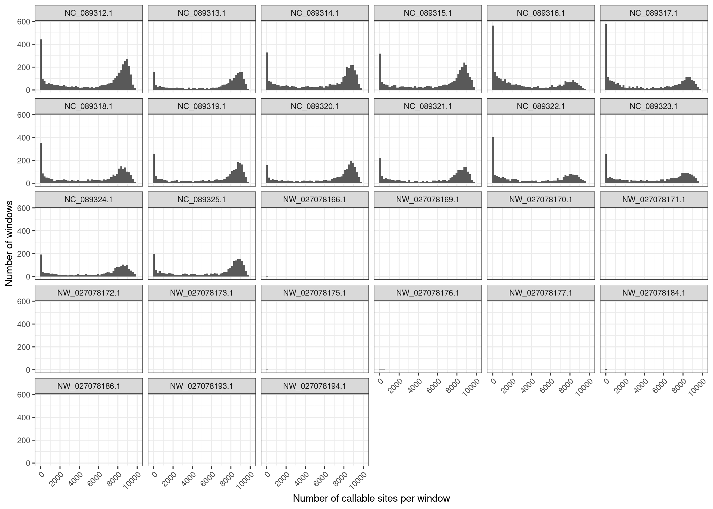

Same plot but allowing free y-axis:
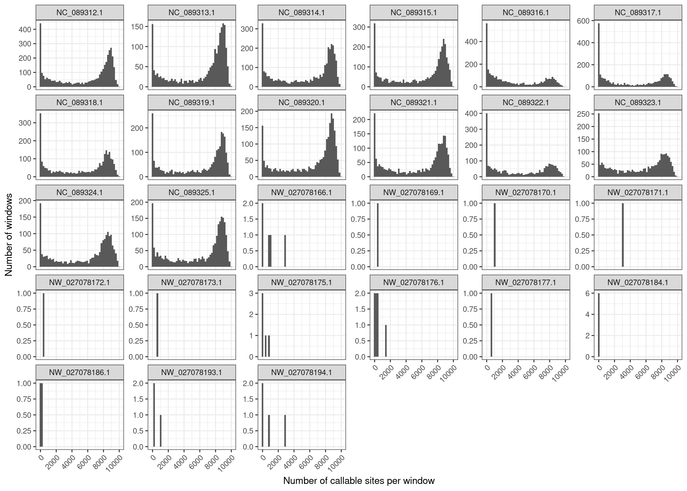

```r
# filter dataset based on 7000 site cutoff
pi_all_filt <- pi_all %>% 
  filter(no_sites >= 7000)

# summarize remaining windows after filtering
pi_all %>%
  summarise(
    total = n(),
    retained = sum(no_sites >= 7000),
    prop = retained / total
  )
```

```
  total retained  prop
  <int>    <int> <dbl>
  35236    16961 0.481
```
Note that this filtering removes all non-chromosome scaffolds from the dataset.

<br>

```r
# sensitivity check: try other cutoffs to see how it changes number of retained windows
pi_all %>%
  summarise(
    prop_6000 = mean(no_sites >= 6000),
    prop_7000 = mean(no_sites >= 7000),
    prop_8000 = mean(no_sites >= 8000)
  )
```

```
  prop_6000 prop_7000 prop_8000
      <dbl>     <dbl>     <dbl>
      0.542     0.481     0.367
```
Decreasing cutoff to 6000 doesn't add that much more data (6%). Increasing to 8000 removes a significant chunk of data (11%). So it looks like 7000 sites is a good sweet spot.

<br>

```r
# plot distribution of pi across filtered 10kb windows
ggplot(pi_all_filt, aes(x = avg_pi)) +
  geom_histogram(bins = 50) +
  labs(
    x = "Nucleotide diversity (π)",
    y = "Number of 10 kb windows"
  ) +
  theme_bw()

# calculate mean pi weighted by number of callable sites per window
wmean_pi_all <- weighted.mean(pi_all_filt$avg_pi, pi_all_filt$no_sites)
# genome-wide weighted mean pi = 0.00210149001149776

# calculate pooled pi across all windows as recommended by pixy
pooled_pi_all = sum(pi_all_filt$count_diffs, na.rm = TRUE) / sum(pi_all_filt$count_comparisons, na.rm = TRUE)
  # genome-wide pooled pi = 0.00210682697930745

# pooled pi and weighted-mean pi are close, but not exactly the same


# replot with weighted mean pi
ggplot(pi_all_filt, aes(x = avg_pi)) +
  geom_histogram(bins = 50) +
  geom_vline(xintercept = wmean_pi_all, linetype = "dashed") +
  labs(
    x = "Nucleotide diversity (π)",
    y = "Count of 10 kb windows"
  ) +
  theme_bw()

  # Distribution is right-skewed with longer tail at higher values
```

Distribution of pi across all retained 10kb windows (weighted mean = 0.00210):

Distribution is right-skewed with longer tail at higher values.

```r
# calculate full summary stats for genome-wide pi
pi_sum <- pi_all_filt %>%
  summarise(
    pooled_pi = sum(count_diffs, na.rm = TRUE) / sum(count_comparisons, na.rm = TRUE), # pixy-recommended aggregate pi across all windows
    w_mean = weighted.mean(avg_pi, no_sites),
    median = median(avg_pi),
    sd = sd(avg_pi),
    q05 = quantile(avg_pi, 0.05),
    q95 = quantile(avg_pi, 0.95)
  )
```
```
  pooled_pi  w_mean  median      sd      q05     q95
    0.00211 0.00210 0.00193 0.00119 0.000325 0.00418
```

```r
# facet by chromosome
ggplot(pi_all_filt, aes(x = avg_pi)) +
  geom_histogram(bins = 50) +
  geom_vline(xintercept = wmean_pi_all, linetype = "dashed") +
  facet_wrap(~ chromosome) +
  labs(
    x = "Nucleotide diversity (π)",
    y = "Count of 10 kb windows"
  ) +
  theme_bw()
```
Faceted by chromosome:
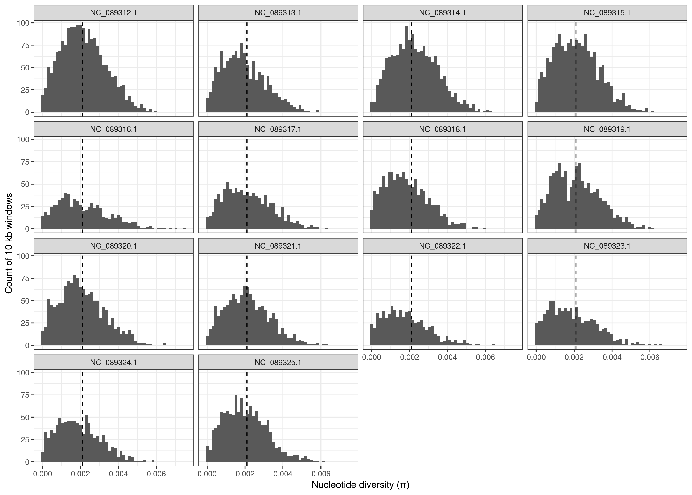

<br>

```r
# plot pi by window across genome
ggplot(pi_all_filt, aes(x = window_pos_1, y = avg_pi)) +
  geom_point(alpha = 0.3, size = 0.5) +
  geom_smooth(span = 0.1, color = "red", linewidth = 0.5) +
  facet_wrap(~ chromosome, scales = "free_x") +
  labs(
    x = "Genomic position",
    y = "π"
  ) +
  theme_bw() +
  theme(axis.text.x = element_text(angle = 45, hjust = 1))
```

Pi of 10kb windows across the genome:
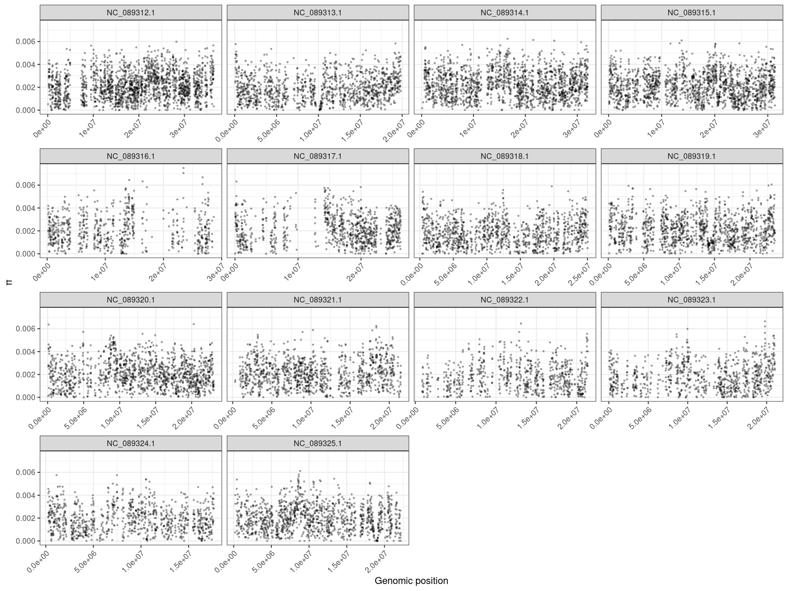

With LOESS smoothing curve:
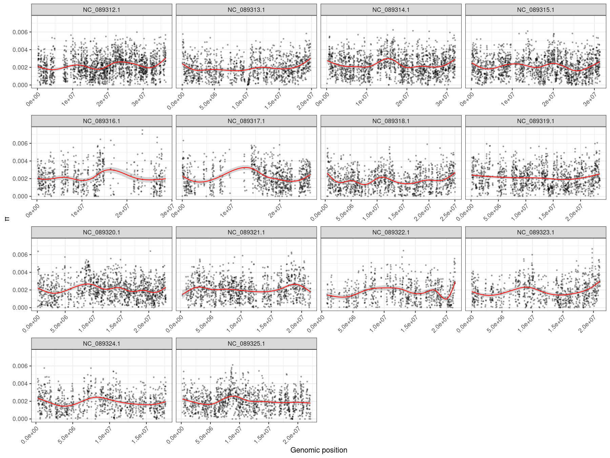

Pi looks pretty consistent across chromosomes (background genomic variation broadly consistent; no obvious genome-wide structure). Pi generally ranges from 0 to 0.006 for all chromosomes, with majority of windows below 0.004 (as seen in the distribution plot). Some fine scale heterogeneity within chromosomes (regions of realtively high or low pi). Low-pi regions could represent conserved regions or evidence of selective sweeps. High-pi regions could indicate balancing selection, introgression, or regions with high recombination rates. Chromosomes 16.1 and 17.1 seem to have the most missing data.

```r
# calculate pi per chromosome
pi_sum_by_chrom <- pi_all_filt %>%
  group_by(chromosome) %>% 
  summarise(
    n_windows = n(),
    total_sites = sum(no_sites),
    pooled_pi = sum(count_diffs, na.rm = TRUE) / sum(count_comparisons, na.rm = TRUE), # pixy-recommended aggregate pi across all windows
    w_mean = weighted.mean(avg_pi, no_sites),  # weighted mean pi
    uw_mean = mean(avg_pi),                    # unweighted mean pi
    median = median(avg_pi),
    sd = sd(avg_pi),
    q05 = quantile(avg_pi, 0.05),
    q95 = quantile(avg_pi, 0.95),
    .groups = "drop"
  )
```
```
   chromosome  n_windows total_sites pooled_pi  w_mean uw_mean  median      sd      q05     q95
   <fct>           <int>       <dbl>     <dbl>   <dbl>   <dbl>   <dbl>   <dbl>    <dbl>   <dbl>
 1 NC_089312.1      1929    16465783   0.00221 0.00221 0.00216 0.00206 0.00117 0.000382 0.00424
 2 NC_089313.1      1238    10583414   0.00198 0.00197 0.00193 0.00180 0.00113 0.000326 0.00404
 3 NC_089314.1      1674    14327238   0.00233 0.00232 0.00228 0.00217 0.00119 0.000512 0.00438
 4 NC_089315.1      1711    14649218   0.00217 0.00216 0.00212 0.00204 0.00117 0.000358 0.00416
 5 NC_089316.1       699     5718524   0.00218 0.00217 0.00210 0.00187 0.00135 0.000253 0.00457
 6 NC_089317.1       954     8016663   0.00218 0.00217 0.00212 0.00199 0.00123 0.000396 0.00430
 7 NC_089318.1      1177     9919168   0.00188 0.00187 0.00182 0.00169 0.00113 0.000210 0.00385
 8 NC_089319.1      1303    11201350   0.00217 0.00216 0.00212 0.00206 0.00120 0.000355 0.00429
 9 NC_089320.1      1369    11700279   0.00211 0.00211 0.00207 0.00193 0.00117 0.000327 0.00426
10 NC_089321.1      1147     9734480   0.00217 0.00217 0.00212 0.00203 0.00117 0.000408 0.00420
11 NC_089322.1       741     6116158   0.00184 0.00184 0.00178 0.00162 0.00118 0.000170 0.00402
12 NC_089323.1       872     7254096   0.00195 0.00194 0.00188 0.00171 0.00122 0.000174 0.00400
13 NC_089324.1       918     7752971   0.00196 0.00195 0.00190 0.00178 0.00114 0.000230 0.00390
14 NC_089325.1      1229    10542673   0.00206 0.00205 0.00202 0.00191 0.00114 0.000362 0.00401
```
<br>

```r
# plot summary stats
ggplot(pi_sum_by_chrom, aes(x = chromosome, y = pooled_pi)) +
  geom_point(size = 3) +
  geom_errorbar(aes(ymin = q05, ymax = q95), width = 0.2) +
  labs(
    x = "Chromosome",
    y = expression(pi~"(5th-95th percentile range)")
  ) +
  theme_bw() +
  theme(axis.text.x = element_text(angle = 45, hjust = 1))
```

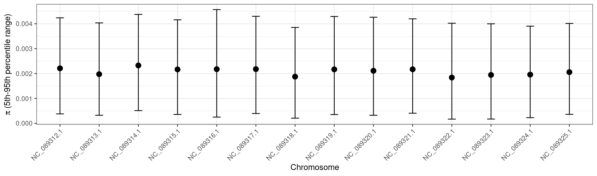

<br>

#### Now Watterson's theta files:
```r
# Now load in Watterson's theta files

# Load in files
theta_all_files <- list.files(
  "./all/",
  pattern = "watterson_theta.txt$",
  full.names = TRUE
)

# name the vector for use in .id column in next step
names(theta_all_files) <- theta_all_files

# import and combine all pi files while creating new column with file path/name
theta_all_raw <- map_dfr(theta_all_files, read_tsv, .id = "source_file")

# reformatting
theta_all <- theta_all_raw %>% 
  mutate(
    chromosome = str_remove(chromosome, "_Pverrucosa$") %>% as.factor(),
    pop = as.factor(pop)
  )

str(theta_all)
```

```
tibble [35,236 × 10] (S3: tbl_df/tbl/data.frame)
 $ source_file        : chr [1:35236] "./all//NC_089312.1_Pverrucosa.all_watterson_theta.txt" "./all//NC_089312.1_Pverrucosa.all_watterson_theta.txt" "./all//NC_089312.1_Pverrucosa.all_watterson_theta.txt" "./all//NC_089312.1_Pverrucosa.all_watterson_theta.txt" ...
 $ pop                : Factor w/ 1 level "ALL": 1 1 1 1 1 1 1 1 1 1 ...
 $ chromosome         : Factor w/ 27 levels "NC_089312.1",..: 1 1 1 1 1 1 1 1 1 1 ...
 $ window_pos_1       : num [1:35236] 1 10001 20001 30001 40001 ...
 $ window_pos_2       : num [1:35236] 1e+04 2e+04 3e+04 4e+04 5e+04 6e+04 7e+04 8e+04 9e+04 1e+05 ...
 $ avg_watterson_theta: num [1:35236] NA 0 0 0.00103 NA ...
 $ no_sites           : num [1:35236] 0 189 864 2425 0 ...
 $ raw_watterson_theta: num [1:35236] NA 0 0 2.51 NA ...
 $ no_var_sites       : num [1:35236] 0 0 0 15 0 0 18 21 62 0 ...
 $ weighted_no_sites  : num [1:35236] NA 179 794 2071 NA ...
```

<br>

```r
# filter dataset based on 7000 site cutoff
theta_all_filt <- theta_all %>% 
  filter(no_sites >= 7000)


# plot distribution of theta across filtered 10kb windows
ggplot(theta_all_filt, aes(x = avg_watterson_theta)) +
  geom_histogram(bins = 50) +
  labs(
    x = "Watterson's θ",
    y = "Number of 10 kb windows"
  ) +
  theme_bw()

# calculate mean theta weighted by number of callable sites per window
wmean_theta_all <- weighted.mean(theta_all_filt$avg_watterson_theta, theta_all_filt$no_sites)
# genome-wide weighted mean theta = 0.00222358854498557

# calculate pooled pi across all windows as recommended by pixy
pooled_theta_all <- sum(theta_all_filt$raw_watterson_theta, na.rm = TRUE) / sum(theta_all_filt$weighted_no_sites, na.rm = TRUE)
# genome-wide pooled theta = 0.00223505063350543

# pooled theta and weighted-mean theta are close, but not exactly the same


# replot with weighted mean theta
ggplot(theta_all_filt, aes(x = avg_watterson_theta)) +
  geom_histogram(bins = 50) +
  geom_vline(xintercept = wmean_theta_all, linetype = "dashed") +
  labs(
    x = "Watterson's θ",
    y = "Count of 10 kb windows"
  ) +
  theme_bw()
```

Distribution of theta across filtered 10kb windows (weighted mean = 0.00222):
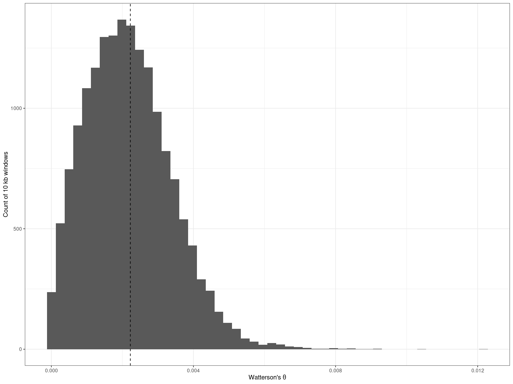


```r
# calculate full summary stats for genome-wide theta
theta_sum <- theta_all_filt %>%
  summarise(
    pooled_theta = sum(raw_watterson_theta, na.rm = TRUE) / sum(weighted_no_sites, na.rm = TRUE),
    w_mean = weighted.mean(avg_watterson_theta, no_sites),
    median = median(avg_watterson_theta),
    sd = sd(avg_watterson_theta),
    q05 = quantile(avg_watterson_theta, 0.05),
    q95 = quantile(avg_watterson_theta, 0.95)
  )
```

```
  pooled_theta  w_mean  median      sd      q05     q95
         <dbl>   <dbl>   <dbl>   <dbl>    <dbl>   <dbl>
       0.00224 0.00222 0.00208 0.00121 0.000410 0.00429
```

<br>

```r
# facet by chromosome
ggplot(theta_all_filt, aes(x = avg_watterson_theta)) +
  geom_histogram(bins = 50) +
  geom_vline(xintercept = wmean_theta_all, linetype = "dashed") +
  facet_wrap(~ chromosome) +
  labs(
    x = "Watterson's θ",
    y = "Count of 10 kb windows"
  ) +
  theme_bw()
```

Faceted by chromosome:
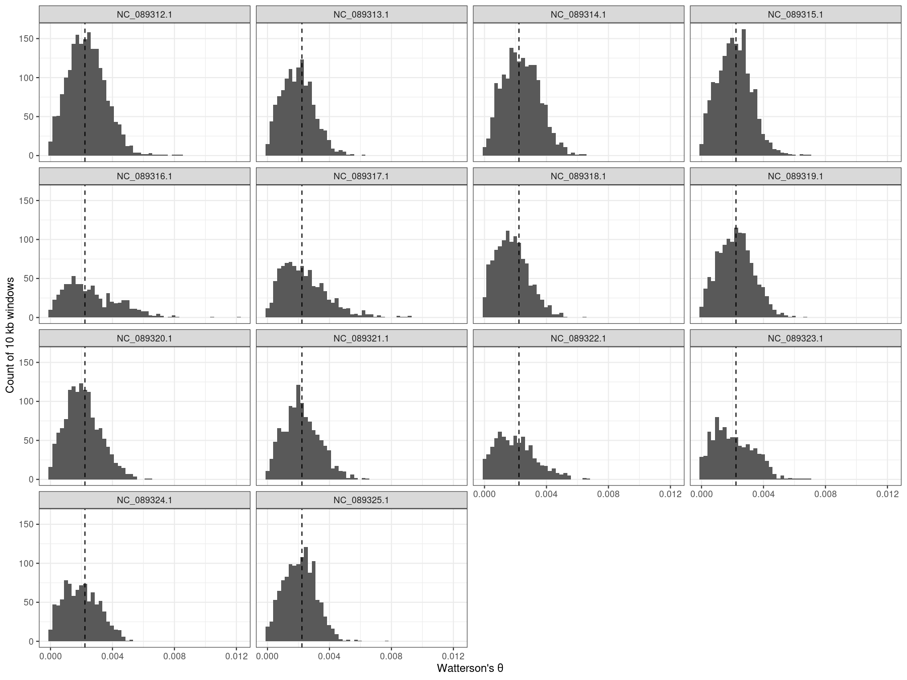

<br>

```r
# plot theta by window across genome
ggplot(theta_all_filt, aes(x = window_pos_1, y = avg_watterson_theta)) +
  geom_point(alpha = 0.3, size = 0.5) +
  geom_smooth(span = 0.1, color = "red", linewidth = 0.5) +
  facet_wrap(~ chromosome, scales = "free_x") +
  labs(
    x = "Genomic position",
    y = "Watterson's θ"
  ) +
  theme_bw() +
  theme(axis.text.x = element_text(angle = 45, hjust = 1))
```

Watterson's theta by window across genome:
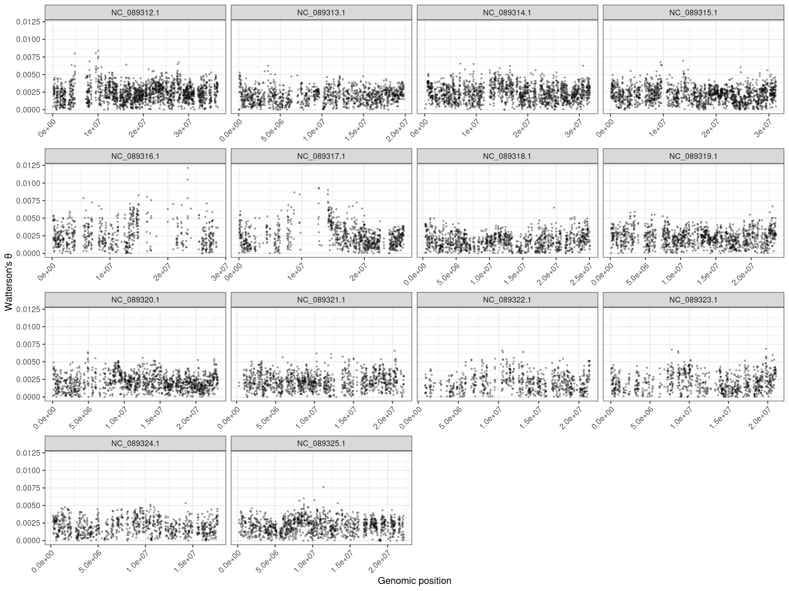

With LOESS smoothing curve:
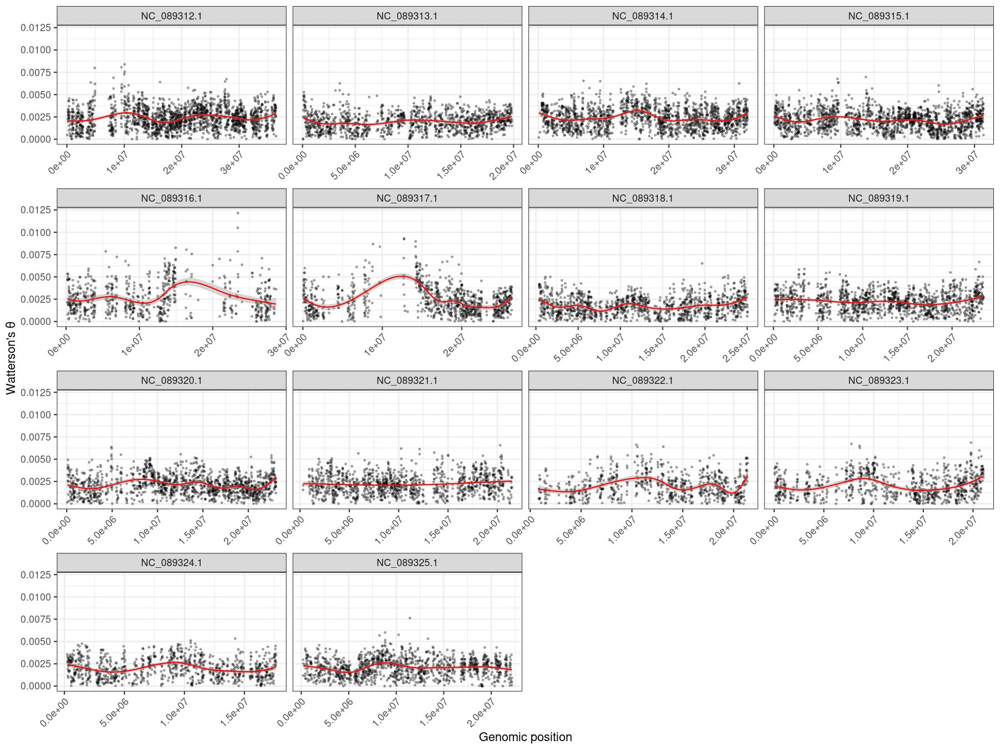

Except for chromosomes with more missing windows, theta seems to be more homogeneous within chromosomes than pi. This makes sense to me because theta is a more coarse measure (essentially number of SNPs), and pi is more sensitive to difference in allele frequencies between those snps (SNPs with minor allele frequencies closer to 0.5 count more than low-frequency SNPs). Relatively homogenous theta means SNP density is fairly uniform across the genome, which could indicate that there aren't massive differences in mutation rates (but other factors also affect theta).

<br>

```r
# calculate theta per chromosome
theta_sum_by_chrom <- theta_all_filt %>%
  group_by(chromosome) %>% 
  summarise(
    n_windows = n(),
    total_sites = sum(no_sites),
    pooled_theta = sum(raw_watterson_theta, na.rm = TRUE) / sum(weighted_no_sites, na.rm = TRUE), # pixy-recommended aggregate theta across all windows
    w_mean = weighted.mean(avg_watterson_theta, no_sites),  # weighted mean theat
    uw_mean = mean(avg_watterson_theta),                    # unweighted mean theta
    median = median(avg_watterson_theta),
    sd = sd(avg_watterson_theta),
    q05 = quantile(avg_watterson_theta, 0.05),
    q95 = quantile(avg_watterson_theta, 0.95),
    .groups = "drop"
  )
```

```
   chromosome  n_windows total_sites pooled_theta  w_mean uw_mean  median      sd      q05     q95
   <fct>           <int>       <dbl>        <dbl>   <dbl>   <dbl>   <dbl>   <dbl>    <dbl>   <dbl>
 1 NC_089312.1      1929    16465783      0.00243 0.00242 0.00237 0.00231 0.00121 0.000532 0.00445
 2 NC_089313.1      1238    10583414      0.00201 0.00200 0.00196 0.00192 0.00103 0.000395 0.00374
 3 NC_089314.1      1674    14327238      0.00243 0.00242 0.00237 0.00232 0.00116 0.000626 0.00433
 4 NC_089315.1      1711    14649218      0.00219 0.00218 0.00214 0.00211 0.00108 0.000452 0.00391
 5 NC_089316.1       699     5718524      0.00276 0.00274 0.00266 0.00224 0.00176 0.000412 0.00583
 6 NC_089317.1       954     8016663      0.00243 0.00242 0.00237 0.00211 0.00152 0.000485 0.00516
 7 NC_089318.1      1177     9919168      0.00185 0.00183 0.00179 0.00170 0.00105 0.000247 0.00370
 8 NC_089319.1      1303    11201350      0.00228 0.00227 0.00222 0.00221 0.00112 0.000420 0.00414
 9 NC_089320.1      1369    11700279      0.00217 0.00216 0.00211 0.00202 0.00113 0.000403 0.00413
10 NC_089321.1      1147     9734480      0.00227 0.00226 0.00221 0.00210 0.00115 0.000491 0.00419
11 NC_089322.1       741     6116158      0.00210 0.00208 0.00202 0.00190 0.00129 0.000211 0.00443
12 NC_089323.1       872     7254096      0.00215 0.00213 0.00207 0.00187 0.00130 0.000237 0.00428
13 NC_089324.1       918     7752971      0.00207 0.00206 0.00200 0.00192 0.00113 0.000308 0.00401
14 NC_089325.1      1229    10542673      0.00214 0.00213 0.00209 0.00209 0.00104 0.000472 0.00382
```

<br>

```r
# plot summary stats
ggplot(theta_sum_by_chrom, aes(x = chromosome, y = pooled_theta)) +
  geom_point(size = 3) +
  geom_errorbar(aes(ymin = q05, ymax = q95), width = 0.2) +
  labs(
    x = "Chromosome",
    y = expression("Watterson's"~theta~"(5th-95th percentile range)")
  ) +
  theme_bw() +
  theme(axis.text.x = element_text(angle = 45, hjust = 1))
```

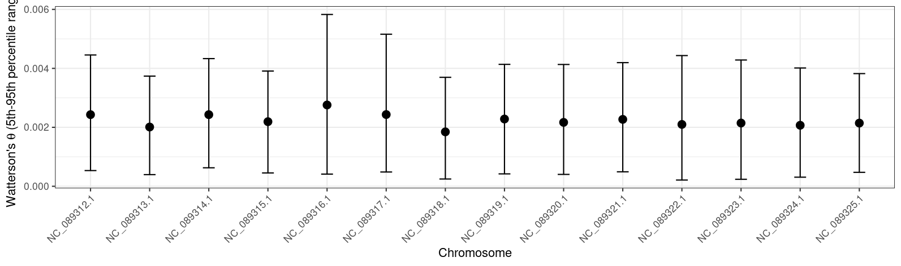

<br>

Genome-wide pooled diversity stats are 0.00211 and 0.00224 for pi and Watterson's theta, respectively.

So θw is slightly larger than π, meaning Tajima's D is slightly negative at the whole-genome scale.

θ > π suggests a slight excess of low-frequency variants. This could be the result of:
- population expansion OR
- purifying selection/background selection

<br>

Genome-wide diversity estimates were very similar whether calculated as pooled or weighted window-based means for π and Watterson’s θ, indicating that window filtering and denominator variation had little effect on aggregate estimates. Accordingly, the weighted mean Tajima’s D across retained 10 kb windows will be taken as a reliable summary of the genome-wide allele-frequency spectrum in the next step. A fully pooled genome-wide Tajima’s D cannot be reconstructed from window-level outputs because the variance term depends on the total number of segregating sites and sample size and is not additive across windows, and therefore would need to be recalculated from pooled site-level data rather than window-level summaries.

<br>

```r
# combine pi and theta into one data frame to plot against each other
pi_theta_merged <- pi_all_filt %>%
  select(chromosome, window_pos_1, avg_pi) %>%
  left_join(
    theta_all_filt %>%
      select(chromosome, window_pos_1, avg_watterson_theta),
    by = c("chromosome", "window_pos_1")
  ) %>%
  mutate(diff = avg_pi - avg_watterson_theta)

# plot pi vs theta
ggplot(pi_theta_merged, aes(x = avg_watterson_theta, y = avg_pi)) +
  geom_point(alpha = 0.3) +
  geom_abline(slope = 1, intercept = 0, linetype = "dashed") + 
  theme_bw()
```

π vs θw for all retained windows:
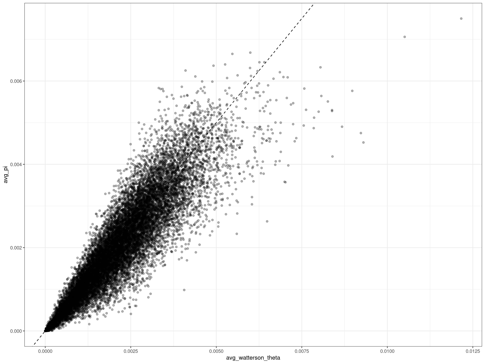

Interpretation:
- Strong linear relationship as expected
- Majority of points below the 1:1 line (generally, theta > pi)
- Fan-shaped spread at higher values (expected, more SNPs = more room for allele freq variation)
- theta > pi means SNPs are skewed towards rare alleles

<br>


#### Now Tajima's D files:
```r
# Now load in Tajima's D files
# Load in files
tajimad_all_files <- list.files(
  "./all/",
  pattern = "_tajima_d.txt$",
  full.names = TRUE
)

# name the vector for use in .id column in next step
names(tajimad_all_files) <- tajimad_all_files

# import and combine all tajima_d files while creating new column with file path/name
tajimad_all_raw <- map_dfr(tajimad_all_files, read_tsv, .id = "source_file")

# reformatting
tajimad_all <- tajimad_all_raw %>% 
  mutate(
    chromosome = str_remove(chromosome, "_Pverrucosa$") %>% as.factor(),
    pop = as.factor(pop)
  )

str(tajimad_all)
```

```
tibble [35,236 × 10] (S3: tbl_df/tbl/data.frame)
 $ source_file        : chr [1:35236] "./all//NC_089312.1_Pverrucosa.all_tajima_d.txt" "./all//NC_089312.1_Pverrucosa.all_tajima_d.txt" "./all//NC_089312.1_Pverrucosa.all_tajima_d.txt" "./all//NC_089312.1_Pverrucosa.all_tajima_d.txt" ...
 $ pop                : Factor w/ 1 level "ALL": 1 1 1 1 1 1 1 1 1 1 ...
 $ chromosome         : Factor w/ 27 levels "NC_089312.1",..: 1 1 1 1 1 1 1 1 1 1 ...
 $ window_pos_1       : num [1:35236] 1 10001 20001 30001 40001 ...
 $ window_pos_2       : num [1:35236] 1e+04 2e+04 3e+04 4e+04 5e+04 6e+04 7e+04 8e+04 9e+04 1e+05 ...
 $ tajima_d           : num [1:35236] NA NA NA 0.514 NA ...
 $ no_sites           : num [1:35236] 0 189 864 2425 0 ...
 $ raw_pi             : num [1:35236] NA 0 0 3.02 NA ...
 $ raw_watterson_theta: num [1:35236] NA 0 0 2.51 NA ...
 $ tajima_d_stdev     : num [1:35236] NA 0 0 0.994 NA ...
```

<br>

```r
# filter dataset based on 7000 site cutoff
tajimad_all_filt <- tajimad_all %>% 
  filter(no_sites >= 7000)


# plot distribution of Tajima's D across filtered 10kb windows
ggplot(tajimad_all_filt, aes(x = tajima_d)) +
  geom_histogram(bins = 50) +
  labs(
    x = "Tajima's D",
    y = "Number of 10 kb windows"
  ) +
  theme_bw()


# determine how many NAs in dataset (windows where pi and theta were both 0 (invariant regions), so Tajima's D is undefined)
tajimad_all_filt %>% filter(is.na(tajima_d)) %>% nrow()
  # 46 windows have NA for tajima_d

# calculate mean Tajima's D weighted by number of callable sites per window (use na.rm = TRUE to remove NAs)
wmean_tajimad_all <- weighted.mean(tajimad_all_filt$tajima_d, tajimad_all_filt$no_sites, na.rm = TRUE)
  # genome-wide weighted mean tajimad = -0.149474782683258


# replot with weighted mean tajimad
ggplot(tajimad_all_filt, aes(x = tajima_d)) +
  geom_histogram(bins = 50) +
  geom_vline(xintercept = wmean_tajimad_all, linetype = "dashed") +
  labs(
    x = "Tajima's D",
    y = "Count of 10 kb windows"
  ) +
  theme_bw()

# Distribution is pretty normal and symmetric, but slightly skewed so that the weighted mean is negative. The positive tail is a slightly longer than the negative tail.
```

Distribution of Tajima's D across all filtered 10kb windows:
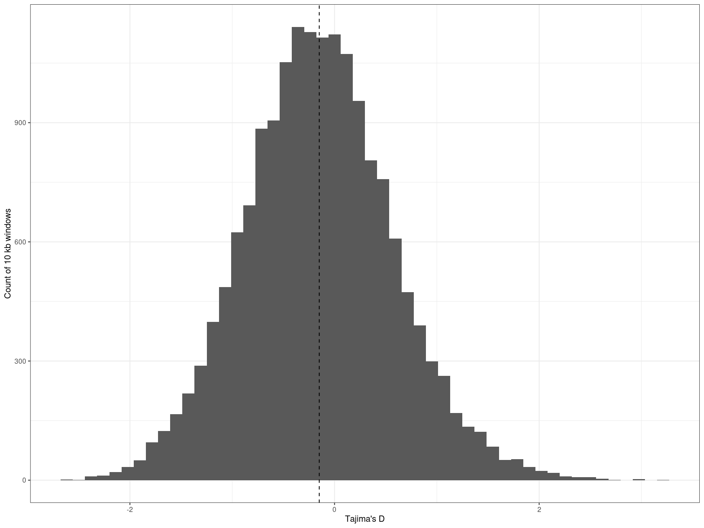

Genome-wide weighted mean Tajima's D = -0.149.

Distribution is pretty normal and symmetric, but slightly skewed so that the weighted mean is negative. The positive tail is a slightly longer than the negative tail.

<br>

```r
# calculate full summary stats for genome-wide Tajima's D
tajimad_sum <- tajimad_all_filt %>%
  summarise(
    w_mean = weighted.mean(tajima_d, no_sites, na.rm = TRUE),
    median = median(tajima_d, na.rm = TRUE),
    sd = sd(tajima_d, na.rm = TRUE),
    q05 = quantile(tajima_d, 0.05, na.rm = TRUE),
    q95 = quantile(tajima_d, 0.95, na.rm = TRUE)
  )
```

```
  w_mean median    sd   q05   q95
   <dbl>  <dbl> <dbl> <dbl> <dbl>
  -0.149 -0.165 0.726 -1.32  1.07
```

<br>

```r
# facet by chromosome
ggplot(tajimad_all_filt, aes(x = tajima_d)) +
  geom_histogram(bins = 50) +
  geom_vline(xintercept = wmean_tajimad_all, linetype = "dashed") +
  facet_wrap(~ chromosome) +
  labs(
    x = "Tajima's D",
    y = "Count of 10 kb windows"
  ) +
  theme_bw()
```

Tajima's D distribution faceted by chromosome:
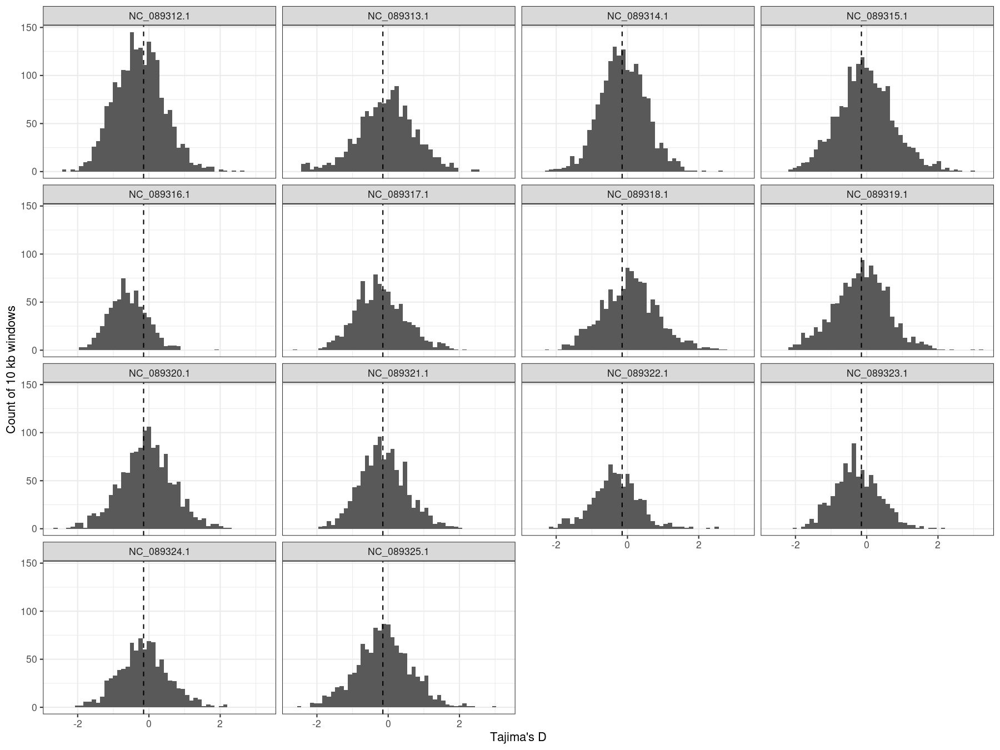
Distribution fairly consistent across chromosomes. Chromosome 16.1 looks slighly shifted to the negative (but this is one of the chromosomes with larger chunks of missing data) and Chromosom 18.1 looks slighly shifted to the positive, compared to the genome-wide distribution.

<br>

```r
# plot Tajima's D by window across genome
ggplot(tajimad_all_filt, aes(x = window_pos_1, y = tajima_d)) +
  geom_point(alpha = 0.3, size = 0.5) +
  geom_smooth(span = 0.1, color = "red", linewidth = 0.5) +
  geom_hline(yintercept = 0, linetype = "dashed", color = "steelblue1", linewidth = 0.6) +
  facet_wrap(~ chromosome, scales = "free_x") +
  labs(
    x = "Genomic position",
    y = "Tajima's D"
  ) +
  theme_bw() +
  theme(axis.text.x = element_text(angle = 45, hjust = 1))
```

Tajima's D by window across the genome:
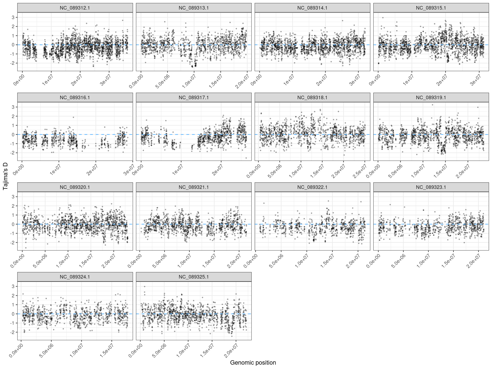

With LOESS smoothing curve:
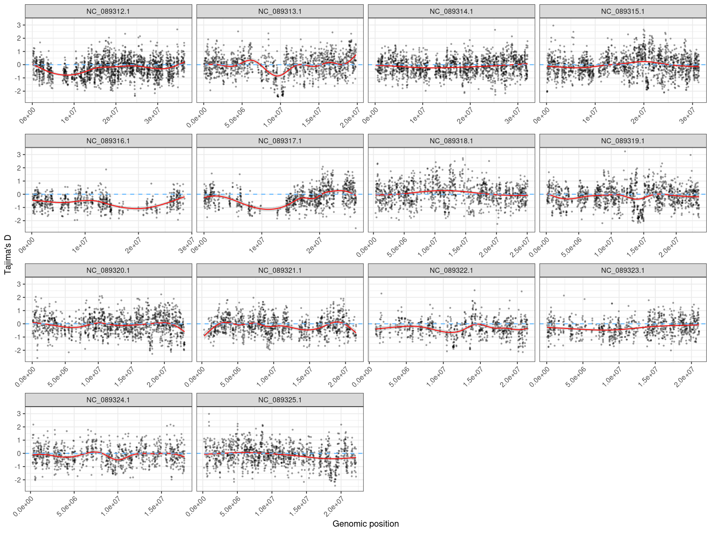


```r
# calculate Tajima's D per chromosome
tajimad_sum_by_chrom <- tajimad_all_filt %>%
  group_by(chromosome) %>% 
  summarise(
    n_windows = n(),
    total_sites = sum(no_sites),
    w_mean = weighted.mean(tajima_d, no_sites, na.rm = TRUE),  # weighted mean tajima's D
    uw_mean = mean(tajima_d, na.rm = TRUE),                    # unweighted mean tajima's D
    median = median(tajima_d, na.rm = TRUE),
    sd = sd(tajima_d, na.rm = TRUE),
    q05 = quantile(tajima_d, 0.05, na.rm = TRUE),
    q95 = quantile(tajima_d, 0.95, na.rm = TRUE),
    .groups = "drop"
  )
```

```
   chromosome  n_windows total_sites  w_mean uw_mean    median    sd   q05   q95
   <fct>           <int>       <dbl>   <dbl>   <dbl>     <dbl> <dbl> <dbl> <dbl>
 1 NC_089312.1      1929    16465783 -0.262  -0.265  -0.273    0.685 -1.35 0.896
 2 NC_089313.1      1238    10583414 -0.0490 -0.0443  0.000162 0.801 -1.41 1.25 
 3 NC_089314.1      1674    14327238 -0.123  -0.123  -0.141    0.641 -1.13 0.956
 4 NC_089315.1      1711    14649218 -0.0253 -0.0253 -0.0552   0.781 -1.30 1.32 
 5 NC_089316.1       699     5718524 -0.587  -0.589  -0.620    0.523 -1.40 0.281
 6 NC_089317.1       954     8016663 -0.207  -0.213  -0.258    0.696 -1.28 0.990
 7 NC_089318.1      1177     9919168  0.0687  0.0688  0.0702   0.782 -1.24 1.42 
 8 NC_089319.1      1303    11201350 -0.159  -0.153  -0.128    0.758 -1.46 1.05 
 9 NC_089320.1      1369    11700279 -0.0692 -0.0673 -0.0573   0.736 -1.31 1.12 
10 NC_089321.1      1147     9734480 -0.124  -0.128  -0.174    0.661 -1.18 1.03 
11 NC_089322.1       741     6116158 -0.330  -0.327  -0.342    0.666 -1.45 0.673
12 NC_089323.1       872     7254096 -0.266  -0.267  -0.317    0.629 -1.28 0.778
13 NC_089324.1       918     7752971 -0.149  -0.146  -0.159    0.692 -1.22 1.03 
14 NC_089325.1      1229    10542673 -0.127  -0.126  -0.129    0.768 -1.46 1.10
```

<br>

```r
# plot summary stats
ggplot(tajimad_sum_by_chrom, aes(x = chromosome, y = w_mean)) +
  geom_point(size = 3) +
  geom_errorbar(aes(ymin = q05, ymax = q95), width = 0.2) +
  labs(
    x = "Chromosome",
    y = "Tajima's D (5th-95th percentile range)"
  ) +
  theme_bw() +
  theme(axis.text.x = element_text(angle = 45, hjust = 1))
```
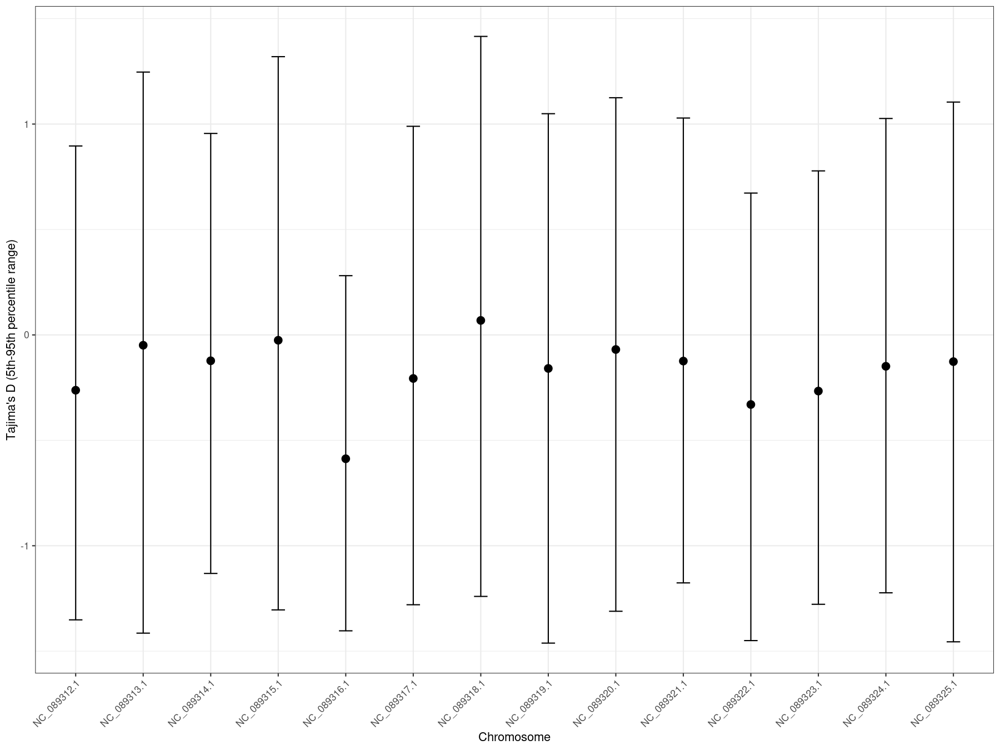

**Interpretation:** Slightly negative Tajima's D is fairly consistent across the genome, with some smaller regions trending above zero. This is most likely indicative of either weak background selection or mild population expansion.

<br>

Make summary table of genome-wide stats for ALL comparison:
```r
# Report weighted means + 5-95% quantile range
ALL_summary <- tibble(
  population = "ALL",
  
  pi = pi_sum$pooled_pi,
  pi_q05 = pi_sum$q05,
  pi_q95 = pi_sum$q95,
  
  theta = theta_sum$pooled_theta,
  theta_q05 = theta_sum$q05,
  theta_q95 = theta_sum$q95,
  
  TajimasD = tajimad_sum$w_mean,
  TajimasD_q05 = tajimad_sum$q05,
  TajimasD_q95 = tajimad_sum$q95
)


# more readable compact version
ALL_summary_compact <- tibble(
  population = "ALL",
  pi = sprintf("%.3f (%.3f–%.3f)", pi_sum$w_mean, pi_sum$q05, pi_sum$q95),
  theta = sprintf("%.3f (%.3f–%.3f)", theta_sum$w_mean, theta_sum$q05, theta_sum$q95),
  TajimasD = sprintf("%.3f (%.3f–%.3f)", tajimad_sum$w_mean, tajimad_sum$q05, tajimad_sum$q95)
)
```

```
  population pi (pooled)               theta (pooled)            TajimasD (weighted mean)             
  ALL        0.00211 (0.00033–0.00418) 0.00224 (0.00041–0.00429) -0.149 (-1.320–1.068)
```

<br>
<br>

### "Island" pixy run (Tutuila vs. Ofu)

Now move on to the island-comparison files.

#### Island-level pi
Load pi files:
```r
# Pi files first

# Load in files
pi_island_files <- list.files(
  "./island/",
  pattern = "_pi.txt$",
  full.names = TRUE
)

# name the vector for use in .id column in next step
names(pi_island_files) <- pi_island_files

# import and combine island pi files while creating new column with file path/name
pi_island_raw <- map_dfr(pi_island_files, read_tsv, .id = "source_file")

# reformatting
pi_island <- pi_island_raw %>% 
  mutate(
    chromosome = str_remove(chromosome, "_Pverrucosa$") %>% as.factor(),
    pop = as.factor(pop)
  )

str(pi_island)
```

```
tibble [70,472 × 10] (S3: tbl_df/tbl/data.frame)
 $ source_file      : chr [1:70472] "./island//NC_089312.1_Pverrucosa.island_pi.txt" "./island//NC_089312.1_Pverrucosa.island_pi.txt" "./island//NC_089312.1_Pverrucosa.island_pi.txt" "./island//NC_089312.1_Pverrucosa.island_pi.txt" ...
 $ pop              : Factor w/ 2 levels "Ofu","Tutuila": 2 1 2 1 1 2 2 1 1 2 ...
 $ chromosome       : Factor w/ 27 levels "NC_089312.1",..: 1 1 1 1 1 1 1 1 1 1 ...
 $ window_pos_1     : num [1:70472] 1 1 10001 10001 20001 ...
 $ window_pos_2     : num [1:70472] 10000 10000 20000 20000 30000 30000 40000 40000 50000 50000 ...
 $ avg_pi           : num [1:70472] NA NA 0 0 0 ...
 $ no_sites         : num [1:70472] 0 0 189 189 864 ...
 $ count_diffs      : num [1:70472] NA NA 0 0 0 ...
 $ count_comparisons: num [1:70472] NA NA 4191716 158647 773245 ...
 $ count_missing    : num [1:70472] NA NA 444643 54545 201347 ...
```

<br>

```r
# plot distribution of callable sites per 10kb window
ggplot(pi_island, aes(x = no_sites)) +
  geom_histogram(bins = 50) +
  facet_wrap(~ pop) +
  labs(
    x = "Number of callable sites per window",
    y = "Number of windows"
  ) +
  scale_x_continuous(breaks = seq(from=0, to = 10000, by = 2000)) +
  theme_bw() +
  theme(axis.text.x = element_text(angle = 45, hjust = 1))


# Distribution of callable sites looks same as before when split between islands. The main peak is still around 9000 sites, with most of the hump between 8000 and 10,000
# This indicates good coverage of callable sites and allows us to set a lower end cutoff of 7000 (retaining windows with >= 70% of sites callable)
# This removes low-information regions while retaining the majority of high-quality genomic windows
```
Distribution of callable sites by island (unfiltered):
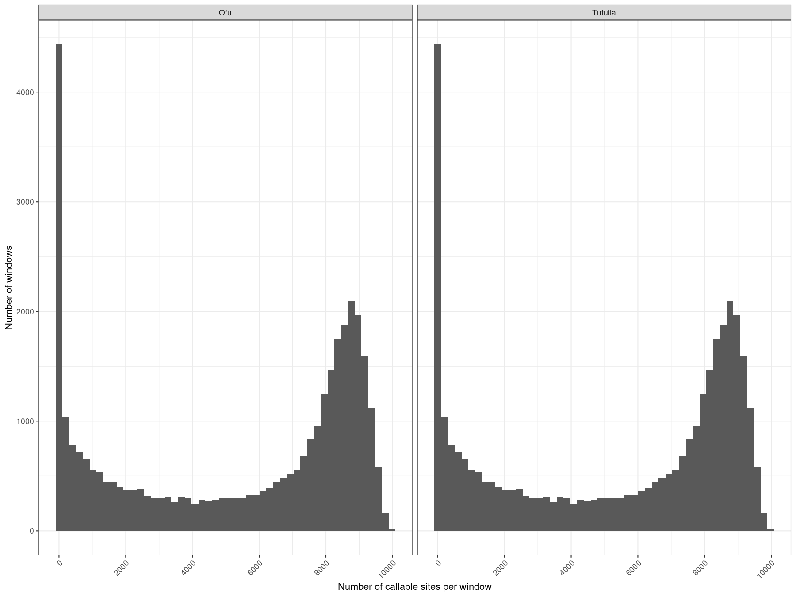
Distribution of callable sites looks same as before when split between islands. The main peak is still around 9000 sites, with most of the hump between 8000 and 10,000.

<br>

Now filter windows using 7000-site cutoff:
```r
# filter dataset based on 7000 site cutoff
pi_island_filt <- pi_island %>% 
  filter(no_sites >= 7000)

# summarize remaining windows after filtering
pi_island %>%
  summarise(
    total = n(),
    retained = sum(no_sites >= 7000),
    prop = retained / total
  )

# sensitivity check: try other cutoffs to see how it changes number of retained windows
pi_island %>%
  summarise(
    prop_6000 = mean(no_sites >= 6000),
    prop_7000 = mean(no_sites >= 7000),
    prop_8000 = mean(no_sites >= 8000)
  )
```
```
  total retained  prop
  70472    33922 0.481

  prop_6000 prop_7000 prop_8000
      0.542     0.481     0.367
```
Decreasing cutoff to 6000 doesn't add that much more data (6%). Increasing to 8000 removes a significant chunk of data (11%). So 7000 still looks like the sweet spot.

<br>

```r
# plot distribution of pi across filtered 10kb windows
ggplot(pi_island_filt, aes(x = avg_pi, fill = pop)) +
  geom_histogram(bins = 50, alpha = 0.5, position = "identity") +
  #facet_wrap(~ pop) +
  labs(
    x = "Nucleotide diversity (π)",
    y = "Number of 10 kb windows"
  ) +
  theme_bw()
```

Tutuila and Ofu distributions are very similar.

<br>

```r
# calculate full summary stats for genome-wide pi by island
pi_sum_island <- pi_island_filt %>% 
  group_by(pop) %>% 
  summarise(
    pooled_pi = sum(count_diffs, na.rm = TRUE) / sum(count_comparisons, na.rm = TRUE), # pixy-recommended approach for aggregating across windows
    w_mean = weighted.mean(avg_pi, no_sites),
    median = median(avg_pi),
    sd = sd(avg_pi),
    q05 = quantile(avg_pi, 0.05),
    q95 = quantile(avg_pi, 0.95)
  )
# genome-wide weighted mean pi: Tutuila=0.00208, Ofu=0.00209
```

```
# A tibble: 2 × 6
  pop     pooled_pi  w_mean  median      sd      q05     q95
  <fct>       <dbl>   <dbl>   <dbl>   <dbl>    <dbl>   <dbl>
1 Ofu       0.00209 0.00209 0.00191 0.00119 0.000317 0.00419
2 Tutuila   0.00209 0.00208 0.00191 0.00118 0.000318 0.00416
```

<br>

```r
wmean_pi_ofu <- pi_sum_island$w_mean[1]
wmean_pi_tutuila <- pi_sum_island$w_mean[2]

  # genome-wide weighted mean pi: Tutuila=0.0020840, Ofu=0.0020858

pooled_pi_ofu <- pi_sum_island$pooled_pi[1]
pooled_pi_tutuila <- pi_sum_island$pooled_pi[2]

  # genome-wide pooled pi: Tutuila=0.0020890, Ofu=0.0020923
```

<br>

```r
# replot with weighted mean pi for each island
ggplot(pi_island_filt, aes(x = avg_pi, fill = pop)) +
  geom_histogram(bins = 50, alpha = 0.5, position = "identity") +
  geom_vline(xintercept = wmean_pi_ofu, linetype = "dashed", color = "red") +
  geom_vline(xintercept = wmean_pi_tutuila, linetype = "dashed", color = "blue") +
  labs(
    x = "Nucleotide diversity (π)",
    y = "Count of 10 kb windows"
  ) +
  theme_bw()

# Distribution is right-skewed with longer tail at higher values
```
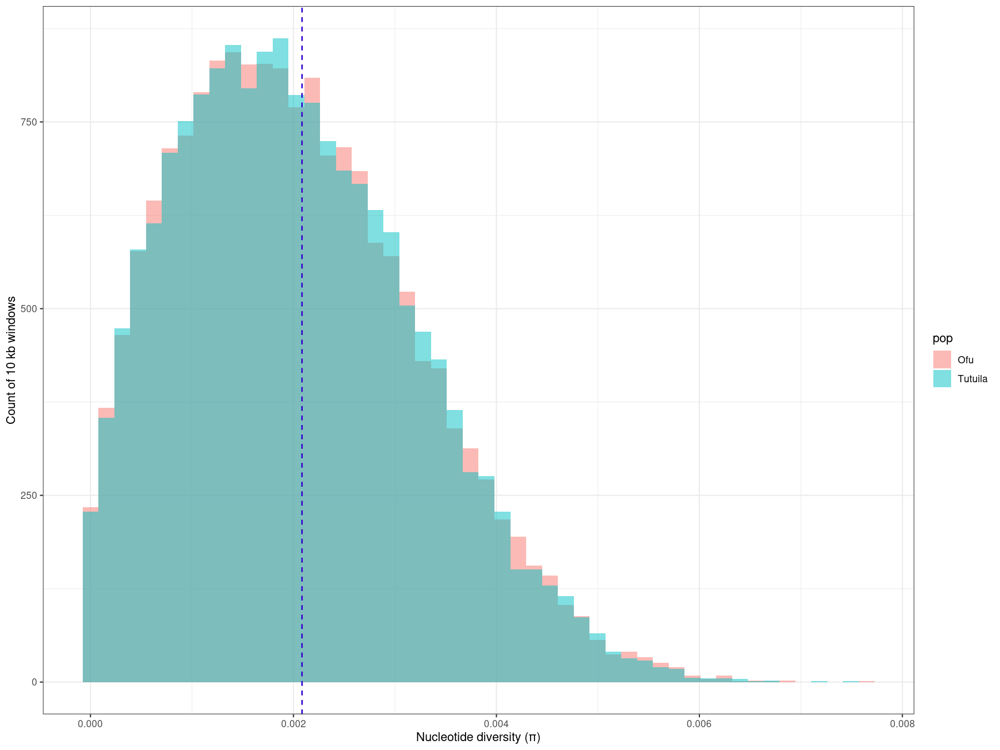

<br>

```r
# facet by chromosome and island (using pooled_pi_all as x-intercept for reference)
ggplot(pi_island_filt, aes(x = avg_pi, fill = pop)) +
  geom_histogram(bins = 50, alpha = 0.5, position = "identity") +
  geom_vline(xintercept = pooled_pi_all, linetype = "dashed") +
  facet_grid(pop ~ chromosome) +
  labs(
    x = "Nucleotide diversity (π)",
    y = "Count of 10 kb windows"
  ) +
  theme_bw() +
  theme(axis.text.x = element_text(angle = 45, hjust = 1))
```
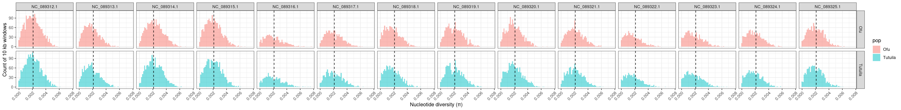

<br>

```r
# plot per-window pi across genome by island
ggplot(pi_island_filt, aes(x = window_pos_1, y = avg_pi)) +
  geom_point(alpha = 0.3, size = 0.5) +
  geom_smooth(span = 0.1, color = "red", linewidth = 0.5) +
  facet_grid(pop ~ chromosome, scales = "free_x") +
  labs(
    x = "Genomic position",
    y = "π"
  ) +
  theme_bw() +
  theme(axis.text.x = element_text(angle = 45, hjust = 1))
```
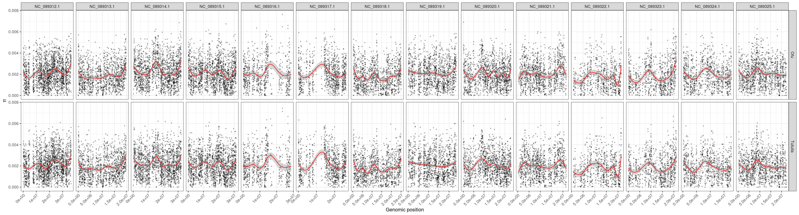
Some slight differences between islands, but overall very similar patterns.

<br>

```r
# calculate pi and summary stats per chromosome
pi_sum_by_chrom_island <- pi_island_filt %>%
  group_by(pop, chromosome) %>% 
  summarise(
    n_windows = n(),
    total_sites = sum(no_sites),
    w_mean = weighted.mean(avg_pi, no_sites),  # weighted mean pi
    uw_mean = mean(avg_pi),                    # unweighted mean pi
    median = median(avg_pi),
    sd = sd(avg_pi),
    q05 = quantile(avg_pi, 0.05),
    q95 = quantile(avg_pi, 0.95),
    .groups = "drop"
  )
```

```
   pop     chromosome  n_windows total_sites pooled_pi  w_mean uw_mean  median      sd      q05     q95
   <fct>   <fct>           <int>       <dbl>     <dbl>   <dbl>   <dbl>   <dbl>   <dbl>    <dbl>   <dbl>
 1 Ofu     NC_089312.1      1929    16465783   0.00217 0.00217 0.00212 0.00206 0.00116 0.000374 0.00418
 2 Ofu     NC_089313.1      1238    10583414   0.00192 0.00192 0.00188 0.00176 0.00110 0.000311 0.00385
 3 Ofu     NC_089314.1      1674    14327238   0.00235 0.00235 0.00231 0.00220 0.00123 0.000453 0.00451
 4 Ofu     NC_089315.1      1711    14649218   0.00214 0.00213 0.00209 0.00199 0.00117 0.000346 0.00415
 5 Ofu     NC_089316.1       699     5718524   0.00215 0.00214 0.00208 0.00183 0.00135 0.000230 0.00455
 6 Ofu     NC_089317.1       954     8016663   0.00210 0.00210 0.00205 0.00193 0.00120 0.000363 0.00425
 7 Ofu     NC_089318.1      1177     9919168   0.00187 0.00187 0.00182 0.00168 0.00114 0.000210 0.00385
 8 Ofu     NC_089319.1      1303    11201350   0.00214 0.00214 0.00210 0.00204 0.00119 0.000354 0.00432
 9 Ofu     NC_089320.1      1369    11700279   0.00207 0.00207 0.00202 0.00187 0.00115 0.000330 0.00417
10 Ofu     NC_089321.1      1147     9734480   0.00218 0.00217 0.00213 0.00201 0.00119 0.000397 0.00433
11 Ofu     NC_089322.1       741     6116158   0.00178 0.00178 0.00173 0.00153 0.00118 0.000170 0.00409
12 Ofu     NC_089323.1       872     7254096   0.00194 0.00193 0.00187 0.00165 0.00125 0.000162 0.00404
13 Ofu     NC_089324.1       918     7752971   0.00200 0.00199 0.00193 0.00182 0.00116 0.000240 0.00406
14 Ofu     NC_089325.1      1229    10542673   0.00212 0.00211 0.00207 0.00195 0.00116 0.000380 0.00408
15 Tutuila NC_089312.1      1929    16465783   0.00220 0.00219 0.00215 0.00205 0.00117 0.000380 0.00424
16 Tutuila NC_089313.1      1238    10583414   0.00196 0.00196 0.00192 0.00178 0.00113 0.000317 0.00399
17 Tutuila NC_089314.1      1674    14327238   0.00229 0.00229 0.00225 0.00212 0.00117 0.000500 0.00431
18 Tutuila NC_089315.1      1711    14649218   0.00215 0.00215 0.00211 0.00203 0.00116 0.000353 0.00411
19 Tutuila NC_089316.1       699     5718524   0.00216 0.00216 0.00209 0.00187 0.00134 0.000245 0.00458
20 Tutuila NC_089317.1       954     8016663   0.00218 0.00217 0.00212 0.00196 0.00124 0.000390 0.00433
21 Tutuila NC_089318.1      1177     9919168   0.00186 0.00185 0.00181 0.00167 0.00112 0.000210 0.00384
22 Tutuila NC_089319.1      1303    11201350   0.00215 0.00215 0.00211 0.00205 0.00120 0.000353 0.00429
23 Tutuila NC_089320.1      1369    11700279   0.00210 0.00209 0.00205 0.00191 0.00118 0.000316 0.00424
24 Tutuila NC_089321.1      1147     9734480   0.00215 0.00215 0.00210 0.00202 0.00116 0.000410 0.00415
25 Tutuila NC_089322.1       741     6116158   0.00183 0.00183 0.00177 0.00162 0.00117 0.000182 0.00397
26 Tutuila NC_089323.1       872     7254096   0.00193 0.00192 0.00186 0.00169 0.00121 0.000173 0.00396
27 Tutuila NC_089324.1       918     7752971   0.00193 0.00193 0.00187 0.00176 0.00113 0.000223 0.00391
28 Tutuila NC_089325.1      1229    10542673   0.00203 0.00202 0.00199 0.00186 0.00113 0.000331 0.00400
```

<br>


```r
# plot summary stats by chromosome and island
ggplot(pi_sum_by_chrom_island, aes(x = chromosome, y = pooled_pi, color = pop)) +
  geom_point(size = 3, position = position_dodge(width = 0.5)) +
  geom_errorbar(aes(ymin = q05, ymax = q95), width = 0.2, position = position_dodge(width = 0.5)) +
  labs(
    x = "Chromosome",
    y = expression("pooled"~pi~"(window-based 5th-95th percentile range)")
  ) +
  theme_bw() +
  theme(axis.text.x = element_text(angle = 45, hjust = 1))
```
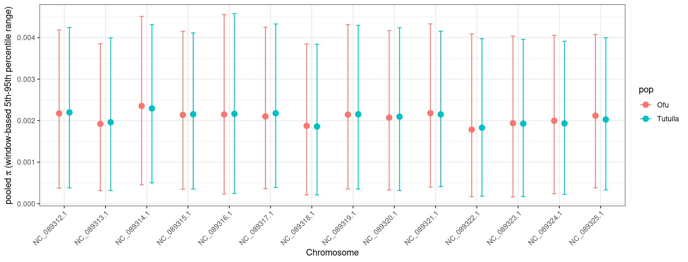

<br>

<br>

#### Island-level theta

```r
# Now island theta files

# Load in files
theta_island_files <- list.files(
  "./island/",
  pattern = "_watterson_theta.txt$",
  full.names = TRUE
)

# name the vector for use in .id column in next step
names(theta_island_files) <- theta_island_files

# import and combine island theta files while creating new column with file path/name
theta_island_raw <- map_dfr(theta_island_files, read_tsv, .id = "source_file")

# reformatting
theta_island <- theta_island_raw %>% 
  mutate(
    chromosome = str_remove(chromosome, "_Pverrucosa$") %>% as.factor(),
    pop = as.factor(pop)
  )

str(theta_island)
```

```
tibble [70,472 × 10] (S3: tbl_df/tbl/data.frame)
 $ source_file        : chr [1:70472] "./island//NC_089312.1_Pverrucosa.island_watterson_theta.txt" "./island//NC_089312.1_Pverrucosa.island_watterson_theta.txt" "./island//NC_089312.1_Pverrucosa.island_watterson_theta.txt" "./island//NC_089312.1_Pverrucosa.island_watterson_theta.txt" ...
 $ pop                : Factor w/ 2 levels "Ofu","Tutuila": 2 1 2 1 1 2 2 1 1 2 ...
 $ chromosome         : Factor w/ 27 levels "NC_089312.1",..: 1 1 1 1 1 1 1 1 1 1 ...
 $ window_pos_1       : num [1:70472] 1 1 10001 10001 20001 ...
 $ window_pos_2       : num [1:70472] 10000 10000 20000 20000 30000 30000 40000 40000 50000 50000 ...
 $ avg_watterson_theta: num [1:70472] NA NA 0 0 0 ...
 $ no_sites           : num [1:70472] 0 0 189 189 864 ...
 $ raw_watterson_theta: num [1:70472] NA NA 0 0 0 ...
 $ no_var_sites       : num [1:70472] 0 0 0 0 0 0 13 14 0 0 ...
 $ weighted_no_sites  : num [1:70472] NA NA 181 170 762 ...
```

<br>

Filter out low-data windows:
```r
# filter dataset based on 7000 site cutoff
theta_island_filt <- theta_island %>% 
  filter(no_sites >= 7000)

# summarize remaining windows after filtering
theta_island %>%
  summarise(
    total = n(),
    retained = sum(no_sites >= 7000),
    prop = retained / total
  )
```

```r
# plot distribution of theta across filtered 10kb windows
ggplot(theta_island_filt, aes(x = avg_watterson_theta, fill = pop)) +
  geom_histogram(bins = 50, alpha = 0.5, position = "identity") +
  #facet_wrap(~ pop) +
  labs(
    x = "Watterson's θ",
    y = "Number of 10 kb windows"
  ) +
  theme_bw()
```

Tutuila and Ofu theta distributions are more differentiated compared to pi. Ofu distribution shifted slightly right compared to Tutuila.

<br>

```r
# calculate full summary stats for genome-wide theta by island
theta_sum_island <- theta_island_filt %>% 
  group_by(pop) %>% 
  summarise(
    pooled_theta = sum(raw_watterson_theta, na.rm = TRUE) / sum(weighted_no_sites, na.rm = TRUE), # pixy-recommended approach for aggregating across windows
    w_mean = weighted.mean(avg_watterson_theta, no_sites),
    median = median(avg_watterson_theta),
    sd = sd(avg_watterson_theta),
    q05 = quantile(avg_watterson_theta, 0.05),
    q95 = quantile(avg_watterson_theta, 0.95)
  )

wmean_theta_ofu <- theta_sum_island$w_mean[1]
wmean_theta_tutuila <- theta_sum_island$w_mean[2]

# genome-wide weighted mean theta: Tutuila=0.0021526, Ofu=0.0023612

pooled_theta_ofu <- theta_sum_island$pooled_theta[1]
pooled_theta_tutuila <- theta_sum_island$pooled_theta[2]

# genome-wide pooled theta: Tutuila=0.0021633, Ofu=0.0023754
```

```
# replot with weighted mean theta for each island
ggplot(theta_island_filt, aes(x = avg_watterson_theta, fill = pop)) +
  geom_histogram(bins = 50, alpha = 0.5, position = "identity") +
  geom_vline(xintercept = wmean_theta_ofu, linetype = "dashed", color = "red") +
  geom_vline(xintercept = wmean_theta_tutuila, linetype = "dashed", color = "blue") +
  labs(
    x = "Watterson's θ",
    y = "Count of 10 kb windows"
  ) +
  theme_bw()
```
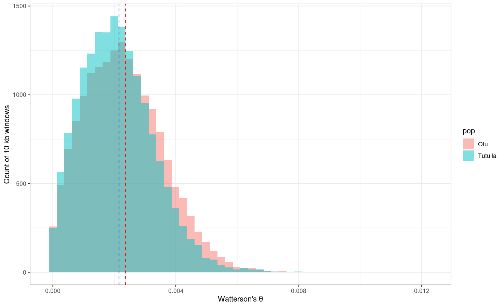
Ofu distribution is shifted right compared to Tutuila.

<br>

```r
# facet by chromosome and island (using pooled_theta_ofu/tutuila as x-intercept for reference)
ggplot(theta_island_filt, aes(x = avg_watterson_theta, fill = pop)) +
  geom_histogram(bins = 50, alpha = 0.5, position = "identity") +
  geom_vline(xintercept = pooled_theta_ofu, linetype = "dashed", color = "red") +
  geom_vline(xintercept = pooled_theta_tutuila, linetype = "dashed", color = "blue") +
  facet_grid(pop ~ chromosome) +
  labs(
    x = "Watterson's θ",
    y = "Count of 10 kb windows"
  ) +
  theme_bw() +
  theme(axis.text.x = element_text(angle = 45, hjust = 1))
```
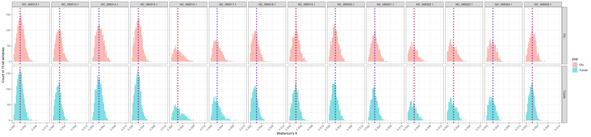


<br>

```r
# plot per-window theta across genome by island
ggplot(theta_island_filt, aes(x = window_pos_1, y = avg_watterson_theta)) +
  geom_point(alpha = 0.3, size = 0.5) +
  geom_smooth(span = 0.1, color = "red", linewidth = 0.5) +
  facet_grid(pop ~ chromosome, scales = "free_x") +
  labs(
    x = "Genomic position",
    y = "θw"
  ) +
  theme_bw() +
  theme(axis.text.x = element_text(angle = 45, hjust = 1))
```
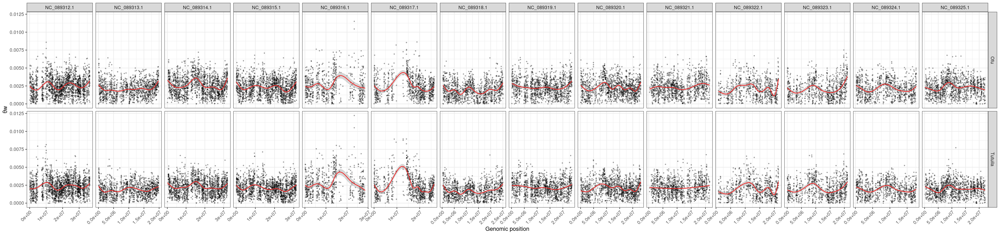
Mostly similar patterns, but some small differences between islands.

<br>

```r
# calculate theta and summary stats per chromosome
theta_sum_by_chrom_island <- theta_island_filt %>%
  group_by(pop, chromosome) %>% 
  summarise(
    n_windows = n(),
    total_sites = sum(no_sites),
    pooled_theta = sum(raw_watterson_theta, na.rm = TRUE) / sum(weighted_no_sites, na.rm = TRUE), # pixy-recommended approach for aggregating across windows
    w_mean = weighted.mean(avg_watterson_theta, no_sites),  # weighted mean theta
    uw_mean = mean(avg_watterson_theta),                    # unweighted mean theta
    median = median(avg_watterson_theta),
    sd = sd(avg_watterson_theta),
    q05 = quantile(avg_watterson_theta, 0.05),
    q95 = quantile(avg_watterson_theta, 0.95),
    .groups = "drop"
  )
  ```

  ```
     pop     chromosome  n_windows total_sites pooled_theta  w_mean uw_mean  median       sd      q05     q95
   <fct>   <fct>           <int>       <dbl>        <dbl>   <dbl>   <dbl>   <dbl>    <dbl>    <dbl>   <dbl>
 1 Ofu     NC_089312.1      1929    16465783      0.00254 0.00253 0.00248 0.00239 0.00129  0.000515 0.00473
 2 Ofu     NC_089313.1      1238    10583414      0.00216 0.00215 0.00210 0.00205 0.00112  0.000397 0.00410
 3 Ofu     NC_089314.1      1674    14327238      0.00265 0.00264 0.00259 0.00250 0.00130  0.000666 0.00486
 4 Ofu     NC_089315.1      1711    14649218      0.00237 0.00236 0.00231 0.00225 0.00118  0.000479 0.00434
 5 Ofu     NC_089316.1       699     5718524      0.00269 0.00267 0.00259 0.00226 0.00170  0.000340 0.00557
 6 Ofu     NC_089317.1       954     8016663      0.00246 0.00244 0.00239 0.00217 0.00144  0.000486 0.00485
 7 Ofu     NC_089318.1      1177     9919168      0.00200 0.00199 0.00193 0.00185 0.00113  0.000247 0.00395
 8 Ofu     NC_089319.1      1303    11201350      0.00239 0.00238 0.00233 0.00228 0.00120  0.000439 0.00442
 9 Ofu     NC_089320.1      1369    11700279      0.00234 0.00232 0.00227 0.00214 0.00120  0.000418 0.00442
10 Ofu     NC_089321.1      1147     9734480      0.00244 0.00242 0.00237 0.00229 0.00126  0.000528 0.00461
11 Ofu     NC_089322.1       741     6116158      0.00218 0.00216 0.00210 0.00191 0.00134  0.000221 0.00458
12 Ofu     NC_089323.1       872     7254096      0.00223 0.00221 0.00214 0.00197 0.00139  0.000218 0.00464
13 Ofu     NC_089324.1       918     7752971      0.00221 0.00220 0.00213 0.00207 0.00122  0.000308 0.00418
14 Ofu     NC_089325.1      1229    10542673      0.00238 0.00237 0.00233 0.00230 0.00117  0.000504 0.00435
15 Tutuila NC_089312.1      1929    16465783      0.00234 0.00233 0.00229 0.00221 0.00118  0.000489 0.00432
16 Tutuila NC_089313.1      1238    10583414      0.00192 0.00192 0.00187 0.00184 0.000996 0.000368 0.00362
17 Tutuila NC_089314.1      1674    14327238      0.00234 0.00233 0.00229 0.00223 0.00112  0.000600 0.00419
18 Tutuila NC_089315.1      1711    14649218      0.00212 0.00211 0.00207 0.00202 0.00107  0.000433 0.00387
19 Tutuila NC_089316.1       699     5718524      0.00270 0.00268 0.00260 0.00227 0.00173  0.000386 0.00568
20 Tutuila NC_089317.1       954     8016663      0.00238 0.00236 0.00231 0.00203 0.00151  0.000458 0.00506
21 Tutuila NC_089318.1      1177     9919168      0.00181 0.00180 0.00175 0.00168 0.00104  0.000244 0.00358
22 Tutuila NC_089319.1      1303    11201350      0.00223 0.00222 0.00217 0.00214 0.00110  0.000427 0.00408
23 Tutuila NC_089320.1      1369    11700279      0.00211 0.00210 0.00206 0.00196 0.00111  0.000377 0.00404
24 Tutuila NC_089321.1      1147     9734480      0.00220 0.00218 0.00214 0.00205 0.00111  0.000455 0.00409
25 Tutuila NC_089322.1       741     6116158      0.00204 0.00202 0.00196 0.00185 0.00126  0.000202 0.00436
26 Tutuila NC_089323.1       872     7254096      0.00209 0.00208 0.00201 0.00184 0.00127  0.000245 0.00422
27 Tutuila NC_089324.1       918     7752971      0.00198 0.00197 0.00191 0.00184 0.00108  0.000281 0.00380
28 Tutuila NC_089325.1      1229    10542673      0.00204 0.00203 0.00199 0.00199 0.00100  0.000439 0.00367
  ```

  <br>

  ```r
# plot summary stats by chromosome and island
ggplot(theta_sum_by_chrom_island, aes(x = chromosome, y = pooled_theta, color = pop)) +
  geom_point(size = 3, position = position_dodge(width = 0.5)) +
  geom_errorbar(aes(ymin = q05, ymax = q95), width = 0.2, position = position_dodge(width = 0.5)) +
  labs(
    x = "Chromosome",
    y = expression("pooled"~theta~"(window-based 5th-95th percentile range)")
  ) +
  theme_bw() +
  theme(axis.text.x = element_text(angle = 45, hjust = 1))
  ```
  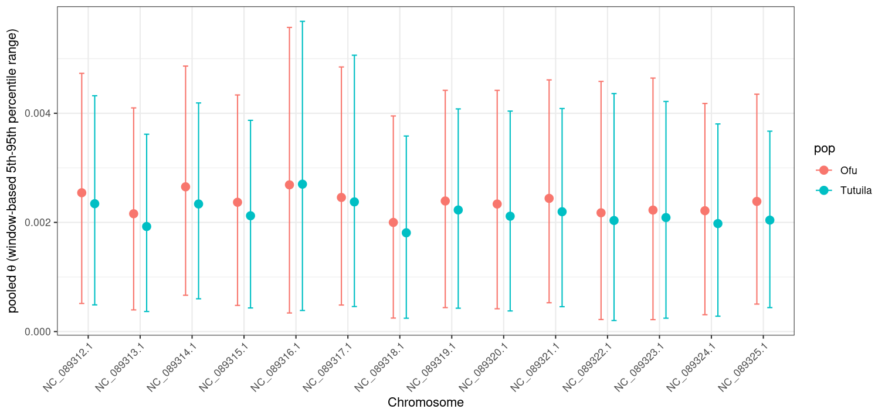
  Ofu theta pretty consistenty higher than Tutuila theta across chromosomes, with exception of Chromosom 316.1, which is one of the chromosomes with more missing data.

<br>
<br>

#### Island-level Tajima's D

```r
# Now island Tajima's D files

# Load in files
tajimad_island_files <- list.files(
  "./island/",
  pattern = "_tajima_d.txt$",
  full.names = TRUE
)

# name the vector for use in .id column in next step
names(tajimad_island_files) <- tajimad_island_files

# import and combine island tajimad files while creating new column with file path/name
tajimad_island_raw <- map_dfr(tajimad_island_files, read_tsv, .id = "source_file")

# reformatting
tajimad_island <- tajimad_island_raw %>% 
  mutate(
    chromosome = str_remove(chromosome, "_Pverrucosa$") %>% as.factor(),
    pop = as.factor(pop)
  )

str(tajimad_island)
```

```
tibble [70,472 × 10] (S3: tbl_df/tbl/data.frame)
 $ source_file        : chr [1:70472] "./island//NC_089312.1_Pverrucosa.island_tajima_d.txt" "./island//NC_089312.1_Pverrucosa.island_tajima_d.txt" "./island//NC_089312.1_Pverrucosa.island_tajima_d.txt" "./island//NC_089312.1_Pverrucosa.island_tajima_d.txt" ...
 $ pop                : Factor w/ 2 levels "Ofu","Tutuila": 2 1 2 1 1 2 2 1 1 2 ...
 $ chromosome         : Factor w/ 27 levels "NC_089312.1",..: 1 1 1 1 1 1 1 1 1 1 ...
 $ window_pos_1       : num [1:70472] 1 1 10001 10001 20001 ...
 $ window_pos_2       : num [1:70472] 10000 10000 20000 20000 30000 30000 40000 40000 50000 50000 ...
 $ tajima_d           : num [1:70472] NA NA NA NA NA ...
 $ no_sites           : num [1:70472] 0 0 189 189 864 ...
 $ raw_pi             : num [1:70472] NA NA 0 0 0 ...
 $ raw_watterson_theta: num [1:70472] NA NA 0 0 0 ...
 $ tajima_d_stdev     : num [1:70472] NA NA 0 0 0 ...
```

<br>

```r
# filter dataset based on 7000 site cutoff
tajimad_island_filt <- tajimad_island %>% 
  filter(no_sites >= 7000)

# summarize remaining windows after filtering
tajimad_island %>%
  summarise(
    total = n(),
    retained = sum(no_sites >= 7000),
    prop = retained / total
  )
```

```
  total retained  prop
  <int>    <int> <dbl>
  70472    33922 0.481
```

<br>

```r
# plot distribution of tajimad across filtered 10kb windows
ggplot(tajimad_island_filt, aes(x = tajima_d, fill = pop)) +
  geom_histogram(bins = 50, alpha = 0.5, position = "identity") +
  #facet_wrap(~ pop) +
  labs(
    x = "Tajima's D",
    y = "Number of 10 kb windows"
  ) +
  theme_bw()
```

Tutuila and Ofu Tajima's D distributions are differentiated similar to theta. Ofu distribution shifted left (more negative) compared to Tutuila.

<br>

Count NAs:
```r
# determine how many NAs in dataset (windows where pi and theta were both 0 (invariant regions), so Tajima's D is undefined)
tajimad_island_filt %>% filter(pop == "Ofu") %>% filter(is.na(tajima_d)) %>% nrow()
tajimad_island_filt %>% filter(pop == "Tutuila") %>% filter(is.na(tajima_d)) %>% nrow()
```

```
71
49
```
71 and 49 windows have tajima_d = NA for the Ofu and Tutuila subsets, respectively.

<br>

```r
# calculate full summary stats for genome-wide tajimad by island
tajimad_sum_island <- tajimad_island_filt %>% 
  group_by(pop) %>% 
  summarise(
    w_mean = weighted.mean(tajima_d, no_sites, na.rm = TRUE), # have to rely on weighted means here because Tajima's D cannot be pooled across windows like pi and theta
    median = median(tajima_d, na.rm = TRUE),
    sd = sd(tajima_d, na.rm = TRUE),
    q05 = quantile(tajima_d, 0.05, na.rm = TRUE),
    q95 = quantile(tajima_d, 0.95, na.rm = TRUE)
  )

wmean_tajimad_ofu <- tajimad_sum_island$w_mean[1]
wmean_tajimad_tutuila <- tajimad_sum_island$w_mean[2]

# genome-wide weighted mean tajimad: Tutuila=-0.07674, Ofu=-0.40812
```

```
  pop      w_mean  median    sd   q05   q95
  <fct>     <dbl>   <dbl> <dbl> <dbl> <dbl>
1 Ofu     -0.408  -0.413  0.723 -1.60 0.792
2 Tutuila -0.0767 -0.0952 0.756 -1.29 1.20 
```
Weighted mean Tajima's D is more negative for Ofu samples than Tutuila.

<br>

```r
# replot with weighted mean tajimad for each island
ggplot(tajimad_island_filt, aes(x = tajima_d, fill = pop)) +
  geom_histogram(bins = 50, alpha = 0.5, position = "identity") +
  geom_vline(xintercept = wmean_tajimad_ofu, linetype = "dashed", color = "red") +
  geom_vline(xintercept = wmean_tajimad_tutuila, linetype = "dashed", color = "blue") +
  labs(
    x = "Tajima's D",
    y = "Count of 10 kb windows"
  ) +
  theme_bw()
```
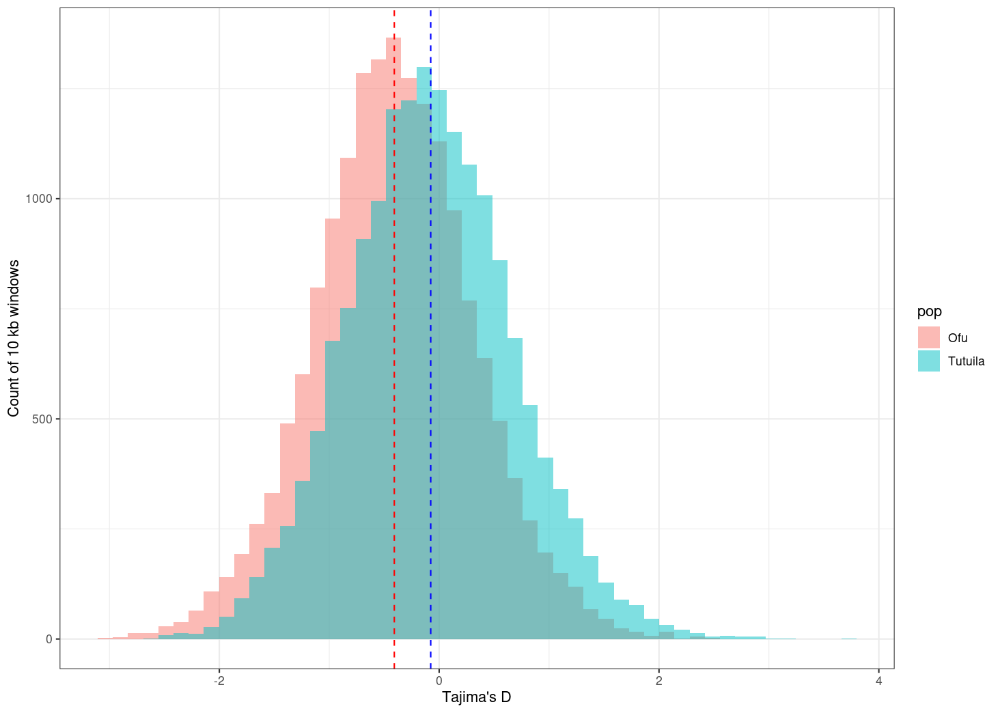


**Interpretation**: A larger theta and more negative Tajima's D means Ofu shows an excess of low-frequency (rare) alleles (relative to expectations under neutrality) that is more extreme than that seen in the Tutuila sample set, indicative of more recent/intense expansion or founding event (e.g., after large disturbance event?) or stronger purifying/background selection. Sample size differences between Ofu (24) and Tutuila (111) would be expected to bias θ downward in Ofu and Tajima’s D upward, but the observed pattern shows the opposite trend, indicating that the signal is unlikely to be driven by sampling effects alone.

<br>

```r
# Double check callable sites by island
tajimad_island_filt %>%
  group_by(pop) %>%
  summarise(mean_sites = mean(no_sites))
  ```
  ```
    pop     mean_sites
  1 Ofu          8489.
  2 Tutuila      8489.
  ```
Mean number of callable sites is identical (8489) across islands.

<br>

```r
# facet by chromosome and island (using wmean_tajimad_ofu/tutuila as x-intercept for reference)
ggplot(tajimad_island_filt, aes(x = tajima_d, fill = pop)) +
  geom_histogram(bins = 50, alpha = 0.5, position = "identity") +
  geom_vline(xintercept = wmean_tajimad_ofu, linetype = "dashed", color = "red") +
  geom_vline(xintercept = wmean_tajimad_tutuila, linetype = "dashed", color = "blue") +
  facet_grid(pop ~ chromosome) +
  labs(
    x = "Tajima's D",
    y = "Count of 10 kb windows"
  ) +
  theme_bw() +
  theme(axis.text.x = element_text(angle = 45, hjust = 1))
```
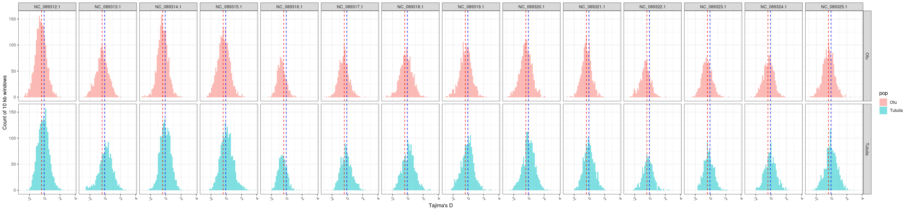
Difference between Ofu and Tutuila is slightly more pronounced in some chromosomes than others, but overall pretty consistent negative shift in Ofu across all chromosomes.

<br>

```r
# plot per-window tajimad across genome by island
ggplot(tajimad_island_filt, aes(x = window_pos_1, y = tajima_d)) +
  geom_point(alpha = 0.3, size = 0.5) +
  geom_smooth(span = 0.1, color = "red", linewidth = 0.5) +
  facet_grid(pop ~ chromosome, scales = "free_x") +
  labs(
    x = "Genomic position",
    y = "Tajima's D"
  ) +
  theme_bw() +
  theme(axis.text.x = element_text(angle = 45, hjust = 1))
```
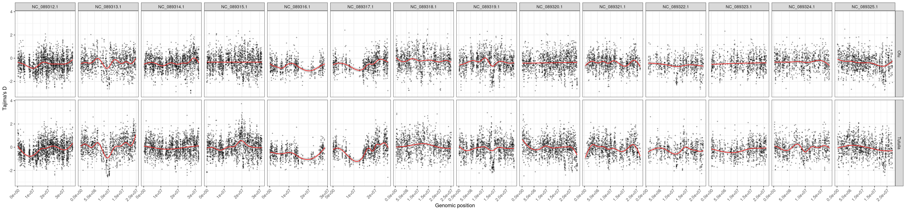

<br>

```r
# calculate tajimad and summary stats per chromosome
tajimad_sum_by_chrom_island <- tajimad_island_filt %>%
  group_by(pop, chromosome) %>% 
  summarise(
    n_windows = n(),
    total_sites = sum(no_sites),
    w_mean = weighted.mean(tajima_d, no_sites, na.rm = TRUE),  # have to rely on weighted means here because Tajima's D cannot be pooled across windows like pi and theta
    uw_mean = mean(tajima_d, na.rm = TRUE),                    # unweighted mean theta
    median = median(tajima_d, na.rm = TRUE),
    sd = sd(tajima_d, na.rm = TRUE),
    q05 = quantile(tajima_d, 0.05, na.rm = TRUE),
    q95 = quantile(tajima_d, 0.95, na.rm = TRUE),
    .groups = "drop"
  )
```

```
   pop     chromosome  n_windows total_sites  w_mean uw_mean  median    sd   q05   q95
   <fct>   <fct>           <int>       <dbl>   <dbl>   <dbl>   <dbl> <dbl> <dbl> <dbl>
 1 Ofu     NC_089312.1      1929    16465783 -0.496  -0.495  -0.502  0.715 -1.66 0.696
 2 Ofu     NC_089313.1      1238    10583414 -0.385  -0.377  -0.368  0.777 -1.76 0.888
 3 Ofu     NC_089314.1      1674    14327238 -0.399  -0.398  -0.405  0.672 -1.45 0.683
 4 Ofu     NC_089315.1      1711    14649218 -0.343  -0.341  -0.351  0.770 -1.62 0.916
 5 Ofu     NC_089316.1       699     5718524 -0.670  -0.671  -0.697  0.554 -1.49 0.288
 6 Ofu     NC_089317.1       954     8016663 -0.451  -0.452  -0.444  0.657 -1.48 0.636
 7 Ofu     NC_089318.1      1177     9919168 -0.212  -0.208  -0.205  0.788 -1.44 1.07 
 8 Ofu     NC_089319.1      1303    11201350 -0.370  -0.361  -0.334  0.778 -1.69 0.928
 9 Ofu     NC_089320.1      1369    11700279 -0.395  -0.392  -0.385  0.758 -1.67 0.868
10 Ofu     NC_089321.1      1147     9734480 -0.374  -0.373  -0.389  0.646 -1.45 0.718
11 Ofu     NC_089322.1       741     6116158 -0.605  -0.599  -0.569  0.675 -1.87 0.440
12 Ofu     NC_089323.1       872     7254096 -0.445  -0.442  -0.473  0.661 -1.53 0.675
13 Ofu     NC_089324.1       918     7752971 -0.337  -0.331  -0.290  0.683 -1.50 0.748
14 Ofu     NC_089325.1      1229    10542673 -0.406  -0.404  -0.393  0.733 -1.68 0.800
15 Tutuila NC_089312.1      1929    16465783 -0.172  -0.175  -0.179  0.724 -1.33 1.03 
16 Tutuila NC_089313.1      1238    10583414  0.0703  0.0753  0.123  0.859 -1.44 1.44 
17 Tutuila NC_089314.1      1674    14327238 -0.0406 -0.0401 -0.0664 0.682 -1.12 1.09 
18 Tutuila NC_089315.1      1711    14649218  0.0624  0.0616  0.0297 0.809 -1.21 1.43 
19 Tutuila NC_089316.1       699     5718524 -0.555  -0.557  -0.578  0.541 -1.42 0.324
20 Tutuila NC_089317.1       954     8016663 -0.130  -0.136  -0.163  0.719 -1.24 1.15 
21 Tutuila NC_089318.1      1177     9919168  0.0989  0.0990  0.104  0.795 -1.20 1.42 
22 Tutuila NC_089319.1      1303    11201350 -0.117  -0.111  -0.0657 0.783 -1.49 1.19 
23 Tutuila NC_089320.1      1369    11700279 -0.0139 -0.0109 -0.0353 0.768 -1.33 1.23 
24 Tutuila NC_089321.1      1147     9734480 -0.0545 -0.0579 -0.0813 0.698 -1.19 1.14 
25 Tutuila NC_089322.1       741     6116158 -0.261  -0.256  -0.260  0.684 -1.45 0.818
26 Tutuila NC_089323.1       872     7254096 -0.222  -0.223  -0.257  0.643 -1.24 0.825
27 Tutuila NC_089324.1       918     7752971 -0.0576 -0.0568 -0.0603 0.719 -1.17 1.22 
28 Tutuila NC_089325.1      1229    10542673 -0.0401 -0.0405 -0.0709 0.789 -1.42 1.26 
```

<br>

```r
# plot summary stats by chromosome and island
ggplot(tajimad_sum_by_chrom_island, aes(x = chromosome, y = w_mean, color = pop)) +
  geom_point(size = 3, position = position_dodge(width = 0.5)) +
  geom_errorbar(aes(ymin = q05, ymax = q95), width = 0.2, position = position_dodge(width = 0.5)) +
  labs(
    x = "Chromosome",
    y = "Weighted mean Tajima's D (window-based 5th-95th percentile range)"
  ) +
  theme_bw() +
  theme(axis.text.x = element_text(angle = 45, hjust = 1))
```
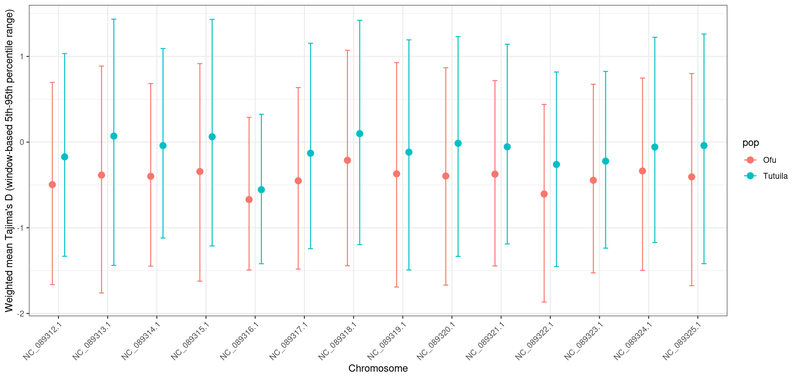

<br>

```r
# Make summary table of island-level stats for "island" comparison
# report pooled stats (or weighted mean for Tajima's D) + window-derived 5-95% quantile range

island_summary <- pi_sum_island %>%
  select(pop, pooled_pi, q05, q95) %>%
  rename(
    population = pop,
    pi_q05 = q05,
    pi_q95 = q95
  ) %>%
  left_join(
    theta_sum_island %>%
      select(pop, pooled_theta, q05, q95) %>%
      rename(
        population = pop,
        theta_q05 = q05,
        theta_q95 = q95
      ),
    by = "population"
  ) %>%
  left_join(
    tajimad_sum_island %>%
      select(pop, w_mean, q05, q95) %>%
      rename(
        population = pop,
        wmean_TajimasD = w_mean,
        TajimasD_q05 = q05,
        TajimasD_q95 = q95
      ),
    by = "population"
  )


# more readable compact version
island_summary_compact <- island_summary %>%
  transmute(
    population,
    pi = sprintf("%.5f (%.5f–%.5f)", pooled_pi, pi_q05, pi_q95),
    theta = sprintf("%.5f (%.5f–%.5f)", pooled_theta, theta_q05, theta_q95),
    TajimasD = sprintf("%.3f (%.3f–%.3f)", wmean_TajimasD, TajimasD_q05, TajimasD_q95)
  )
```

```
  population pi                        theta                     TajimasD             
1 Ofu        0.00209 (0.00032–0.00419) 0.00238 (0.00041–0.00456) -0.408 (-1.598–0.792)
2 Tutuila    0.00209 (0.00032–0.00416) 0.00216 (0.00039–0.00417) -0.077 (-1.293–1.199)
```

<br>

<br>

### "Location" pixy run (location-level summaries and comparisons)

Now move on to the sampling location-comparison files.

#### Location-level pi
Load pi files:

```r
# Pi files first

# Load in files
pi_location_files <- list.files(
  "./location/",
  pattern = "_pi.txt$",
  full.names = TRUE
)

# name the vector for use in .id column in next step
names(pi_location_files) <- pi_location_files

# import and combine location pi files while creating new column with file path/name
pi_location_raw <- map_dfr(pi_location_files, read_tsv, .id = "source_file")

# reformatting
pi_location <- pi_location_raw %>% 
  mutate(
    chromosome = str_remove(chromosome, "_Pverrucosa$") %>% as.factor(),
    pop = as.factor(pop)
  )

str(pi_location)
```

```
tibble [352,360 × 10] (S3: tbl_df/tbl/data.frame)
 $ source_file      : chr [1:352360] "./location//NC_089312.1_Pverrucosa.location_pi.txt" "./location//NC_089312.1_Pverrucosa.location_pi.txt" "./location//NC_089312.1_Pverrucosa.location_pi.txt" "./location//NC_089312.1_Pverrucosa.location_pi.txt" ...
 $ pop              : Factor w/ 10 levels "ALOF","AOAA",..: 1 2 3 4 6 5 8 7 10 9 ...
 $ chromosome       : Factor w/ 27 levels "NC_089312.1",..: 1 1 1 1 1 1 1 1 1 1 ...
 $ window_pos_1     : num [1:352360] 1 1 1 1 1 1 1 1 1 1 ...
 $ window_pos_2     : num [1:352360] 10000 10000 10000 10000 10000 10000 10000 10000 10000 10000 ...
 $ avg_pi           : num [1:352360] NA NA NA NA NA NA NA NA NA NA ...
 $ no_sites         : num [1:352360] 0 0 0 0 0 0 0 0 0 0 ...
 $ count_diffs      : num [1:352360] NA NA NA NA NA NA NA NA NA NA ...
 $ count_comparisons: num [1:352360] NA NA NA NA NA NA NA NA NA NA ...
 $ count_missing    : num [1:352360] NA NA NA NA NA NA NA NA NA NA ...
```

<br>

```
# plot distribution of callable sites per 10kb window
ggplot(pi_location, aes(x = no_sites)) +
  geom_histogram(bins = 50) +
  geom_vline(xintercept = 7000, linetype = "dashed") +  # cutoff I've been using for previous pixy runs
  facet_wrap(~ pop) +
  labs(
    x = "Number of callable sites per window",
    y = "Number of windows"
  ) +
  scale_x_continuous(breaks = seq(from=0, to = 10000, by = 2000)) +
  theme_bw() +
  theme(axis.text.x = element_text(angle = 45, hjust = 1))
```
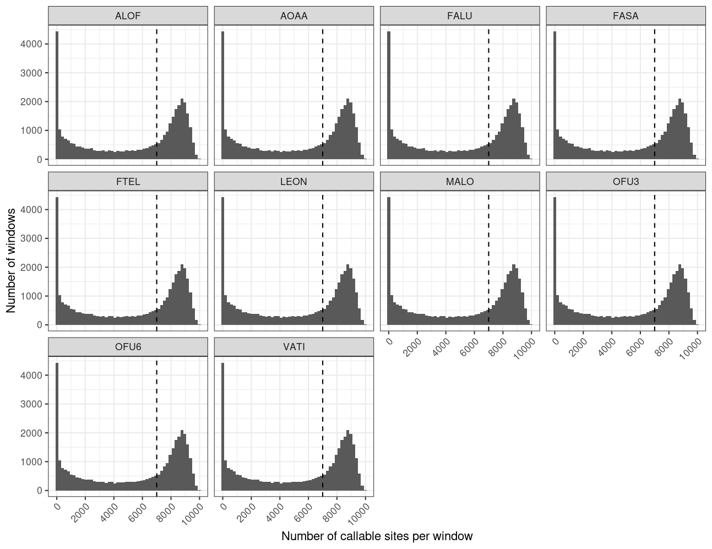

<br>

```r
# filter dataset based on 7000 site cutoff
pi_location_filt <- pi_location %>% 
  filter(no_sites >= 7000)

# summarize remaining windows after filtering
pi_location %>%
  summarise(
    total = n(),
    retained = sum(no_sites >= 7000),
    prop = retained / total
  )
```

```
   total retained  prop
1 352360   169610 0.481
```

<br>

```r
# sensitivity check: try other cutoffs to see how it changes number of retained windows
pi_location %>%
  summarise(
    prop_6000 = mean(no_sites >= 6000),
    prop_7000 = mean(no_sites >= 7000),
    prop_8000 = mean(no_sites >= 8000)
  )
```

```
  prop_6000 prop_7000 prop_8000
      <dbl>     <dbl>     <dbl>
1     0.542     0.481     0.367
```
Decreasing cutoff to 6000 doesn't add that much more data (6%). Increasing to 8000 removes a significant chunk of data (11%). So 7000 still looks like the sweet spot.

<br>

```r
# confirm number of windows remaining for each location
table(pi_location_filt$pop)
```

```
ALOF  AOAA  FALU  FASA  FTEL  LEON  MALO  OFU3  OFU6  VATI 
16961 16961 16961 16961 16961 16961 16961 16961 16961 16961
```

<br>

```r
# plot distribution of pi across filtered 10kb windows
ggplot(pi_location_filt, aes(x = avg_pi, fill = pop)) +
  geom_histogram(bins = 50, alpha = 0.5, position = "identity") +
  facet_wrap(~ pop) +
  labs(
    x = "Nucleotide diversity (π)",
    y = "Number of 10 kb windows"
  ) +
  theme_bw()

ggplot(pi_location_filt, aes(x = avg_pi, color = pop)) +
  geom_density(alpha = 0.5, position = "identity") +
  labs(
    x = "Nucleotide diversity (π)",
    y = "Number of 10 kb windows"
  ) +
  theme_bw()
```
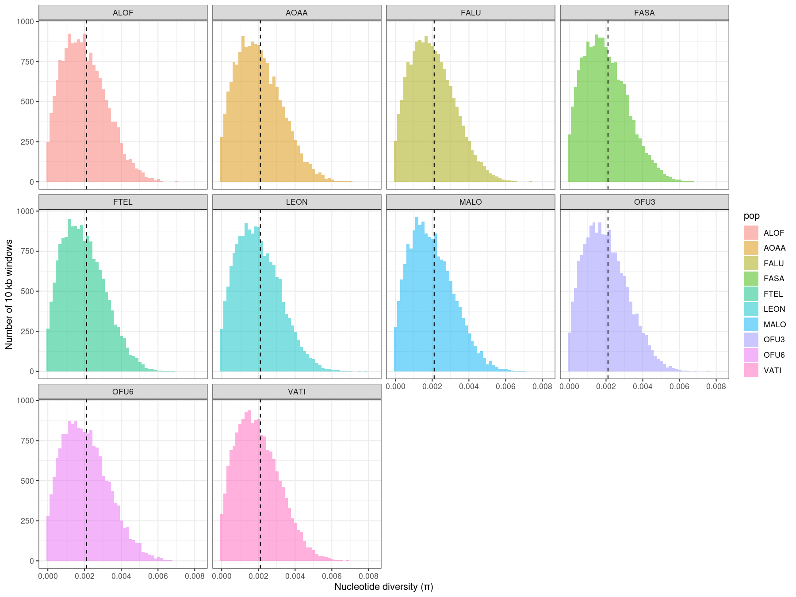
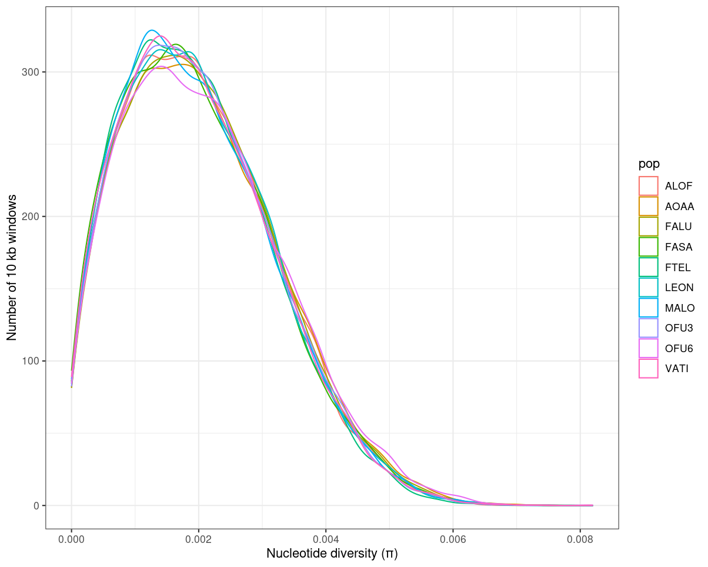
Distributions pretty similar across locations.

<br>

```r
# calculate full summary stats for genome-wide pi by location
pi_sum_location <- pi_location_filt %>% 
  group_by(pop) %>% 
  summarise(
    pooled_pi = sum(count_diffs, na.rm = TRUE) / sum(count_comparisons, na.rm = TRUE), # pixy-recommended approach for aggregating across windows
    w_mean = weighted.mean(avg_pi, no_sites),
    median = median(avg_pi),
    sd = sd(avg_pi),
    q05 = quantile(avg_pi, 0.05),
    q95 = quantile(avg_pi, 0.95)
  )

pi_sum_location %>% arrange(desc(pooled_pi))
```

```
   pop   pooled_pi  w_mean  median      sd      q05     q95
 1 OFU6    0.00213 0.00212 0.00194 0.00125 0.000305 0.00434
 2 AOAA    0.00210 0.00210 0.00192 0.00123 0.000295 0.00426
 3 FALU    0.00209 0.00208 0.00191 0.00120 0.000313 0.00420
 4 ALOF    0.00207 0.00207 0.00190 0.00119 0.000306 0.00414
 5 LEON    0.00206 0.00206 0.00189 0.00119 0.000297 0.00417
 6 OFU3    0.00206 0.00205 0.00188 0.00118 0.000303 0.00415
 7 FASA    0.00204 0.00203 0.00184 0.00120 0.000277 0.00420
 8 VATI    0.00203 0.00203 0.00185 0.00119 0.000285 0.00414
 9 MALO    0.00203 0.00203 0.00184 0.00119 0.000295 0.00416
10 FTEL    0.00201 0.00200 0.00184 0.00116 0.000296 0.00407
```
Similar pi across all locations (0.00201-0.00213)

<br>

```r
# facet by chromosome and location (using pooled_pi_all as x-intercept for reference)
ggplot(pi_location_filt, aes(x = avg_pi, fill = pop)) +
  geom_histogram(bins = 50, alpha = 0.5, position = "identity") +
  geom_vline(xintercept = pooled_pi_all, linetype = "dashed") +
  facet_grid(pop ~ chromosome) +
  labs(
    x = "Nucleotide diversity (π)",
    y = "Count of 10 kb windows"
  ) +
  theme_bw() +
  theme(axis.text.x = element_text(angle = 45, hjust = 1))
```
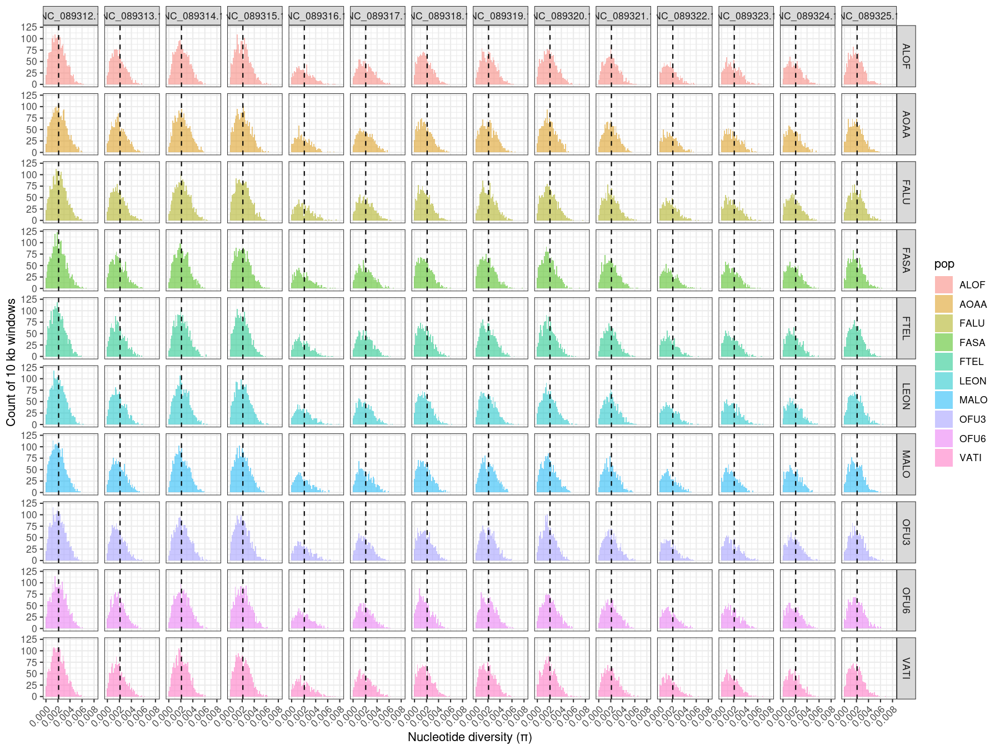

<br>

```r
# plot per-window pi across genome by location
ggplot(pi_location_filt, aes(x = window_pos_1, y = avg_pi)) +
  geom_point(alpha = 0.3, size = 0.5) +
  geom_smooth(span = 0.1, color = "red", linewidth = 0.5) +
  facet_grid(pop ~ chromosome, scales = "free_x") +
  labs(
    x = "Genomic position",
    y = "π"
  ) +
  theme_bw() +
  theme(axis.text.x = element_text(angle = 45, hjust = 1))
```
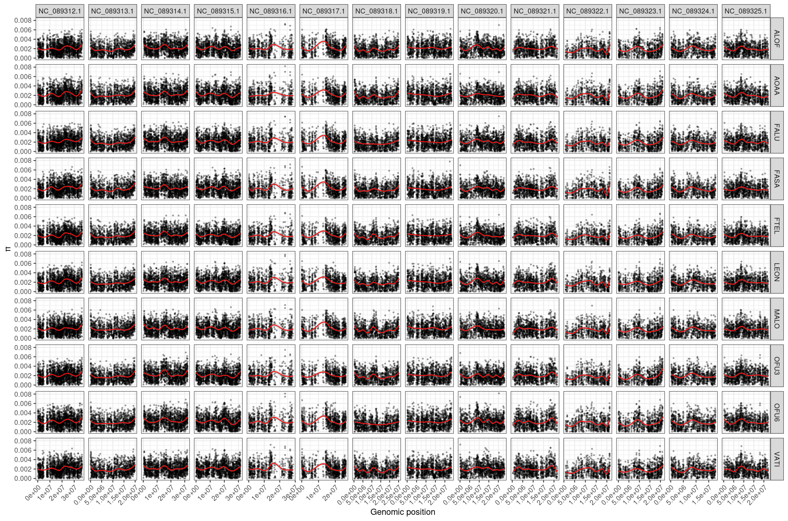

<br>

```r
# calculate pi and summary stats per chromosome
pi_sum_by_chrom_location <- pi_location_filt %>%
  group_by(pop, chromosome) %>% 
  summarise(
    n_windows = n(),
    total_sites = sum(no_sites),
    pooled_pi = sum(count_diffs, na.rm = TRUE) / sum(count_comparisons, na.rm = TRUE), # pixy-recommended approach for aggregating across windows
    w_mean = weighted.mean(avg_pi, no_sites),  # weighted mean pi
    uw_mean = mean(avg_pi),                    # unweighted mean pi
    median = median(avg_pi),
    sd = sd(avg_pi),
    q05 = quantile(avg_pi, 0.05),
    q95 = quantile(avg_pi, 0.95),
    .groups = "drop"
  )


# plot summary stats by chromosome and location
ggplot(pi_sum_by_chrom_location, aes(x = chromosome, y = pooled_pi, color = pop)) +
  geom_point(size = 3, position = position_dodge(width = 0.5)) +
  geom_errorbar(aes(ymin = q05, ymax = q95), width = 0.2, position = position_dodge(width = 0.5)) +
  labs(
    x = "Chromosome",
    y = expression("pooled"~pi~"(window-based 5th-95th percentile range)")
  ) +
  theme_bw() +
  theme(axis.text.x = element_text(angle = 45, hjust = 1))
```
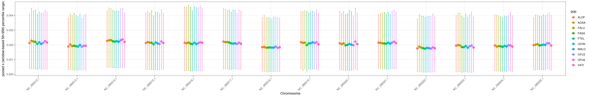
No single location or chromosome stands out as particularly divergent from the rest, consistent with similar pi across all locations. Ofu6 pretty consistently among greatest pi across chromosomes, but some variation.

<br>
<br>

#### Location-level theta

```r
# Now theta files (location run)

# Load in files
theta_location_files <- list.files(
  "./location/",
  pattern = "_watterson_theta.txt$",
  full.names = TRUE
)

# name the vector for use in .id column in next step
names(theta_location_files) <- theta_location_files

# import and combine location theta files while creating new column with file path/name
theta_location_raw <- map_dfr(theta_location_files, read_tsv, .id = "source_file")

# reformatting
theta_location <- theta_location_raw %>% 
  mutate(
    chromosome = str_remove(chromosome, "_Pverrucosa$") %>% as.factor(),
    pop = as.factor(pop)
  )

str(theta_location)
```

```
tibble [352,360 × 10] (S3: tbl_df/tbl/data.frame)
 $ source_file        : chr [1:352360] "./location//NC_089312.1_Pverrucosa.location_watterson_theta.txt" "./location//NC_089312.1_Pverrucosa.location_watterson_theta.txt" "./location//NC_089312.1_Pverrucosa.location_watterson_theta.txt" "./location//NC_089312.1_Pverrucosa.location_watterson_theta.txt" ...
 $ pop                : Factor w/ 10 levels "ALOF","AOAA",..: 1 2 3 4 6 5 8 7 10 9 ...
 $ chromosome         : Factor w/ 27 levels "NC_089312.1",..: 1 1 1 1 1 1 1 1 1 1 ...
 $ window_pos_1       : num [1:352360] 1 1 1 1 1 1 1 1 1 1 ...
 $ window_pos_2       : num [1:352360] 10000 10000 10000 10000 10000 10000 10000 10000 10000 10000 ...
 $ avg_watterson_theta: num [1:352360] NA NA NA NA NA NA NA NA NA NA ...
 $ no_sites           : num [1:352360] 0 0 0 0 0 0 0 0 0 0 ...
 $ raw_watterson_theta: num [1:352360] NA NA NA NA NA NA NA NA NA NA ...
 $ no_var_sites       : num [1:352360] 0 0 0 0 0 0 0 0 0 0 ...
 $ weighted_no_sites  : num [1:352360] NA NA NA NA NA NA NA NA NA NA ...
```

<br>

```r
# plot distribution of callable sites per 10kb window
ggplot(theta_location, aes(x = no_sites)) +
  geom_histogram(bins = 50) +
  geom_vline(xintercept = 7000, linetype = "dashed") +  # cutoff I've been using for previous pixy runs
  facet_wrap(~ pop) +
  labs(
    x = "Number of callable sites per window",
    y = "Number of windows"
  ) +
  scale_x_continuous(breaks = seq(from=0, to = 10000, by = 2000)) +
  theme_bw() +
  theme(axis.text.x = element_text(angle = 45, hjust = 1))
```
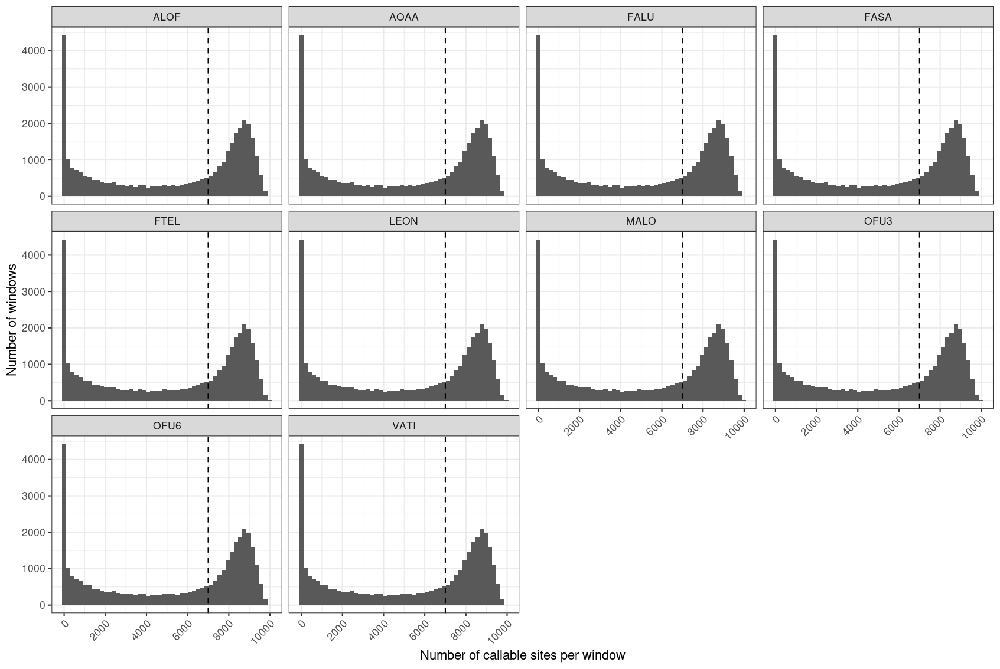

<br>

```r
# filter dataset based on 7000 site cutoff
theta_location_filt <- theta_location %>% 
  filter(no_sites >= 7000)

# summarize remaining windows after filtering
theta_location %>%
  summarise(
    total = n(),
    retained = sum(no_sites >= 7000),
    prop = retained / total
  )
```

```
   total retained  prop
1 352360   169610 0.481
```

<br>

```r
# plot distribution of theta across filtered 10kb windows with pooled theta for ALL samples indicated for reference
ggplot(theta_location_filt, aes(x = avg_watterson_theta, fill = pop)) +
  geom_histogram(bins = 50, alpha = 0.5, position = "identity") +
  geom_vline(xintercept = pooled_theta_all, linetype = "dashed") +
  facet_wrap(~ pop) +
  labs(
    x = "Watterson's θ",
    y = "Number of 10 kb windows"
  ) +
  theme_bw()

ggplot(theta_location_filt, aes(x = avg_watterson_theta, color = pop)) +
  geom_density(alpha = 0.5, position = "identity") +
  labs(
    x = "Watterson's θ",
    y = "Number of 10 kb windows"
  ) +
  theme_bw()
```
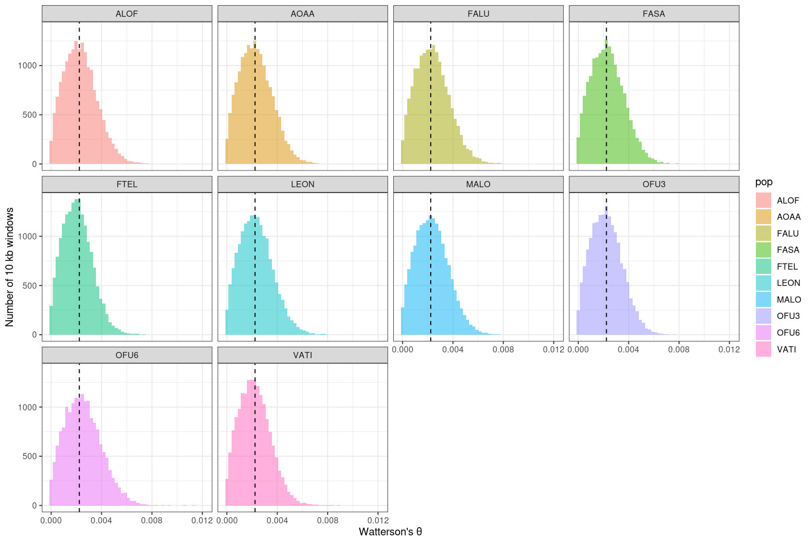
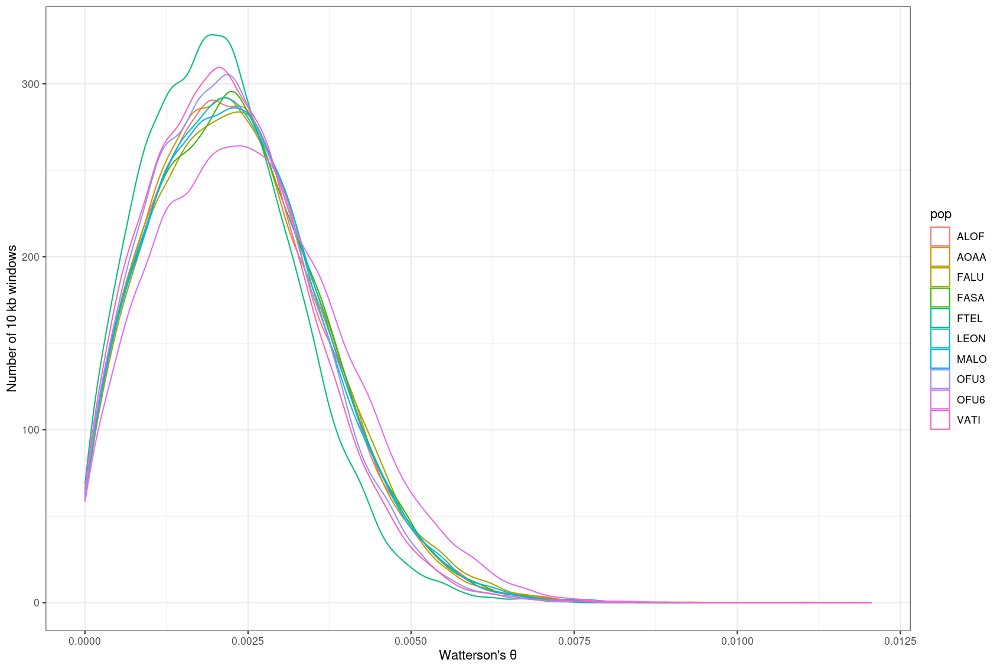
Theta distributions more divergent across locations compared to pi (e.g., OFU6 vs FTEL).

<br>

```r
# calculate full summary stats for genome-wide theta by location
theta_sum_location <- theta_location_filt %>% 
  group_by(pop) %>% 
  summarise(
    pooled_theta = sum(raw_watterson_theta, na.rm = TRUE) / sum(weighted_no_sites, na.rm = TRUE), # pixy-recommended approach for aggregating across windows
    w_mean = weighted.mean(avg_watterson_theta, no_sites),
    median = median(avg_watterson_theta),
    sd = sd(avg_watterson_theta),
    q05 = quantile(avg_watterson_theta, 0.05),
    q95 = quantile(avg_watterson_theta, 0.95)
  )

theta_sum_location %>% arrange(desc(pooled_theta))
```

```
   pop   pooled_theta  w_mean  median      sd      q05     q95
   <fct>        <dbl>   <dbl>   <dbl>   <dbl>    <dbl>   <dbl>
 1 OFU6       0.00262 0.00261 0.00244 0.00143 0.000433 0.00510
 2 FALU       0.00246 0.00245 0.00229 0.00134 0.000415 0.00474
 3 FASA       0.00242 0.00241 0.00226 0.00131 0.000395 0.00466
 4 MALO       0.00241 0.00240 0.00226 0.00130 0.000399 0.00464
 5 LEON       0.00241 0.00240 0.00224 0.00131 0.000404 0.00466
 6 ALOF       0.00241 0.00239 0.00224 0.00131 0.000410 0.00467
 7 AOAA       0.00239 0.00238 0.00221 0.00130 0.000395 0.00461
 8 OFU3       0.00233 0.00231 0.00217 0.00125 0.000394 0.00445
 9 VATI       0.00228 0.00227 0.00213 0.00124 0.000382 0.00440
10 FTEL       0.00215 0.00214 0.00200 0.00117 0.000361 0.00414
```
Theta a bit more variable across locations than pi (0.00215-0.00262; OFU6 greatest, FTEL smallest)

<br>

```r
# facet by chromosome and location (using pooled_theta_all as x-intercept for reference)
ggplot(theta_location_filt, aes(x = avg_watterson_theta, fill = pop)) +
  geom_histogram(bins = 50, alpha = 0.5, position = "identity") +
  geom_vline(xintercept = pooled_theta_all, linetype = "dashed") +
  facet_grid(pop ~ chromosome) +
  labs(
    x = "Watterson's θ",
    y = "Count of 10 kb windows"
  ) +
  theme_bw() +
  theme(axis.text.x = element_text(angle = 45, hjust = 1))
```
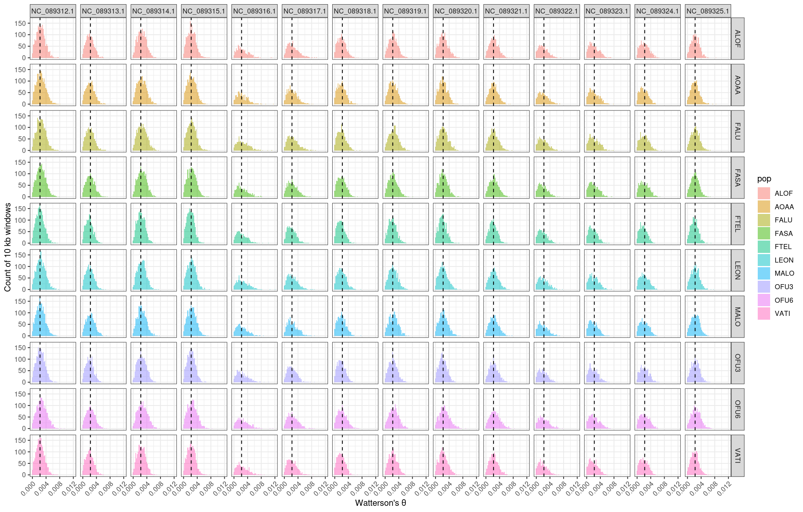

<br>

```r
# plot per-window theta across genome by location
ggplot(theta_location_filt, aes(x = window_pos_1, y = avg_watterson_theta)) +
  geom_point(alpha = 0.3, size = 0.5) +
  geom_smooth(span = 0.1, color = "red", linewidth = 0.5) +
  facet_grid(pop ~ chromosome, scales = "free_x") +
  labs(
    x = "Genomic position",
    y = "θw"
  ) +
  theme_bw() +
  theme(axis.text.x = element_text(angle = 45, hjust = 1))
```
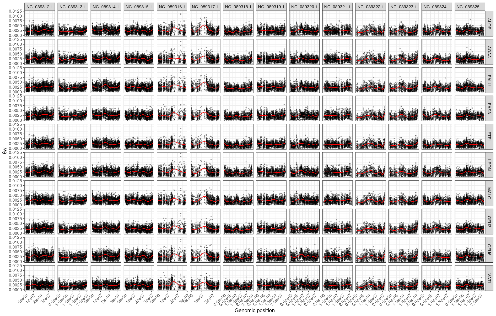


```r
# calculate theta and summary stats per chromosome
theta_sum_by_chrom_location <- theta_location_filt %>%
  group_by(pop, chromosome) %>% 
  summarise(
    n_windows = n(),
    total_sites = sum(no_sites),
    pooled_theta = sum(raw_watterson_theta, na.rm = TRUE) / sum(weighted_no_sites, na.rm = TRUE), # pixy-recommended approach for aggregating across windows
    w_mean = weighted.mean(avg_watterson_theta, no_sites),  # weighted mean theta
    uw_mean = mean(avg_watterson_theta),                    # unweighted mean theta
    median = median(avg_watterson_theta),
    sd = sd(avg_watterson_theta),
    q05 = quantile(avg_watterson_theta, 0.05),
    q95 = quantile(avg_watterson_theta, 0.95),
    .groups = "drop"
  )


# plot summary stats by chromosome and location
ggplot(theta_sum_by_chrom_location, aes(x = chromosome, y = pooled_theta, color = pop)) +
  geom_point(size = 3, position = position_dodge(width = 0.5)) +
  geom_errorbar(aes(ymin = q05, ymax = q95), width = 0.2, position = position_dodge(width = 0.5)) +
  labs(
    x = "Chromosome",
    y = expression("pooled"~theta~"(window-based 5th-95th percentile range)")
  ) +
  theme_bw() +
  theme(axis.text.x = element_text(angle = 45, hjust = 1))
```
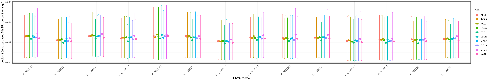
OFU6 consistently high, FTEL consistently low.

<br>
<br>

### Location-level Tajima's D

```r
# Now tajimad files (location run)

# Load in files
tajimad_location_files <- list.files(
  "./location/",
  pattern = "_tajima_d.txt$",
  full.names = TRUE
)

# name the vector for use in .id column in next step
names(tajimad_location_files) <- tajimad_location_files

# import and combine location tajimad files while creating new column with file path/name
tajimad_location_raw <- map_dfr(tajimad_location_files, read_tsv, .id = "source_file")

# reformatting
tajimad_location <- tajimad_location_raw %>% 
  mutate(
    chromosome = str_remove(chromosome, "_Pverrucosa$") %>% as.factor(),
    pop = as.factor(pop)
  )

str(tajimad_location)
```

```
tibble [352,360 × 10] (S3: tbl_df/tbl/data.frame)
 $ source_file        : chr [1:352360] "./location//NC_089312.1_Pverrucosa.location_tajima_d.txt" "./location//NC_089312.1_Pverrucosa.location_tajima_d.txt" "./location//NC_089312.1_Pverrucosa.location_tajima_d.txt" "./location//NC_089312.1_Pverrucosa.location_tajima_d.txt" ...
 $ pop                : Factor w/ 10 levels "ALOF","AOAA",..: 1 2 3 4 6 5 8 7 10 9 ...
 $ chromosome         : Factor w/ 27 levels "NC_089312.1",..: 1 1 1 1 1 1 1 1 1 1 ...
 $ window_pos_1       : num [1:352360] 1 1 1 1 1 1 1 1 1 1 ...
 $ window_pos_2       : num [1:352360] 10000 10000 10000 10000 10000 10000 10000 10000 10000 10000 ...
 $ tajima_d           : num [1:352360] NA NA NA NA NA NA NA NA NA NA ...
 $ no_sites           : num [1:352360] 0 0 0 0 0 0 0 0 0 0 ...
 $ raw_pi             : num [1:352360] NA NA NA NA NA NA NA NA NA NA ...
 $ raw_watterson_theta: num [1:352360] NA NA NA NA NA NA NA NA NA NA ...
 $ tajima_d_stdev     : num [1:352360] NA NA NA NA NA NA NA NA NA NA ...
```

<br>

```r
# plot distribution of callable sites per 10kb window
ggplot(tajimad_location, aes(x = no_sites)) +
  geom_histogram(bins = 50) +
  geom_vline(xintercept = 7000, linetype = "dashed") +  # cutoff I've been using for previous pixy runs
  facet_wrap(~ pop) +
  labs(
    x = "Number of callable sites per window",
    y = "Number of windows"
  ) +
  scale_x_continuous(breaks = seq(from=0, to = 10000, by = 2000)) +
  theme_bw() +
  theme(axis.text.x = element_text(angle = 45, hjust = 1))
```
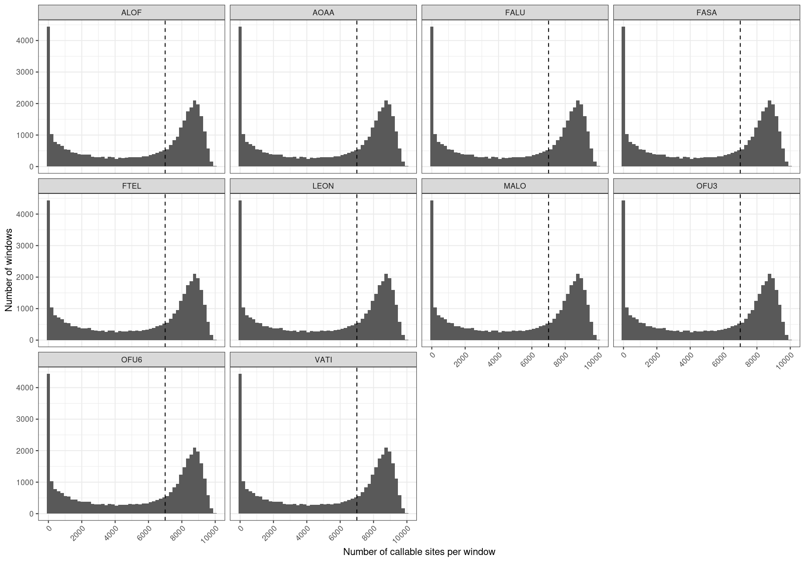

<br>

```r
# filter dataset based on 7000 site cutoff
tajimad_location_filt <- tajimad_location %>% 
  filter(no_sites >= 7000)

# summarize remaining windows after filtering
tajimad_location %>%
  summarise(
    total = n(),
    retained = sum(no_sites >= 7000),
    prop = retained / total
  )
```

```
   total retained  prop
1 352360   169610 0.481
```

<br>

```r
# plot distribution of tajimad across filtered 10kb windows with wmean tajimad for ALL samples indicated for reference
ggplot(tajimad_location_filt, aes(x = tajima_d, fill = pop)) +
  geom_histogram(bins = 50, alpha = 0.5, position = "identity") +
  geom_vline(xintercept = wmean_tajimad_all, linetype = "dashed") +
  facet_wrap(~ pop) +
  labs(
    x = "Tajima's D",
    y = "Number of 10 kb windows"
  ) +
  theme_bw()
```
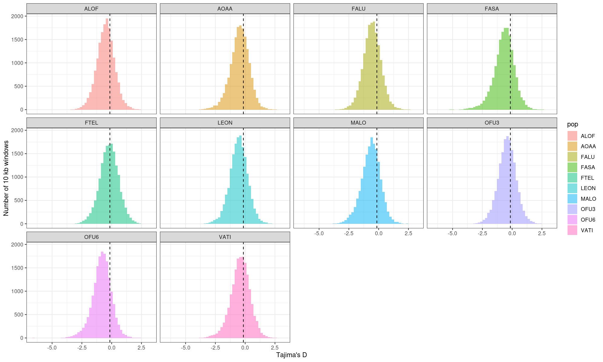


```r
ggplot(tajimad_location_filt, aes(x = tajima_d, color = pop)) +
  geom_density(alpha = 0.5, position = "identity") +
  labs(
    x = "Tajima's D",
    y = "Number of 10 kb windows"
  ) +
  theme_bw()
```
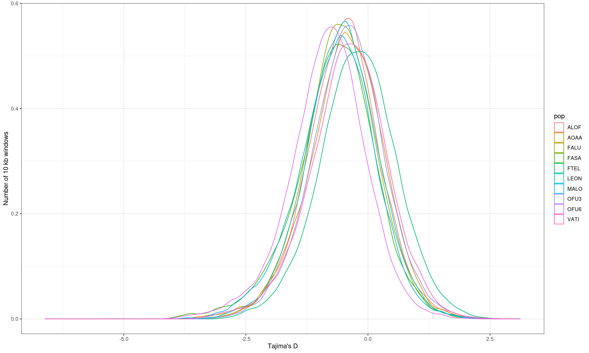


```r
ggplot(tajimad_location_filt %>% filter(pop == "FTEL" | pop == "OFU6"), aes(x = tajima_d, color = pop)) +
  geom_density(alpha = 0.5, position = "identity") +
  labs(
    x = "Tajima's D",
    y = "Number of 10 kb windows"
  ) +
  theme_bw()
```
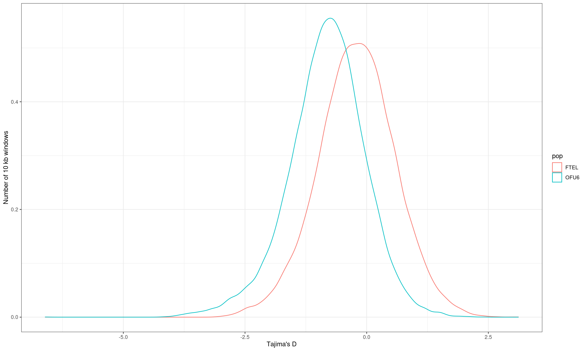
Tajima's D distributions more divergent across locations compared to pi (e.g., OFU6 vs FTEL).

<br>

```r
# Double check callable sites by location
tajimad_location_filt %>%
  group_by(pop) %>%
  summarise(mean_sites = mean(no_sites))
```
Mean number of callable sites is identical (8489) across islands.

<br>

Check number of windows with Tajima's D = NA and sample sizes for each location:
```r
# load sample sizes
sampsizes_location <- read_tsv("../vcf/pixy_location.pop.tsv", col_names = FALSE) %>%
  rename(sample = X1, pop = X2) %>%
  count(pop, name = "n") %>%
  arrange(desc(n))

# determine how many NAs in dataset (windows where pi and theta were both 0 (invariant regions), so Tajima's D is undefined)
NA_sum_location <- tajimad_location_filt %>% 
  group_by(pop) %>% 
  summarize(
    numNA = sum(is.na(tajima_d)),
    num_windows = n(),
    propNA = numNA/num_windows
    ) %>% 
  arrange(desc(propNA)) %>% 
  left_join(sampsizes_location, by = "pop")

NA_sum_location
```

```
   pop   numNA num_windows  propNA     n
 1 FASA    108       16961 0.00637     8
 2 MALO    102       16961 0.00601     9
 3 OFU6     95       16961 0.00560     7
 4 VATI     92       16961 0.00542    14
 5 AOAA     88       16961 0.00519    12
 6 FTEL     84       16961 0.00495    24
 7 LEON     83       16961 0.00489    14
 8 FALU     79       16961 0.00466    14
 9 ALOF     76       16961 0.00448    16
10 OFU3     73       16961 0.00430    17
```

<br>

```r
# plot propNA vs. sample size
ggplot(NA_sum_location) +
  geom_point(aes(x = n, y = propNA)) +
  scale_x_continuous(breaks = seq(from = 0, to = 26, by = 2)) +
  theme_bw()
```
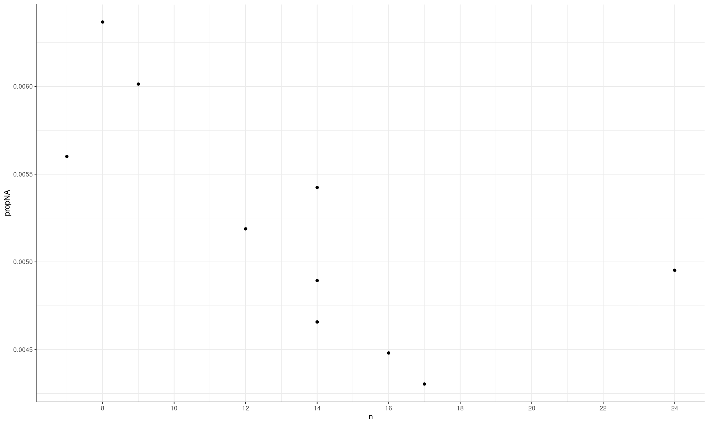
There is the expected trend of more NA windows in lower sample size locations, but effect size is small (range of propNA is only 0.0043 - 0.00637), and there is also some real among-location variation beyond sample size alone (e.g, FTEL has greatest n but moderate NAprop).

<br>

```r
tajimad_sum_location <- tajimad_location_filt %>% 
  group_by(pop) %>% 
  summarise(
    w_mean = weighted.mean(tajima_d, no_sites, na.rm = TRUE), # have to rely on weighted means here because Tajima's D cannot be pooled across windows like pi and theta
    median = median(tajima_d, na.rm = TRUE),
    sd = sd(tajima_d, na.rm = TRUE),
    q05 = quantile(tajima_d, 0.05, na.rm = TRUE),
    q95 = quantile(tajima_d, 0.95, na.rm = TRUE)
  )

tajimad_sum_location %>% arrange(desc(w_mean))
```

```
   pop   w_mean median    sd   q05   q95
 1 FTEL  -0.212 -0.200 0.793 -1.54 1.09 
 2 VATI  -0.409 -0.376 0.805 -1.77 0.879
 3 OFU3  -0.426 -0.407 0.755 -1.69 0.803
 4 AOAA  -0.467 -0.431 0.788 -1.82 0.755
 5 ALOF  -0.507 -0.489 0.745 -1.75 0.700
 6 LEON  -0.544 -0.525 0.753 -1.80 0.669
 7 FALU  -0.556 -0.552 0.742 -1.78 0.653
 8 MALO  -0.657 -0.608 0.797 -2.03 0.583
 9 FASA  -0.683 -0.625 0.839 -2.14 0.606
10 OFU6  -0.831 -0.788 0.793 -2.18 0.401
```
Tajima's D more variable across locations than pi (-0.831 to -0.212; OFU6 most negative, FTEL least negative).

Interestingly, the estimates for Tajima's D for OFU3 and OFU6 are both more negative than the value for Ofu in the "island"-level pixy run (D = -0.408). This is probably because Tajima's D is dependent on the number of segregating sites and sample size, both of which change when moving from location level to island level. These aggregate Tajima's D estimates are also calculated as weighted means, not pooled recalculated values like for pi and theta.

<br>

```r
# plot summary stats by location
ggplot(tajimad_sum_location, aes(x = fct_reorder(pop, w_mean), y = w_mean, color = pop)) +
  geom_point(size = 3, position = position_dodge(width = 0.5)) +
  geom_errorbar(aes(ymin = q05, ymax = q95), width = 0.2, position = position_dodge(width = 0.5)) +
  labs(
    x = "Chromosome",
    y = "Tajima's D (window-based 5th-95th percentile range)"
  ) +
  theme_bw() +
  theme(axis.text.x = element_text(angle = 45, hjust = 1))
```
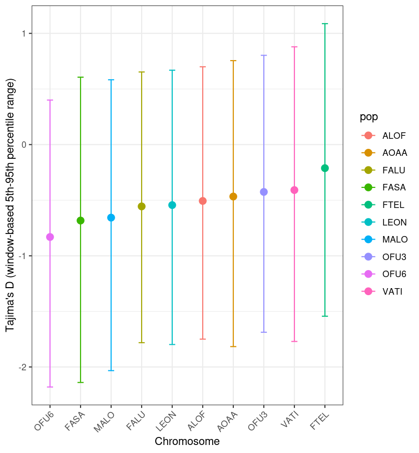

OFU6, FASA, and MALO, have the three lowest sample sizes, which you would expect to deflate theta and push Tajima's D more positive, but we see the opposite here: These three sites have the most negative Tajima's D values of all sites.

<br>

```r
# facet by chromosome and location (using wmean_tajimad_all as x-intercept for reference)
ggplot(tajimad_location_filt, aes(x = tajima_d, fill = pop)) +
  geom_histogram(bins = 50, alpha = 0.5, position = "identity") +
  geom_vline(xintercept = wmean_tajimad_all, linetype = "dashed") +
  facet_grid(pop ~ chromosome) +
  labs(
    x = "Tajima's D",
    y = "Count of 10 kb windows"
  ) +
  theme_bw() +
  theme(axis.text.x = element_text(angle = 45, hjust = 1))
```
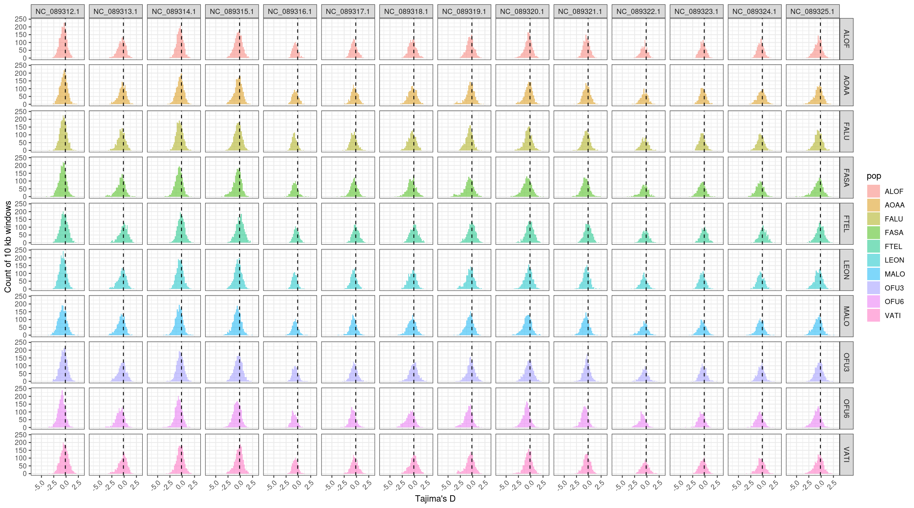

<br>

```r
# plot per-window tajimad across genome by location
ggplot(tajimad_location_filt, aes(x = window_pos_1, y = tajima_d)) +
  geom_point(alpha = 0.3, size = 0.5) +
  geom_smooth(span = 0.1, color = "red", linewidth = 0.5) +
  facet_grid(pop ~ chromosome, scales = "free_x") +
  labs(
    x = "Genomic position",
    y = "Tajima's D"
  ) +
  theme_bw() +
  theme(axis.text.x = element_text(angle = 45, hjust = 1))
```
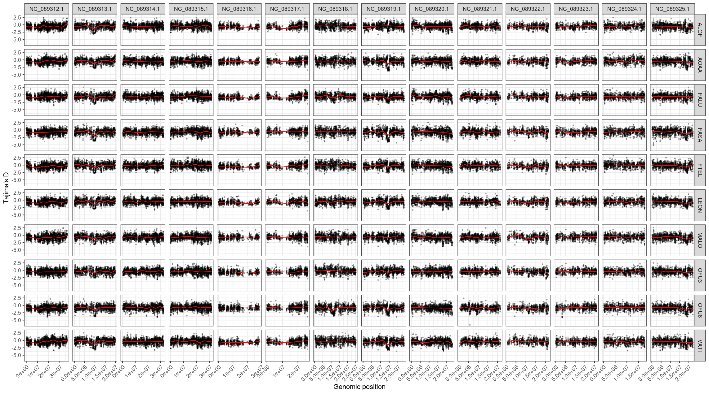

<br>

```r
# calculate tajimad and summary stats per chromosome
tajimad_sum_by_chrom_location <- tajimad_location_filt %>%
  group_by(pop, chromosome) %>% 
  summarise(
    n_windows = n(),
    total_sites = sum(no_sites),
    w_mean = weighted.mean(tajima_d, no_sites, na.rm = TRUE),  # have to rely on weighted means here because Tajima's D cannot be pooled across windows like pi and theta
    uw_mean = mean(tajima_d, na.rm = TRUE),                    # unweighted mean theta
    median = median(tajima_d, na.rm = TRUE),
    sd = sd(tajima_d, na.rm = TRUE),
    q05 = quantile(tajima_d, 0.05, na.rm = TRUE),
    q95 = quantile(tajima_d, 0.95, na.rm = TRUE),
    .groups = "drop"
  )

# plot summary stats by chromosome and location
ggplot(tajimad_sum_by_chrom_location, aes(x = chromosome, y = w_mean, color = pop)) +
  geom_point(size = 3, position = position_dodge(width = 0.5)) +
  geom_errorbar(aes(ymin = q05, ymax = q95), width = 0.2, position = position_dodge(width = 0.5)) +
  labs(
    x = "Chromosome",
    y = "Tajima's D (window-based 5th-95th percentile range)"
  ) +
  theme_bw() +
  theme(axis.text.x = element_text(angle = 45, hjust = 1))
```
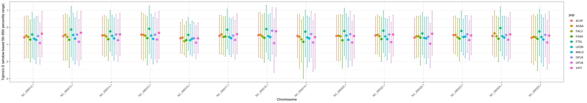
OFU6 consistently most negative, FTEL consistently least negative (except first chromosome, where it is second least negative).

<br>

```r
# Make summary table of location-level stats for "location" comparison
# report pooled stats (or weighted mean for Tajima's D) + window-derived 5-95% quantile range

location_summary <- pi_sum_location %>%
  select(pop, pooled_pi, q05, q95) %>%
  rename(
    population = pop,
    pi_q05 = q05,
    pi_q95 = q95
  ) %>%
  left_join(
    theta_sum_location %>%
      select(pop, pooled_theta, q05, q95) %>%
      rename(
        population = pop,
        theta_q05 = q05,
        theta_q95 = q95
      ),
    by = "population"
  ) %>%
  left_join(
    tajimad_sum_location %>%
      select(pop, w_mean, q05, q95) %>%
      rename(
        population = pop,
        wmean_TajimasD = w_mean,
        TajimasD_q05 = q05,
        TajimasD_q95 = q95
      ),
    by = "population"
  )


# more readable compact version
location_summary_compact <- location_summary %>%
  transmute(
    population,
    pi = sprintf("%.5f (%.5f–%.5f)", pooled_pi, pi_q05, pi_q95),
    theta = sprintf("%.5f (%.5f–%.5f)", pooled_theta, theta_q05, theta_q95),
    TajimasD = sprintf("%.3f (%.3f–%.3f)", wmean_TajimasD, TajimasD_q05, TajimasD_q95)
  ) %>% 
  arrange(TajimasD)
```

```
   population pi                        theta                     TajimasD                            
 1 FTEL       0.00201 (0.00030–0.00407) 0.00215 (0.00036–0.00414) -0.212 (-1.543–1.087)
 2 VATI       0.00203 (0.00029–0.00414) 0.00228 (0.00038–0.00440) -0.409 (-1.770–0.879)
 3 OFU3       0.00206 (0.00030–0.00415) 0.00233 (0.00039–0.00445) -0.426 (-1.688–0.803)
 4 AOAA       0.00210 (0.00029–0.00426) 0.00239 (0.00040–0.00461) -0.467 (-1.817–0.755)
 5 ALOF       0.00207 (0.00031–0.00414) 0.00241 (0.00041–0.00467) -0.507 (-1.749–0.700)
 6 LEON       0.00206 (0.00030–0.00417) 0.00241 (0.00040–0.00466) -0.544 (-1.798–0.669)
 7 FALU       0.00209 (0.00031–0.00420) 0.00246 (0.00041–0.00474) -0.556 (-1.782–0.653)
 8 MALO       0.00203 (0.00030–0.00416) 0.00241 (0.00040–0.00464) -0.657 (-2.033–0.583)
 9 FASA       0.00204 (0.00028–0.00420) 0.00242 (0.00039–0.00466) -0.683 (-2.139–0.606)
10 OFU6       0.00213 (0.00030–0.00434) 0.00262 (0.00043–0.00510) -0.831 (-2.180–0.401)
```

<br>

```r
# plot theta vs pi by location
ggplot(location_summary, aes(x = pooled_pi, y = pooled_theta)) +
  geom_smooth(method = "lm", color = "black", linetype = "dashed", linewidth = 0.75, fill = "grey85") +
  geom_point(aes(color = population), size = 3, show.legend = FALSE) +
  geom_text_repel(aes(label = population), size = 3, point.padding = 0.5, box.padding = 0.4) +
  theme_bw()
  
# plot Tajima's D vs pi by location
ggplot(location_summary, aes(x = pooled_pi, y = wmean_TajimasD)) +
  geom_smooth(method = "lm", color = "black", linetype = "dashed", linewidth = 0.75, fill = "grey85") +
  geom_point(aes(color = population), size = 3, show.legend = FALSE) +
  geom_text_repel(aes(label = population), size = 3, point.padding = 0.5, box.padding = 0.4) +
  theme_bw()

# plot Tajima's D vs theta by location
ggplot(location_summary, aes(x = pooled_theta, y = wmean_TajimasD)) +
  geom_smooth(method = "lm", color = "black", linetype = "dashed", linewidth = 0.75, fill = "grey85") +
  geom_point(aes(color = population), size = 3, show.legend = FALSE) +
  geom_text_repel(aes(label = population), size = 3, point.padding = 0.5, box.padding = 0.4) +
  theme_bw()
```

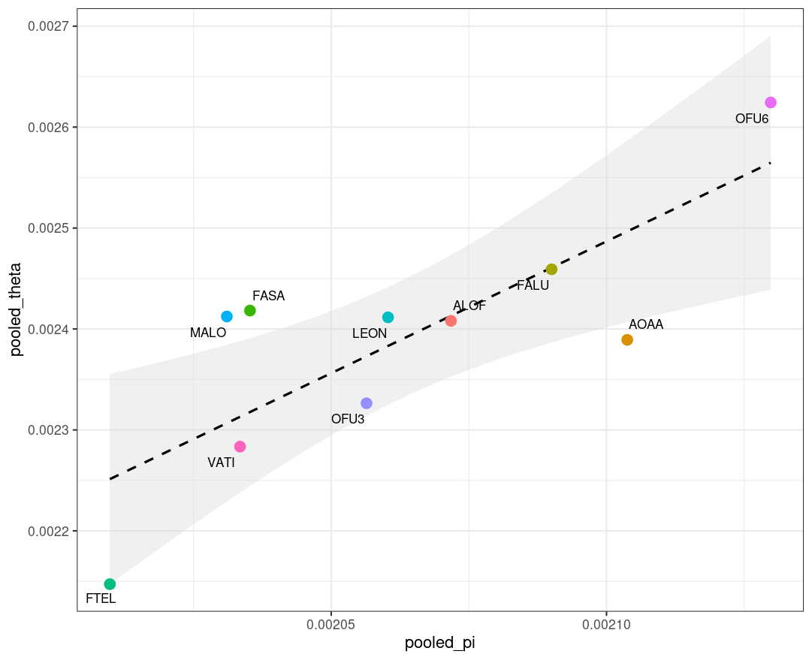
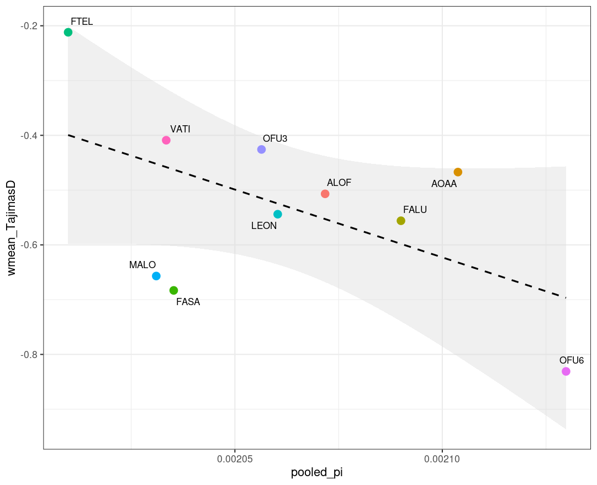
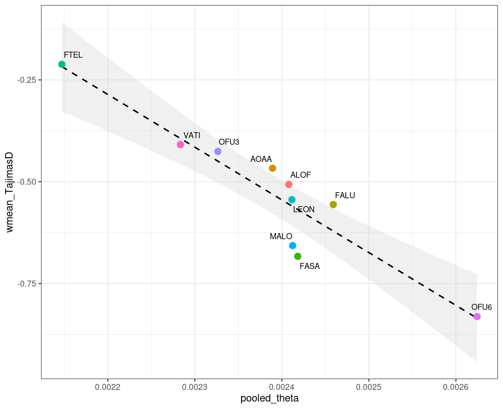

<br>


**Takeaways so far**:
- There is no meaningful difference in nucleotide diversity (π) between islands (or locations).
  - This indicates that long-term effective population size (Ne) is similar between islands
  - So likely no major bottlenecks in one island or strong long-term isolation-driven differences
- θ is consistently greater than π across subgroups and chromosomes
  - Creates weakly negative Tajima's D (excess of rare alleles)
  - This is consitent across the genome so likely indicates:
    - background selection
    - mild population expansion/recovery after disturbance
    - or subtle structure effects
- θ and Tajima's D show greater among location variation than π
  - OFU6 notably shows the strongest excess of low-frequency variants among sites, consistent with stronger recent nonequilibrium dynamics and/or linked selection, but demographic and selective explanations cannot be distinguished from Tajima’s D alone.
  - FTEL notably has lowest theta and most positive Tajima's D (closest to 0).
    - Tajima's D closest to 0 means FTEL shows the weakest deviation from the neutral equilibrium expectation (least skewed/perturbed SFS), relative to the other populations
    - This pattern is consistent with comparatively weaker recent expansion or a more stable demographic history at FTEL (e.g., more stable population size, no/fewer strong recent selective sweeps, no/more mild recent expansion), although Tajima’s D alone cannot distinguish among demographic and selective processes or detect present but opposing processes that may counteract each other's effects on Tajima's D.
  - Admixture plots also show FTEL separating out as a notable group by k=4, and in the PCA, PCs 2 and 3 separate out FTEL pretty well from the other points
  - So, likely:
    - OFU6: rare-allele enriched (negative D) -> dynamic / expanding
    - FTEL: less rare-allele skew + fewer SNPs -> stable / drift-dominated
  - This is interesting given FTEL is the only location within the National Marine Sanctuary

<br>

<br>

### Island-level differentiation (Dxy & Fst)

Now let's look at the genetic differentiation stats, Dxy and Fst, starting with the island-level comparison

<br>

#### Start with Dxy

```r
### Island comparison first

# Load in files
dxy_island_files <- list.files(
  "./island/",
  pattern = "_dxy.txt$",
  full.names = TRUE
)

# name the vector for use in .id column in next step
names(dxy_island_files) <- dxy_island_files

# import and combine island dxy files while creating new column with file path/name
dxy_island_raw <- map_dfr(dxy_island_files, read_tsv, .id = "source_file")

#reformatting
dxy_island <- dxy_island_raw %>%
  mutate(
    chromosome = str_remove(chromosome, "_Pverrucosa$") %>% as.factor(),
    pop1 = as.factor(pop1),
    pop2 = as.factor(pop2)
  )

str(dxy_island)
```

```
tibble [35,236 × 11] (S3: tbl_df/tbl/data.frame)
 $ source_file      : chr [1:35236] "./island//NC_089312.1_Pverrucosa.island_dxy.txt" "./island//NC_089312.1_Pverrucosa.island_dxy.txt" "./island//NC_089312.1_Pverrucosa.island_dxy.txt" "./island//NC_089312.1_Pverrucosa.island_dxy.txt" ...
 $ pop1             : Factor w/ 1 level "Tutuila": 1 1 1 1 1 1 1 1 1 1 ...
 $ pop2             : Factor w/ 1 level "Ofu": 1 1 1 1 1 1 1 1 1 1 ...
 $ chromosome       : Factor w/ 27 levels "NC_089312.1",..: 1 1 1 1 1 1 1 1 1 1 ...
 $ window_pos_1     : num [1:35236] 1 10001 20001 30001 40001 ...
 $ window_pos_2     : num [1:35236] 1e+04 2e+04 3e+04 4e+04 5e+04 6e+04 7e+04 8e+04 9e+04 1e+05 ...
 $ avg_dxy          : num [1:35236] NA 0 0 0.00129 NA ...
 $ no_sites         : num [1:35236] 0 189 864 2425 0 ...
 $ count_diffs      : num [1:35236] NA 0 0 23842 NA ...
 $ count_comparisons: num [1:35236] NA 1650064 7574788 18510048 NA ...
 $ count_missing    : num [1:35236] NA 363920 1631996 7330752 NA ...
```

<br>

```r
# plot distribution of callable sites per 10kb window (should be same as other island stats)
ggplot(dxy_island, aes(x = no_sites)) +
  geom_histogram(bins = 50) +
  labs(
    x = "Number of callable sites per window",
    y = "Number of windows"
  ) +
  scale_x_continuous(breaks = seq(from=0, to = 10000, by = 2000)) +
  theme_bw() +
  theme(axis.text.x = element_text(angle = 45, hjust = 1))
```
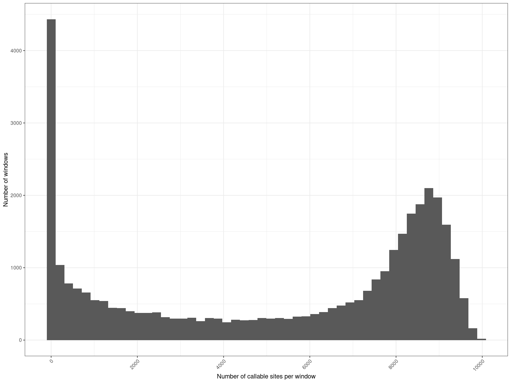

<br>

```r
# filter dataset based on 7000 site cutoff
dxy_island_filt <- dxy_island %>% 
  filter(no_sites >= 7000)

# summarize remaining windows after filtering (another sanity check)
dxy_island %>%
  summarise(
    total = n(),
    retained = sum(no_sites >= 7000),
    prop = retained / total
  )

# sensitivity check: try other cutoffs to see how it changes number of retained windows
dxy_island %>%
  summarise(
    prop_6000 = mean(no_sites >= 6000),
    prop_7000 = mean(no_sites >= 7000),
    prop_8000 = mean(no_sites >= 8000)
  )
```

```
  total retained  prop
  <int>    <int> <dbl>
  35236    16961 0.481

  prop_6000 prop_7000 prop_8000
      <dbl>     <dbl>     <dbl>
      0.542     0.481     0.367
```
Looks same as previous stats, as expected.

<br>

```r
# plot distribution of dxy across filtered 10kb windows
ggplot(dxy_island_filt, aes(x = avg_dxy)) +
  geom_histogram(bins = 50, alpha = 0.5, position = "identity") +
  labs(
    x = "avg_dxy (Mean per-site Dxy across 10 kb window)",
    y = "Number of 10 kb windows"
  ) +
  theme_bw()
```

Looks similar to distribution of pi.

<br>

```r
# calculate full summary stats for genome-wide dxy between islands
dxy_sum_island <- dxy_island_filt %>% 
  summarise(
    pooled_dxy = sum(count_diffs, na.rm = TRUE) / sum(count_comparisons, na.rm = TRUE), # pixy-recommended approach for aggregating across windows
    w_mean = weighted.mean(avg_dxy, no_sites),
    median = median(avg_dxy),
    sd = sd(avg_dxy),
    q05 = quantile(avg_dxy, 0.05),
    q95 = quantile(avg_dxy, 0.95)
  )

wmean_dxy_island <- dxy_sum_island$w_mean[1]
# genome-wide weighted mean dxy between islands: 0.0021435

pooled_dxy_island <- dxy_sum_island$pooled_dxy[1]
# genome-wide pooled dxy between islands: 0.0021494
```

```
  pooled_dxy  w_mean  median      sd      q05     q95
       <dbl>   <dbl>   <dbl>   <dbl>    <dbl>   <dbl>
     0.00215 0.00214 0.00198 0.00121 0.000337 0.00425
```
Pooled dxy between islands is pretty close to pooled_pi_all.

<br>

```r
# replot with weighted mean dxy for each island
ggplot(dxy_island_filt, aes(x = avg_dxy)) +
  geom_histogram(bins = 50, alpha = 0.5, position = "identity") +
  geom_vline(xintercept = wmean_dxy_island, linetype = "dashed") +
  labs(
    x = "avg_dxy (Mean per-site Dxy across 10 kb window)",
    y = "Count of 10 kb windows"
  ) +
  theme_bw()

```
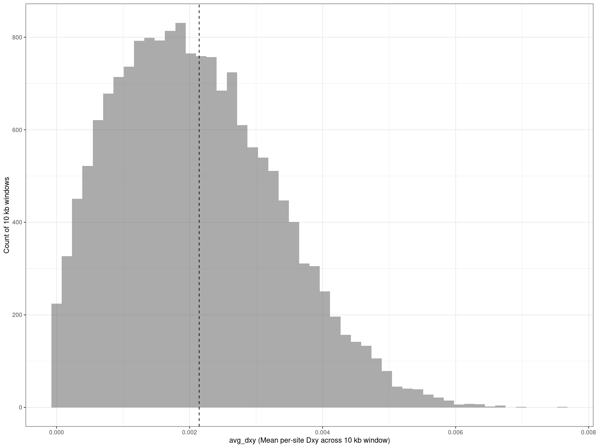

<br>

```r
# facet by chromosome (using pooled_dxy_island as x-intercept for reference)
ggplot(dxy_island_filt, aes(x = avg_dxy)) +
  geom_histogram(bins = 50, alpha = 0.5, position = "identity") +
  geom_vline(xintercept = pooled_dxy_island, linetype = "dashed") +
  facet_grid(~ chromosome) +
  labs(
    x = "avg_dxy (Mean per-site Dxy across 10 kb window)",
    y = "Count of 10 kb windows"
  ) +
  theme_bw() +
  theme(axis.text.x = element_text(angle = 45, hjust = 1))
```
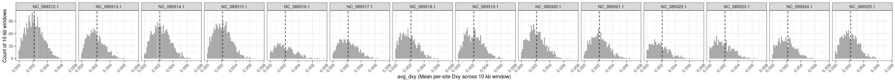

<br>

```r
# plot per-window dxy across genome
ggplot(dxy_island_filt, aes(x = window_pos_1, y = avg_dxy)) +
  geom_point(alpha = 0.3, size = 0.5) +
  geom_smooth(span = 0.1, color = "red", linewidth = 0.5) +
  facet_grid(~ chromosome, scales = "free_x") +
  labs(
    x = "Genomic position",
    y = "avg_dxy"
  ) +
  theme_bw() +
  theme(axis.text.x = element_text(angle = 45, hjust = 1))
```
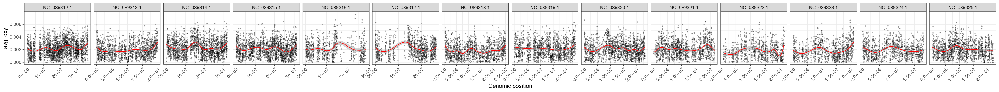

<br>

```r
# calculate dxy and summary stats per chromosome
dxy_sum_by_chrom_island <- dxy_island_filt %>%
  group_by(chromosome) %>% 
  summarise(
    n_windows = n(),
    total_sites = sum(no_sites),
    pooled_dxy = sum(count_diffs, na.rm = TRUE) / sum(count_comparisons, na.rm = TRUE), # pixy-recommended approach for aggregating across windows
    w_mean = weighted.mean(avg_dxy, no_sites),  # weighted mean dxy
    uw_mean = mean(avg_dxy),                    # unweighted mean dxy
    median = median(avg_dxy),
    sd = sd(avg_dxy),
    q05 = quantile(avg_dxy, 0.05),
    q95 = quantile(avg_dxy, 0.95),
    .groups = "drop"
  )
```

```
   chromosome  n_windows total_sites pooled_dxy  w_mean uw_mean  median      sd      q05     q95
   <fct>           <int>       <dbl>      <dbl>   <dbl>   <dbl>   <dbl>   <dbl>    <dbl>   <dbl>
 1 NC_089312.1      1929    16465783    0.00224 0.00224 0.00219 0.00211 0.00118 0.000384 0.00429
 2 NC_089313.1      1238    10583414    0.00201 0.00201 0.00196 0.00182 0.00114 0.000332 0.00408
 3 NC_089314.1      1674    14327238    0.00240 0.00239 0.00235 0.00225 0.00123 0.000505 0.00448
 4 NC_089315.1      1711    14649218    0.00220 0.00219 0.00215 0.00208 0.00119 0.000369 0.00420
 5 NC_089316.1       699     5718524    0.00221 0.00220 0.00213 0.00187 0.00137 0.000249 0.00464
 6 NC_089317.1       954     8016663    0.00219 0.00218 0.00213 0.00202 0.00124 0.000388 0.00432
 7 NC_089318.1      1177     9919168    0.00192 0.00191 0.00186 0.00173 0.00115 0.000223 0.00390
 8 NC_089319.1      1303    11201350    0.00221 0.00220 0.00216 0.00211 0.00122 0.000367 0.00437
 9 NC_089320.1      1369    11700279    0.00216 0.00215 0.00211 0.00197 0.00118 0.000337 0.00432
10 NC_089321.1      1147     9734480    0.00223 0.00222 0.00217 0.00205 0.00120 0.000423 0.00433
11 NC_089322.1       741     6116158    0.00187 0.00187 0.00181 0.00165 0.00121 0.000175 0.00414
12 NC_089323.1       872     7254096    0.00199 0.00198 0.00192 0.00175 0.00125 0.000170 0.00408
13 NC_089324.1       918     7752971    0.00202 0.00201 0.00195 0.00186 0.00116 0.000241 0.00405
14 NC_089325.1      1229    10542673    0.00212 0.00212 0.00208 0.00196 0.00116 0.000387 0.00410
```

<br>

```r
ggplot(dxy_sum_by_chrom_island, aes(x = chromosome, y = pooled_dxy)) +
  geom_point(size = 3, position = position_dodge(width = 0.5)) +
  geom_errorbar(aes(ymin = q05, ymax = q95), width = 0.2, position = position_dodge(width = 0.5)) +
  labs(
    x = "Chromosome",
    y = "pooled dxy (window-based 5th-95th percentile range)"
  ) +
  theme_bw() +
  theme(axis.text.x = element_text(angle = 45, hjust = 1))
```
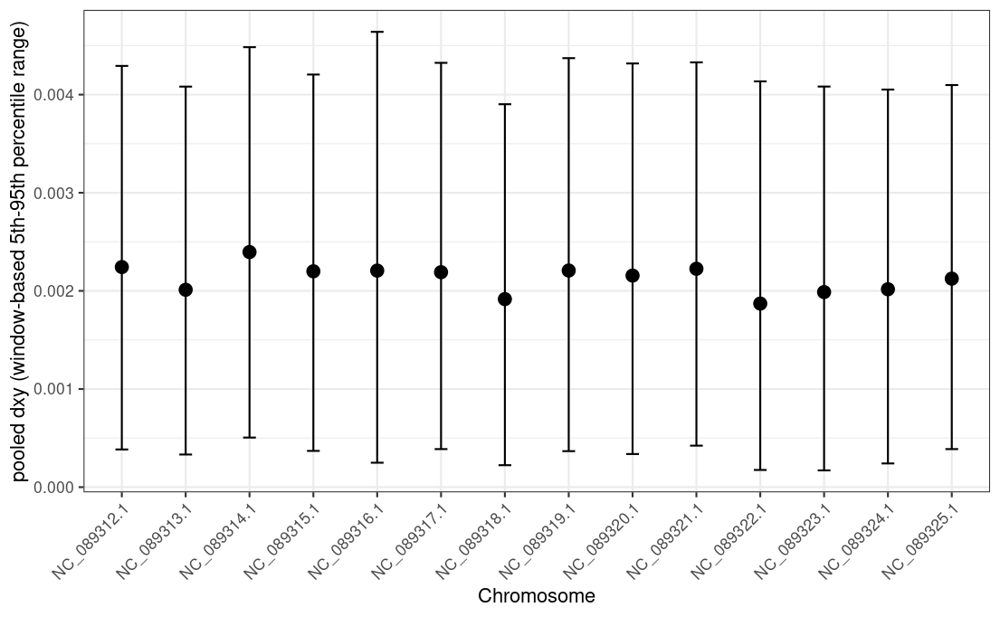

```r
# plot dxy against pi by chromosome
plot(pi_sum_by_chrom$pooled_pi, 
     dxy_sum_by_chrom_island$pooled_dxy,
     xlab = "π (within-pop diversity)",
     ylab = "Dxy (between-pop divergence)",
     pch = 19)
abline(0, 1, lty = 2, col = "red")
```
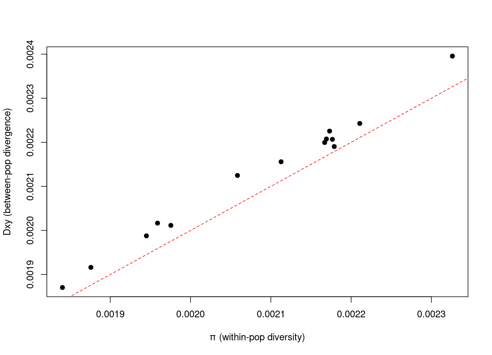

```r
# ggplot version for nicer plot
dxy_island_vs_pi <- pi_sum_by_chrom %>%
  select(chromosome, pooled_pi) %>%
  left_join(
    dxy_sum_by_chrom_island %>%
      select(chromosome, pooled_dxy),
    by = "chromosome"
  )

ggplot(dxy_island_vs_pi, aes(x = pooled_pi, y = pooled_dxy)) +
  geom_point(size = 3) +
  geom_abline(slope = 1, intercept = 0, linetype = "dashed", color = "red") +
  geom_text_repel(aes(label = chromosome), size = 3) +
  coord_equal() +
  labs(
    x = expression("Within-population diversity (" * pi * ")"),
    y = expression("Between-population divergence (" * D[xy] * ")")
  ) +
  theme_bw()
```
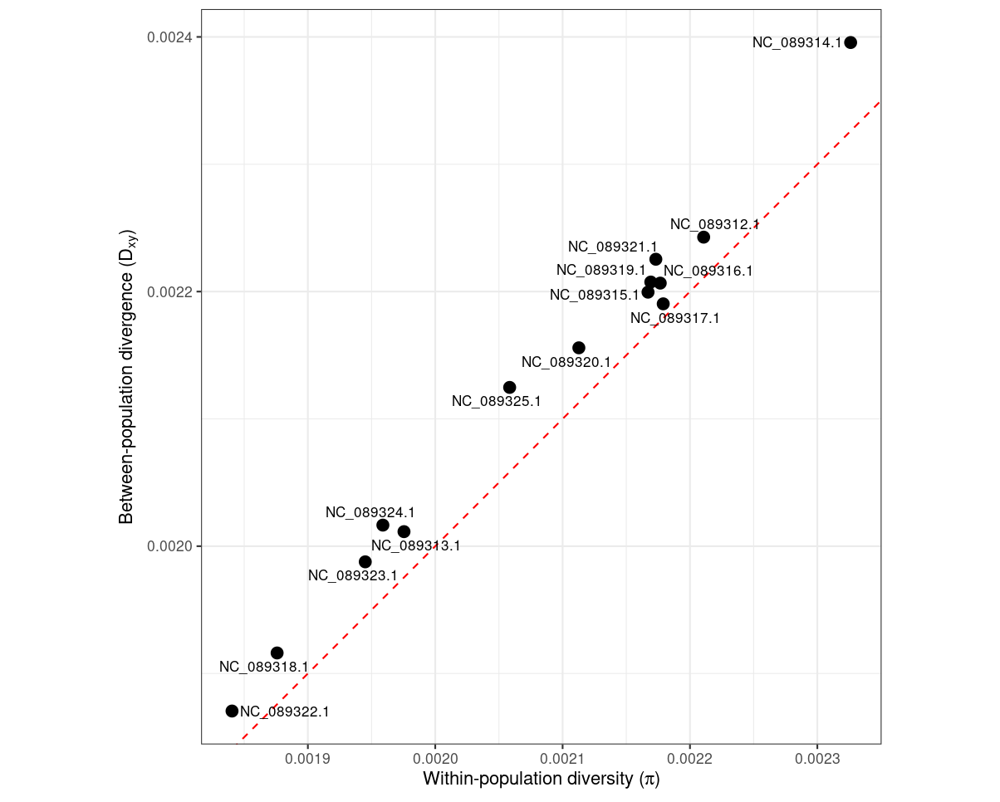
This just shows what we already know, there is some degree of population structure (differentiation) between Ofu and Tutuila. Sequences drawn from different island are more different than sequences drawn within islands.

<br>
<br>

#### Now Fst
```r
## Now Fst

# Load in files
fst_island_files <- list.files(
  "./island/",
  pattern = "_fst.txt$",
  full.names = TRUE
)

  # only 18 Fst files instead of 27 because some scaffolds had no SNPs at all, which makes the demoninator 0 and Fst undefined.

# name the vector for use in .id column in next step
names(fst_island_files) <- fst_island_files

# import and combine island fst files while creating new column with file path/name
fst_island_raw <- map_dfr(fst_island_files, read_tsv, .id = "source_file")

#reformatting
fst_island <- fst_island_raw %>%
  mutate(
    chromosome = str_remove(chromosome, "_Pverrucosa$") %>% as.factor(),
    pop1 = as.factor(pop1),
    pop2 = as.factor(pop2)
  )

str(fst_island)
```

```
tibble [25,248 × 8] (S3: tbl_df/tbl/data.frame)
 $ source_file   : chr [1:25248] "./island//NC_089312.1_Pverrucosa.island_fst.txt" "./island//NC_089312.1_Pverrucosa.island_fst.txt" "./island//NC_089312.1_Pverrucosa.island_fst.txt" "./island//NC_089312.1_Pverrucosa.island_fst.txt" ...
 $ pop1          : Factor w/ 1 level "Tutuila": 1 1 1 1 1 1 1 1 1 1 ...
 $ pop2          : Factor w/ 1 level "Ofu": 1 1 1 1 1 1 1 1 1 1 ...
 $ chromosome    : Factor w/ 18 levels "NC_089312.1",..: 1 1 1 1 1 1 1 1 1 1 ...
 $ window_pos_1  : num [1:25248] 30001 60001 70001 80001 120001 ...
 $ window_pos_2  : num [1:25248] 40000 70000 80000 90000 130000 140000 190000 200000 210000 220000 ...
 $ avg_hudson_fst: num [1:25248] 0.03841 0.02053 0.04777 0.02513 0.00599 ...
 $ no_snps       : num [1:25248] 15 16 21 59 7 6 78 152 116 89 ...
```

<br>

```r
# plot distribution of SNPs per 10kb window (no_sites is not included in pixy output)
ggplot(fst_island, aes(x = no_snps)) +
  geom_histogram(binwidth = 10) +
  labs(
    x = "Number of SNPs per 10 kb window",
    y = "Number of windows"
  ) +
  scale_x_continuous(breaks = seq(from=0, to = 800, by = 100)) +
  theme_bw() +
  theme(axis.text.x = element_text(angle = 45, hjust = 1))

# log-scaled x-axis version for better visual clarity at low SNP numbers
ggplot(fst_island, aes(x = no_snps)) +
  geom_histogram() +
  labs(
    x = "Number of SNPs per 10 kb window (log scale)",
    y = "Number of windows"
  ) +
  scale_x_log10() +
  theme_bw() +
  theme(axis.text.x = element_text(angle = 45, hjust = 1))
```
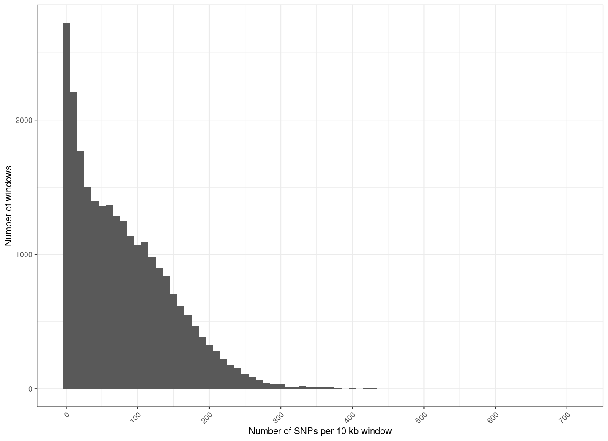
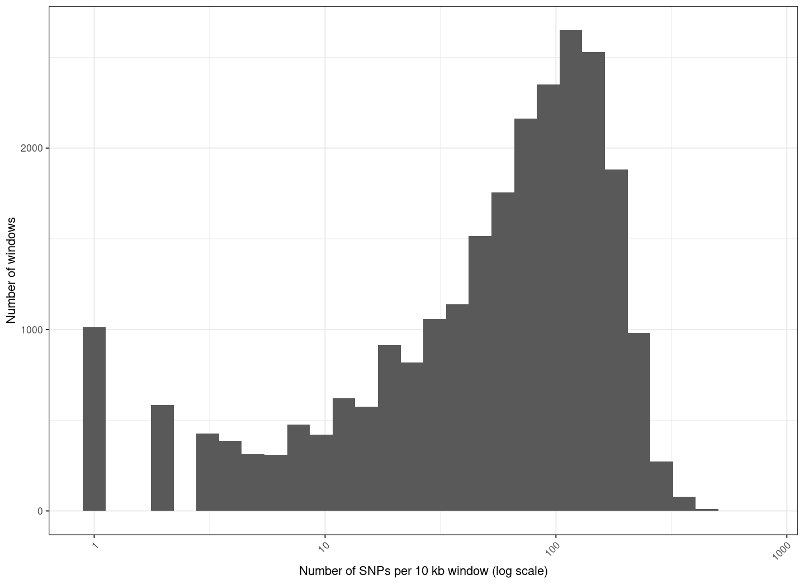

```r
# summarize remaining windows if we filter for windows with at least 10 SNPs
fst_island %>%
  summarise(
    total = n(),
    retained = sum(no_snps >= 10),
    prop = retained / total
  )

# sensitivity check: try other cutoffs to see how it changes number of retained windows
fst_island %>%
  summarise(
    prop_05 = mean(no_snps >= 5),
    prop_10 = mean(no_snps >= 10),
    prop_20 = mean(no_snps >= 20),
    prop_30 = mean(no_snps >= 30)
  )
```
```
  total retained  prop
  <int>    <int> <dbl>
  25248    21524 0.853

  prop_05 prop_10 prop_20 prop_30
    <dbl>   <dbl>   <dbl>   <dbl>
    0.905   0.853   0.776   0.711
```
This means we could use a cutoff value of >= 10 SNPs, but this leaves 21,524 windows which is more than the 16,961 windows kept for dxy (after filtering for no_sites >= 7000), so Fst and Dxy would not be directly comparable.

Instead, let's use the same windows we kept for the Dxy analysis:
```r
keep_windows <- dxy_island %>%
  filter(no_sites >= 7000) %>%
  select(chromosome, window_pos_1, window_pos_2)

fst_island_filt <- fst_island %>%
  inner_join(keep_windows, by = c("chromosome", "window_pos_1", "window_pos_2"))

# summarize remaining windows after keeping sites used in dxy analysis
nrow(fst_island)
nrow(fst_island_filt)
nrow(fst_island_filt)/nrow(fst_island)

nrow(dxy_island_filt) - nrow(fst_island_filt)
```
```
> nrow(fst_island)
[1] 25248
> nrow(fst_island_filt)
[1] 16911
> nrow(fst_island_filt)/nrow(fst_island)
[1] 0.669795627376426
> nrow(dxy_island_filt) - nrow(fst_island_filt)
[1] 50
```
So only 50 windows are missing that did not have enough polymorphism to calculate Fst but were included in the dxy analysis.

<br>

```r
# now filter based on low snp number (low snp number creates unreliable Fst estimates)
fst_island_filt_snpfilt <- fst_island_filt %>% filter(no_snps >= 10)

nrow(fst_island_filt_snpfilt)
nrow(fst_island_filt) - nrow(fst_island_filt_snpfilt)
```
```
> nrow(fst_island_filt_snpfilt)
[1] 16566
> nrow(fst_island_filt) - nrow(fst_island_filt_snpfilt)
[1] 345
```
Good news: this only removes another 345 windows.

<br>

```r
# plot distribution of average fst across filtered 10kb windows
ggplot(fst_island_filt_snpfilt, aes(x = avg_hudson_fst)) +
  geom_histogram(bins = 50, alpha = 0.5, position = "identity") +
  labs(
    x = "avg_hudson_fst (Mean per-site Hudson's Fst across SNPs in 10 kb window)",
    y = "Number of 10 kb windows"
  ) +
  theme_bw()
```
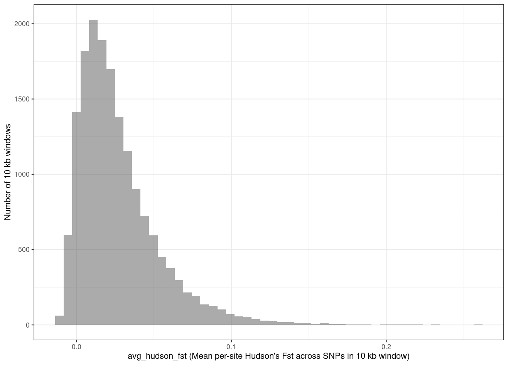
Right tailed distribution with mode around 0.02. Note left tail has a few values below 0. This is caused by sampling noise around zero and common when divergence is low and SNP counts are modest.

<br>

```r
# calculate full summary stats for genome-wide Fst between islands
fst_sum_island <- fst_island_filt_snpfilt %>% 
  summarise(
    w_mean = weighted.mean(avg_hudson_fst, no_snps),  # pixy output doesn't give separate numerator and denominator values, so pooling isn't possible. Next best option is mean weighted by no_snps in window.
    median = median(avg_hudson_fst),
    sd = sd(avg_hudson_fst),
    q05 = quantile(avg_hudson_fst, 0.05),
    q95 = quantile(avg_hudson_fst, 0.95)
  )

wmean_fst_island <- fst_sum_island$w_mean[1]
```
```
  w_mean median     sd      q05    q95
   <dbl>  <dbl>  <dbl>    <dbl>  <dbl>
  0.0265 0.0208 0.0266 -0.00207 0.0777
```
Genome-wide weighted mean **Fst between islands: 0.0264826**.

About 2.65% of the total genetic variation is attributable to differences between islands, while ~97.35% exists within islands. So islands are significantly but very weakly differentiated.

<br>

```r
# replot with weighted mean fst
ggplot(fst_island_filt_snpfilt, aes(x = avg_hudson_fst)) +
  geom_histogram(bins = 50, alpha = 0.5, position = "identity") +
  geom_vline(xintercept = wmean_fst_island, linetype = "dashed") +
  labs(
    x = "avg_hudson_fst (Mean per-site Hudson's Fst across SNPs in 10 kb window)",
    y = "Count of 10 kb windows"
  ) +
  theme_bw()
```
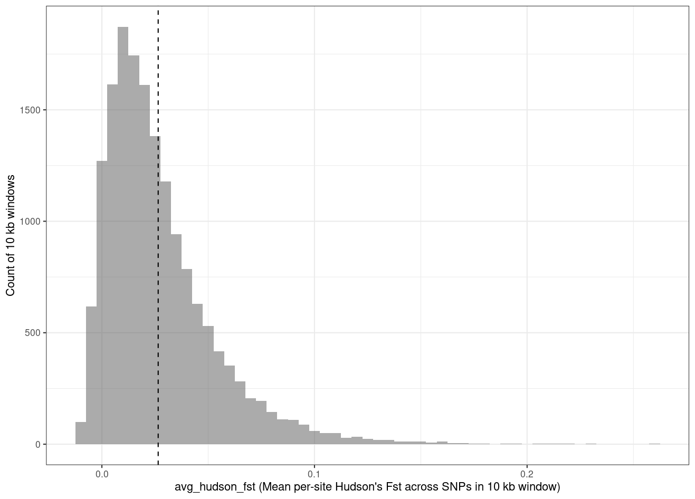

<br>

```r
# facet by chromosome (using mean_fst_island as x-intercept for reference)
ggplot(fst_island_filt_snpfilt, aes(x = avg_hudson_fst)) +
  geom_histogram(binwidth = .005, alpha = 0.5, position = "identity") +
  geom_vline(xintercept = wmean_fst_island, linetype = "dashed") +
  facet_grid(~ chromosome) +
  labs(
    x = "avg_hudson_fst (Mean per-site Hudson's Fst across SNPs in 10 kb window)",
    y = "Count of 10 kb windows"
  ) +
  theme_bw() +
  theme(axis.text.x = element_text(angle = 45, hjust = 1))
```
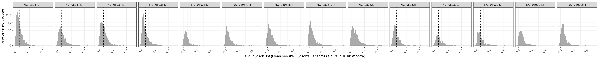

<br>

```r
# calculate fst and summary stats per chromosome
fst_sum_by_chrom_island <- fst_island_filt_snpfilt %>%
  group_by(chromosome) %>% 
  summarise(
    n_windows = n(),
    total_snps = sum(no_snps),
    w_mean = weighted.mean(avg_hudson_fst, no_snps),  # weighted mean fst (weighted by no_snps)
    uw_mean = mean(avg_hudson_fst),                    # unweighted mean fst
    median = median(avg_hudson_fst),
    sd = sd(avg_hudson_fst),
    q05 = quantile(avg_hudson_fst, 0.05),
    q95 = quantile(avg_hudson_fst, 0.95),
    .groups = "drop"
  )
```
```
   chromosome  n_windows total_snps w_mean uw_mean median     sd       q05    q95
   <fct>           <int>      <dbl>  <dbl>   <dbl>  <dbl>  <dbl>     <dbl>  <dbl>
 1 NC_089312.1      1899     225893 0.0244  0.0248 0.0193 0.0229 -0.00160  0.0700
 2 NC_089313.1      1216     118392 0.0331  0.0330 0.0270 0.0283  0.000406 0.0877
 3 NC_089314.1      1657     196851 0.0291  0.0290 0.0237 0.0264 -0.00181  0.0759
 4 NC_089315.1      1679     179775 0.0229  0.0239 0.0166 0.0253 -0.00287  0.0762
 5 NC_089316.1       680      92357 0.0226  0.0222 0.0183 0.0184  0.000349 0.0592
 6 NC_089317.1       936     112109 0.0221  0.0234 0.0171 0.0237 -0.00208  0.0673
 7 NC_089318.1      1122     101610 0.0258  0.0261 0.0202 0.0258 -0.00228  0.0740
 8 NC_089319.1      1278     143293 0.0255  0.0254 0.0169 0.0313 -0.00419  0.0826
 9 NC_089320.1      1341     142068 0.0325  0.0337 0.0253 0.0332 -0.00215  0.100 
10 NC_089321.1      1126     124642 0.0259  0.0264 0.0206 0.0261 -0.00231  0.0733
11 NC_089322.1       701      72972 0.0327  0.0331 0.0279 0.0256  0.000684 0.0788
12 NC_089323.1       831      89096 0.0280  0.0293 0.0223 0.0280  0.000638 0.0864
13 NC_089324.1       896      90551 0.0256  0.0261 0.0208 0.0239 -0.00215  0.0756
14 NC_089325.1      1204     125872 0.0234  0.0245 0.0190 0.0247 -0.00333  0.0704
```

```r
# plot per-window fst across genome
ggplot(fst_island_filt_snpfilt, aes(x = window_pos_1, y = avg_hudson_fst)) +
  geom_point(alpha = 0.3, size = 0.5) +
  geom_smooth(span = 0.1, color = "red", linewidth = 0.5) +
  facet_grid(~ chromosome, scales = "free_x") +
  labs(
    x = "Genomic position",
    y = "avg_hudson_fst"
  ) +
  theme_bw() +
  theme(axis.text.x = element_text(angle = 45, hjust = 1))
```
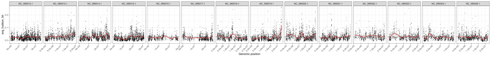

<br>

```r
# plot summary stats by chromosome
ggplot(fst_sum_by_chrom_island, aes(x = chromosome, y = w_mean)) +
  geom_point(size = 3, position = position_dodge(width = 0.5)) +
  geom_errorbar(aes(ymin = q05, ymax = q95), width = 0.2, position = position_dodge(width = 0.5)) +
  labs(
    x = "Chromosome",
    y = "weighted mean Fst (window-based 5th-95th percentile range)"
  ) +
  theme_bw() +
  theme(axis.text.x = element_text(angle = 45, hjust = 1))
```
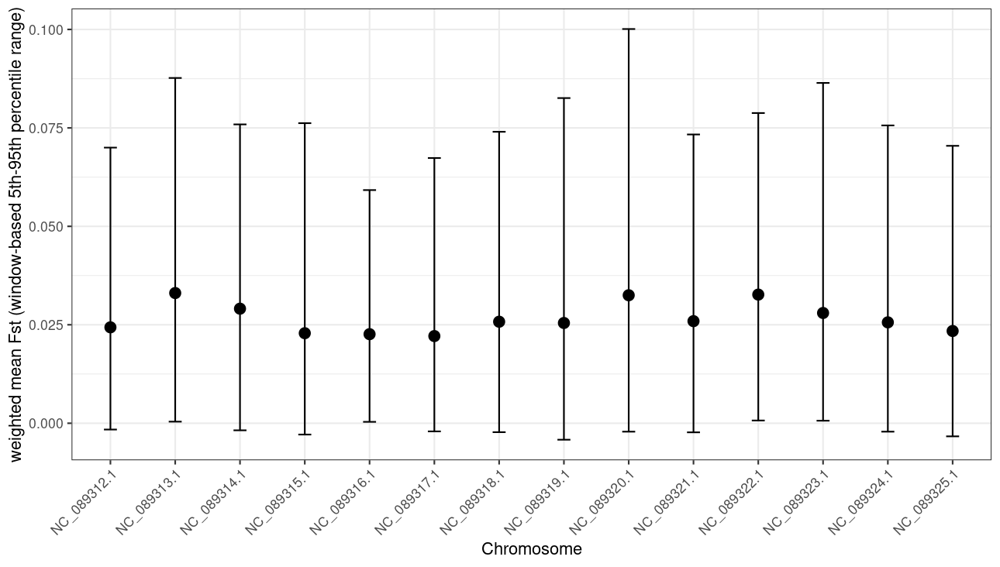

<br>

```r
# plot Fst against Dxy by chromosome
plot(dxy_sum_by_chrom_island$pooled_dxy, 
     fst_sum_by_chrom_island$w_mean,
     xlab = "Dxy (between-pop divergence)",
     ylab = "Fst (Hudson's)",
     pch = 19)

# ggplot version for nicer plot
fst_island_vs_dxy <- dxy_sum_by_chrom_island %>%
  select(chromosome, pooled_dxy) %>%
  left_join(
    fst_sum_by_chrom_island %>%
      select(chromosome, w_mean),
    by = "chromosome"
  )

ggplot(fst_island_vs_dxy, aes(x = pooled_dxy, y = w_mean)) +
  geom_point(size = 3) +
  geom_text_repel(aes(label = chromosome), size = 3) +
  labs(
    x = expression("Between-population divergence (" * D[xy] * ")"),
    y = expression("Hudson's " *F[ST])
    ) +
  theme_bw()
```
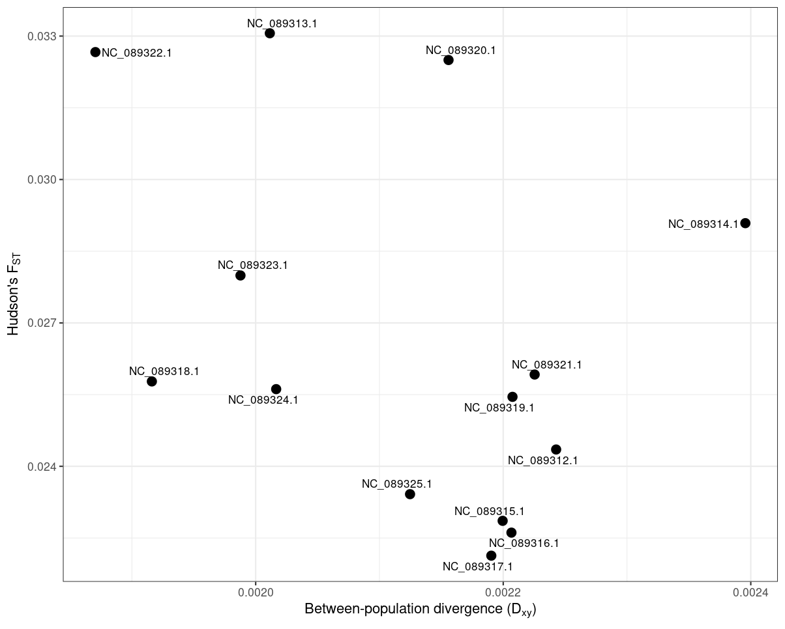

<br>

```r
# plot Fst againsd Dxy and pi by window
island_fst_dxy_pi_windows <- fst_island_filt_snpfilt %>% 
  select(chromosome, window_pos_1, window_pos_2, avg_hudson_fst, no_snps) %>%
  left_join(
    dxy_island_filt %>% 
      select(chromosome, window_pos_1, window_pos_2, avg_dxy, no_sites),
    by = c("chromosome", "window_pos_1", "window_pos_2")
  ) %>% 
  left_join(
    pi_island_filt %>% 
      select(chromosome, window_pos_1, window_pos_2, pop, avg_pi) %>% 
      pivot_wider(
        names_from = pop,
        values_from = avg_pi,
        names_prefix = "pi_"
      ),
    by = c("chromosome", "window_pos_1", "window_pos_2")
  ) %>%
  mutate(
    avg_pi_within = (pi_Ofu + pi_Tutuila) / 2,
    diff = avg_dxy - avg_pi_within
  )

# Fst vs Dxy
fst_v_dxy <- ggplot(island_fst_dxy_pi_windows, aes(x = avg_dxy, y = avg_hudson_fst)) +
  geom_point(alpha = 0.25, size = 2) +
  geom_smooth(method = "lm") +
  labs(
    x = expression("Between-population divergence (" * D[xy] * ") of 10 kb window"),
    y = expression("Hudson's " *F[ST] * " of 10kb window")
  ) +
  theme_bw()

# Fst vs average pi
fst_v_pi <- ggplot(island_fst_dxy_pi_windows, aes(x = avg_pi_within, y = avg_hudson_fst)) +
  geom_point(alpha = 0.25, size = 2) +
  geom_smooth(method = "lm") +
  labs(
    x = expression("Avg within-population diversity ("~pi~") of 10 kb window"),
    y = expression("Hudson's " *F[ST] * " of 10kb window")
  ) +
  theme_bw()

# Dxy vs average pi
dxy_v_pi <- ggplot(island_fst_dxy_pi_windows, aes(x = avg_pi_within, y = avg_dxy)) +
  geom_point(alpha = 0.25, size = 2) +
  geom_smooth(method = "lm") +
  geom_abline(slope = 1, intercept = 0, linetype = "dashed", color = "red") +
  labs(
    x = expression("Avg within-population diversity ("~pi~") of 10 kb window"),
    y = expression("Between-population divergence (" * D[xy] * ") of 10 kb window")
  ) +
  theme_bw()

  # Fst vs (Dxy-pi)
fst_v_diff <- ggplot(island_fst_dxy_pi_windows, aes(x = diff, y = avg_hudson_fst)) +
  geom_point(alpha = 0.25, size = 2) +
  geom_smooth(method = "lm") +
  labs(
    x = expression(D[xy]~" - "~pi),
    y = expression("Hudson's " *F[ST] * " of 10kb window")
  ) +
  theme_bw()

library(cowplot)
plot_grid(fst_v_dxy + fst_v_pi + dxy_v_pi + fst_v_diff)
```
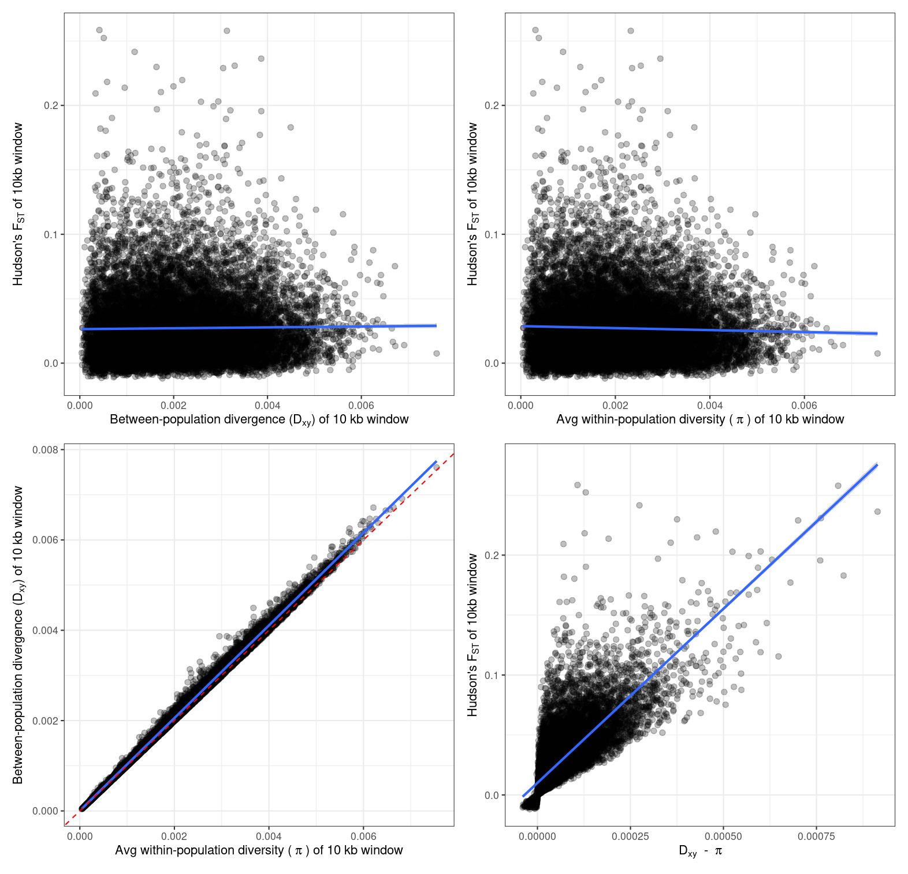


No strong correllation between Fst and Dxy, so Fst is only partially explained by Dxy.  
No strong correllation between Fst and average population pi, so Fst is only partially explained by pi.
Very tight (nearly 1:1) correllation between Dxy and average pi, but Dxy systemically greater than pi.
Strong correlation between Fst and difference between Dxy and average pi.

Hudson's Fst:
Fst​ = 1 − (avg. ​within-pop π)​/Dxy​

If Fst were driven purely by divergence, we’d see a tight positive relationship, but we don't see that here.

We see:
- many windows with low Fst even at moderate Dxy
- high fst mostly at low to moderate Dxy values
- similar pattern for pi
- Fst has slightly positive realtionship with Dxy, slightly negative relationship with pi, but both very weak
- no cluster of high Fst + high Dxy, so no "islands of divergence" 

**Interpretation**: Genome-wide patterns of relative differentiation are weak (Fst = 0.0265) and show little association with either absolute divergence (Dxy) or average within-population diversity (π) when considered independently. Instead, Dxy and π are nearly identical across genomic windows, with Dxy slightly but consistently elevated, indicating that most genetic variation is shared among populations. Variation in FST is strongly associated with the difference between Dxy and π, suggesting relative differentiation reflects small but genome-wide elevation in between-population divergence relative to within-population diversity. These patterns are consistent with weak, genome-wide differentiation maintained by ongoing gene flow and/or recent divergence in a large effective population.


<br>

```r
## Plot genome tracks for each metric as stacked plot

# set theme settings
track_theme <- theme_bw() +
  theme(
    panel.grid.minor = element_blank(),
    panel.grid.major.x = element_blank(),
    strip.background = element_rect(fill = "grey90", color = "grey50"),
    strip.text = element_text(size = 10),
    axis.text.x = element_text(angle = 45, hjust = 1),
    plot.margin = margin(3, 5.5, 3, 5.5)
  )
    

# average pi
pi_track <- ggplot(island_fst_dxy_pi_windows, aes(x = window_pos_1, y = avg_pi_within)) +
  geom_point(alpha = 0.3, size = 0.5) +
  geom_smooth(span = 0.1, color = "red", linewidth = 0.5, se = FALSE) +
  facet_grid(~ chromosome, scales = "free_x") +
  labs(
    x = NULL,
    y = expression("Avgerage population " * pi)
  ) +
  track_theme +
  theme(
    axis.text.x = element_blank(),
    axis.ticks.x = element_blank()
  )

# Dxy
dxy_track <- ggplot(island_fst_dxy_pi_windows, aes(x = window_pos_1, y = avg_dxy)) +
  geom_hline(yintercept = pooled_dxy_island, linetype = "dashed", linewidth = 0.4) +
  geom_point(alpha = 0.3, size = 0.5) +
  geom_smooth(span = 0.1, color = "red", linewidth = 0.5, se = FALSE) +
  facet_grid(~ chromosome, scales = "free_x") +
  labs(
    x = NULL,
    y = expression(D[xy])
  ) +
  track_theme +
  theme(
    axis.text.x = element_blank(),
    axis.ticks.x = element_blank(),
    strip.text = element_blank(),
    strip.background = element_blank()
  )

# Fst
fst_track <- ggplot(island_fst_dxy_pi_windows, aes(x = window_pos_1, y = avg_hudson_fst)) +
  geom_hline(yintercept = wmean_fst_island, linetype = "dashed", linewidth = 0.4) +
  geom_point(alpha = 0.3, size = 0.5) +
  geom_smooth(span = 0.1, color = "red", linewidth = 0.5, se = FALSE) +
  facet_grid(~ chromosome, scales = "free_x") +
  labs(
    x = NULL,
    y = expression("Hudson's " * F[ST])
  ) +
  track_theme +
  theme(
    axis.text.x = element_blank(),
    axis.ticks.x = element_blank(),
    strip.text = element_blank(),
    strip.background = element_blank()
  )

plot_grid(pi_track,
          dxy_track,
          fst_track,
          ncol = 1,
          align = "v",
          axis = "lr",
          rel_heights = c(1, 1, 1)
)
```

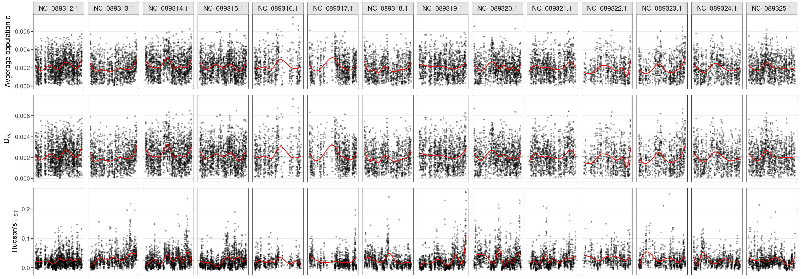

<br>
<br>

### Location-level differentiation (Dxy & Fst)

#### Dxy first
```r
### Now location-level comparison
## Dxy first

# Load in files
dxy_location_files <- list.files(
  "./location/",
  pattern = "_dxy.txt$",
  full.names = TRUE
)

# name the vector for use in .id column in next step
names(dxy_location_files) <- dxy_location_files

# import and combine location dxy files while creating new column with file path/name
dxy_location_raw <- map_dfr(dxy_location_files, read_tsv, .id = "source_file")

#reformatting
dxy_location <- dxy_location_raw %>%
  mutate(
    chromosome = str_remove(chromosome, "_Pverrucosa$") %>% as.factor(),
    pop1 = as.factor(pop1),
    pop2 = as.factor(pop2)
  )

str(dxy_location)
```
```
tibble [1,585,620 × 11] (S3: tbl_df/tbl/data.frame)
 $ source_file      : chr [1:1585620] "./location//NC_089312.1_Pverrucosa.location_dxy.txt" "./location//NC_089312.1_Pverrucosa.location_dxy.txt" "./location//NC_089312.1_Pverrucosa.location_dxy.txt" "./location//NC_089312.1_Pverrucosa.location_dxy.txt" ...
 $ pop1             : Factor w/ 9 levels "ALOF","AOAA",..: 1 1 1 1 9 4 4 4 5 5 ...
 $ pop2             : Factor w/ 9 levels "AOAA","FALU",..: 1 2 3 4 9 7 8 9 5 6 ...
 $ chromosome       : Factor w/ 27 levels "NC_089312.1",..: 1 1 1 1 1 1 1 1 1 1 ...
 $ window_pos_1     : num [1:1585620] 1 1 1 1 1 1 1 1 1 1 ...
 $ window_pos_2     : num [1:1585620] 10000 10000 10000 10000 10000 10000 10000 10000 10000 10000 ...
 $ avg_dxy          : num [1:1585620] NA NA NA NA NA NA NA NA NA NA ...
 $ no_sites         : num [1:1585620] 0 0 0 0 0 0 0 0 0 0 ...
 $ count_diffs      : num [1:1585620] NA NA NA NA NA NA NA NA NA NA ...
 $ count_comparisons: num [1:1585620] NA NA NA NA NA NA NA NA NA NA ...
 $ count_missing    : num [1:1585620] NA NA NA NA NA NA NA NA NA NA ...
```

<br>

```r
# plot distribution of callable sites per 10kb window (should be same as other location stats)
ggplot(dxy_location, aes(x = no_sites)) +
  geom_histogram(bins = 50) +
  labs(
    x = "Number of callable sites per window",
    y = "Number of windows"
  ) +
  scale_x_continuous(breaks = seq(from=0, to = 10000, by = 2000)) +
  theme_bw() +
  theme(axis.text.x = element_text(angle = 45, hjust = 1))
```
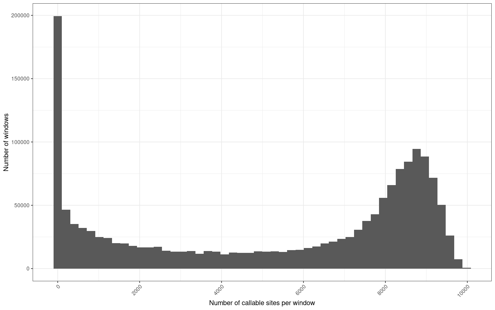

<br>

```r
# filter dataset based on 7000 site cutoff
dxy_location_filt <- dxy_location %>% 
  filter(no_sites >= 7000)

# summarize remaining windows after filtering (another sanity check)
dxy_location %>%
  summarise(
    total = n(),
    retained = sum(no_sites >= 7000),
    prop = retained / total
  )

# sensitivity check: try other cutoffs to see how it changes number of retained windows
dxy_location %>%
  summarise(
    prop_6000 = mean(no_sites >= 6000),
    prop_7000 = mean(no_sites >= 7000),
    prop_8000 = mean(no_sites >= 8000)
  )
```
```
    total retained  prop
    <int>    <int> <dbl>
  1585620   763245 0.481

  prop_6000 prop_7000 prop_8000
      <dbl>     <dbl>     <dbl>
      0.542     0.481     0.367
```

<br>

```r
# plot distribution of average dxy across filtered 10kb windows
ggplot(dxy_location_filt, aes(x = avg_dxy)) +
  geom_histogram(bins = 50, alpha = 0.5, position = "identity") +
  labs(
    x = "avg_dxy (Mean per-site Dxy across 10 kb window)",
    y = "Number of 10 kb windows"
  ) +
  theme_bw()
```
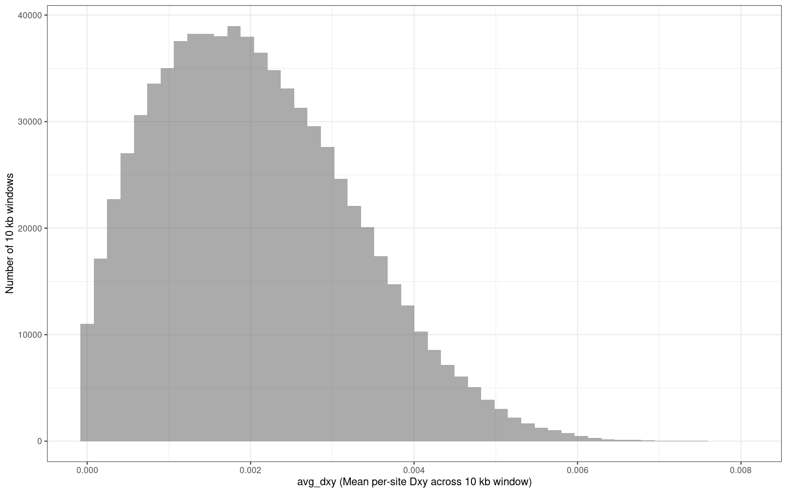
Looks similar to distribution for island-level comparison.

<br>

```r
# calculate full summary stats for genome-wide dxy between locations
dxy_sum_location <- dxy_location_filt %>% 
  group_by(comparison) %>% 
  summarise(
    pooled_dxy = sum(count_diffs, na.rm = TRUE) / sum(count_comparisons, na.rm = TRUE), # pixy-recommended approach for aggregating across windows
    w_mean = weighted.mean(avg_dxy, no_sites),
    median = median(avg_dxy),
    sd = sd(avg_dxy),
    q05 = quantile(avg_dxy, 0.05),
    q95 = quantile(avg_dxy, 0.95)
  ) %>% 
  arrange(desc(pooled_dxy))
```
```
   comparison pooled_dxy  w_mean  median      sd      q05     q95
   <fct>           <dbl>   <dbl>   <dbl>   <dbl>    <dbl>   <dbl>
 1 AOAA_OFU3     0.00217 0.00217 0.00199 0.00123 0.000333 0.00433
 2 OFU3_VATI     0.00217 0.00216 0.00198 0.00123 0.000330 0.00433
 3 FASA_OFU3     0.00216 0.00215 0.00198 0.00123 0.000323 0.00431
 4 MALO_OFU3     0.00216 0.00215 0.00198 0.00123 0.000332 0.00430
 5 AOAA_OFU6     0.00216 0.00215 0.00197 0.00124 0.000326 0.00432
 6 ALOF_OFU3     0.00216 0.00215 0.00198 0.00122 0.000329 0.00430
 7 FALU_OFU3     0.00216 0.00215 0.00198 0.00122 0.000339 0.00429
 8 LEON_OFU3     0.00215 0.00214 0.00198 0.00121 0.000330 0.00428
 9 FTEL_OFU3     0.00214 0.00214 0.00197 0.00122 0.000333 0.00429
10 OFU6_VATI     0.00214 0.00214 0.00197 0.00122 0.000320 0.00429
...
# ℹ 35 more rows
```

<br>

```r
# convert to matrix for easier visualization
pop_order <- c("ALOF","AOAA","FALU","FASA","FTEL","LEON","MALO","OFU3","OFU6","VATI")

dxy_matrix <- dxy_sum_location %>%
  separate(comparison, into = c("pop1", "pop2"), sep = "_") %>%  # split comparison back into pop1 and pop2
  select(pop1, pop2, pooled_dxy) %>%
  mutate(pop1 = factor(pop1, levels = pop_order)) %>%
  pivot_wider(names_from = pop2, values_from = pooled_dxy) %>%  # cast to matrix format
  arrange(pop1) %>% 
  select(pop1, all_of(pop_order[-1])) %>%   # reorder columns to match row order
  column_to_rownames("pop1") %>%
  as.matrix() %>% 
  t() %>% 
  round(5)

dxy_matrix
```
```
        ALOF    AOAA    FALU    FASA    FTEL    LEON    MALO    OFU3    OFU6
AOAA 0.00212      NA      NA      NA      NA      NA      NA      NA      NA
FALU 0.00210 0.00213      NA      NA      NA      NA      NA      NA      NA
FASA 0.00210 0.00211 0.00210      NA      NA      NA      NA      NA      NA
FTEL 0.00209 0.00210 0.00209 0.00209      NA      NA      NA      NA      NA
LEON 0.00209 0.00211 0.00209 0.00209 0.00208      NA      NA      NA      NA
MALO 0.00209 0.00210 0.00210 0.00207 0.00206 0.00208      NA      NA      NA
OFU3 0.00216 0.00217 0.00216 0.00216 0.00214 0.00215 0.00216      NA      NA
OFU6 0.00213 0.00216 0.00213 0.00213 0.00212 0.00212 0.00213 0.00213      NA
VATI 0.00211 0.00212 0.00211 0.00207 0.00209 0.00210 0.00209 0.00217 0.00214
```

<br>

```r
# fill out full symmetrical matrix to enable reorder of locations
pop_order <- c("ALOF","AOAA","FALU","FASA","FTEL","LEON","MALO","VATI","OFU3","OFU6")

# original pairwise dataframe
dxy_pairs <- dxy_sum_location %>%
  separate(comparison, into = c("pop1", "pop2"), sep = "_") %>%
  select(pop1, pop2, pooled_dxy)

# reversed copy to bind
dxy_pairs_rev <- dxy_pairs %>%
  rename(new_pop1 = pop2, new_pop2 = pop1) %>% 
  rename(pop1 = new_pop1, pop2 = new_pop2)

# bind together and convert to full matrix
dxy_matrix_full <- bind_rows(dxy_pairs, dxy_pairs_rev) %>% 
  mutate(
    pop1 = factor(pop1, levels = pop_order),
    pop2 = factor(pop2, levels = pop_order)
  ) %>%
  pivot_wider(
    names_from = pop2,
    values_from = pooled_dxy,
    names_expand = TRUE
  ) %>%
  arrange(pop1) %>%
  select(pop1, all_of(pop_order)) %>%
  column_to_rownames("pop1") %>%
  as.matrix() %>%
  round(5)


# now reorder locations by island
new_order <- c("ALOF","AOAA","FALU","FASA","FTEL","LEON","MALO","VATI","OFU3","OFU6")

dxy_matrix_full_reordered <- dxy_matrix_full[new_order, new_order]


# trim to lower triangle only
dxy_matrix_lower <- dxy_matrix_full_reordered
dxy_matrix_lower[upper.tri(dxy_matrix_lower, diag = TRUE)] <- NA
dxy_matrix_lower

# also create upper triangle in case I want it later
dxy_matrix_upper <- dxy_matrix_full_reordered
dxy_matrix_upper[lower.tri(dxy_matrix_upper, diag = TRUE)] <- NA
```
```
        ALOF    AOAA    FALU    FASA    FTEL    LEON    MALO    VATI    OFU3 OFU6
ALOF      NA      NA      NA      NA      NA      NA      NA      NA      NA   NA
AOAA 0.00212      NA      NA      NA      NA      NA      NA      NA      NA   NA
FALU 0.00210 0.00213      NA      NA      NA      NA      NA      NA      NA   NA
FASA 0.00210 0.00211 0.00210      NA      NA      NA      NA      NA      NA   NA
FTEL 0.00209 0.00210 0.00209 0.00209      NA      NA      NA      NA      NA   NA
LEON 0.00209 0.00211 0.00209 0.00209 0.00208      NA      NA      NA      NA   NA
MALO 0.00209 0.00210 0.00210 0.00207 0.00206 0.00208      NA      NA      NA   NA
VATI 0.00211 0.00212 0.00211 0.00207 0.00209 0.00210 0.00209      NA      NA   NA
OFU3 0.00216 0.00217 0.00216 0.00216 0.00214 0.00215 0.00216 0.00217      NA   NA
OFU6 0.00213 0.00216 0.00213 0.00213 0.00212 0.00212 0.00213 0.00214 0.00213   NA
```

<br>

Visualize as heatmap:
```r
# convert back to long format
dxy_heatmap_df <- dxy_matrix_lower %>%
  as.data.frame() %>%
  rownames_to_column("pop1") %>%
  pivot_longer(
    cols = -pop1,
    names_to = "pop2",
    values_to = "dxy"
  ) %>%
  mutate(
    pop1 = factor(pop1, levels = new_order),
    pop2 = factor(pop2, levels = new_order)
  )

# plot heatmap!
ggplot(dxy_heatmap_df, aes(x = pop2, y = pop1, fill = dxy)) +
  geom_tile(color = "white") +
  geom_text(aes(label = ifelse(is.na(dxy), "", sprintf("%.5f", dxy))), size = 3) +
  scale_fill_viridis_c(na.value = "white") +
  scale_y_discrete(limits = rev(levels(dxy_heatmap_df$pop1))) +
  coord_fixed() +
  labs(
    x = NULL,
    y = NULL,
    fill = "Dxy"
  ) +
  theme_bw() +
  theme(
    axis.text.x = element_text(angle = 45, hjust = 1),
    panel.grid = element_blank()
  )
```
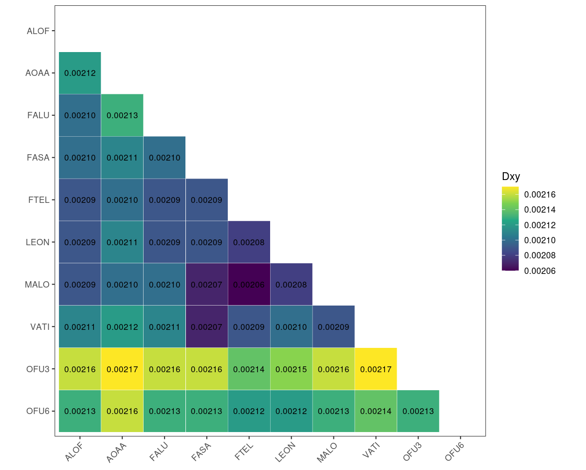

<br>

```r
mean_pairwise_dxy <- mean(dxy_sum_location$pooled_dxy)


mean_pairwise_dxy_tutuila <- dxy_sum_location %>% 
  filter(!str_detect(comparison, "OFU")) %>% 
  pull(pooled_dxy) %>% 
  mean()

```
Mean pairwise pooled dxy between all locations = 0.00211439136208461

Mean pairwise pooled dxy between Tutila locations = 0.00209592103758804

<br>

```r
# replot distribution with mean pairwise dxy between all locations
ggplot(dxy_location_filt, aes(x = avg_dxy)) +
  geom_histogram(bins = 50, alpha = 0.5, position = "identity") +
  geom_vline(xintercept = mean_pairwise_dxy, linetype = "dashed") +
  labs(
    x = "avg_dxy (Mean per-site Dxy across 10 kb window)",
    y = "Count of 10 kb windows"
  ) +
  theme_bw()
```
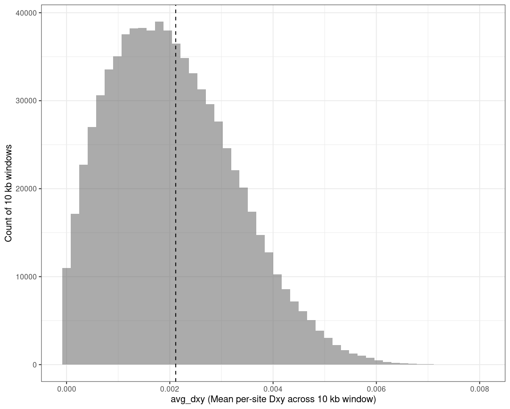

<br>

```r
# facet by chromosome (using mean_pairwise_dxy as x-intercept for reference)
ggplot(dxy_location_filt, aes(x = avg_dxy)) +
  geom_histogram(bins = 50, alpha = 0.5, position = "identity") +
  geom_vline(xintercept = mean_pairwise_dxy, linetype = "dashed") +
  facet_grid(~ chromosome) +
  labs(
    x = "avg_dxy (Mean per-site Dxy across 10 kb window)",
    y = "Count of 10 kb windows"
  ) +
  theme_bw() +
  theme(axis.text.x = element_text(angle = 45, hjust = 1))
```
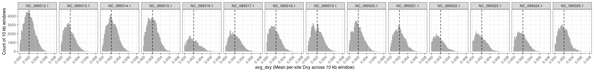

<br>

```r
# plot "average" per-window dxy across genome
# calculate pooled dxy (across location comparisons) for each window
dxy_window_sum_location <- dxy_location_filt %>% 
  group_by(chromosome, window_pos_1) %>%
  summarise(
    mean_dxy = mean(avg_dxy, na.rm = TRUE),  # mean_dxy treats each location-pair comparison equally, which is what we are interested in here
    var_dxy  = var(avg_dxy, na.rm = TRUE),
    max_dxy  = max(avg_dxy, na.rm = TRUE),
    n_pairs  = n(),
    .groups = "drop"
  )

# plot mean dxy
ggplot(dxy_window_sum_location, aes(x = window_pos_1, y = mean_dxy)) +
  geom_point(alpha = 0.3, size = 0.5) +
  geom_smooth(span = 0.1, color = "red", linewidth = 0.5) +
  facet_wrap(~ chromosome, scales = "free_x") +
  labs(
    x = "Genomic position",
    y = "Mean dxy across location pairs"
  ) +
  theme_bw() +
  theme(axis.text.x = element_text(angle = 45, hjust = 1))
```
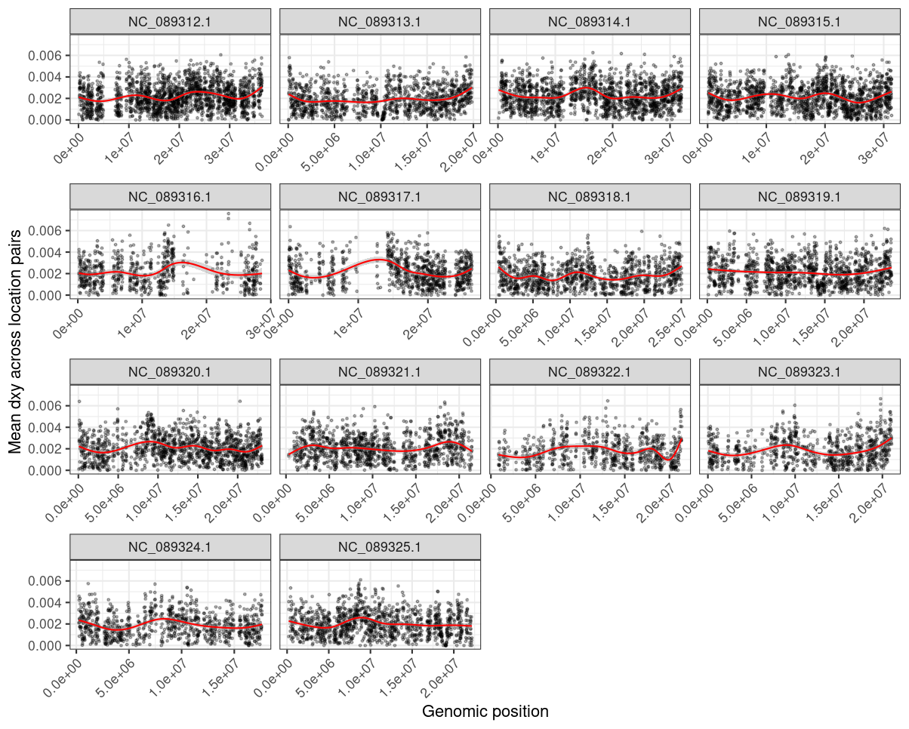

<br>

```r
# plot variance
ggplot(dxy_window_sum_location, aes(x = window_pos_1, y = var_dxy)) +
  geom_point(alpha = 0.3, size = 0.5) +
  geom_smooth(span = 0.1, color = "red", linewidth = 0.5) +
  facet_wrap(~ chromosome, scales = "free_x") +
  labs(
    x = "Genomic position",
    y = "Variance in dxy across location pairs"
  ) +
  theme_bw() +
  theme(axis.text.x = element_text(angle = 45, hjust = 1))
```
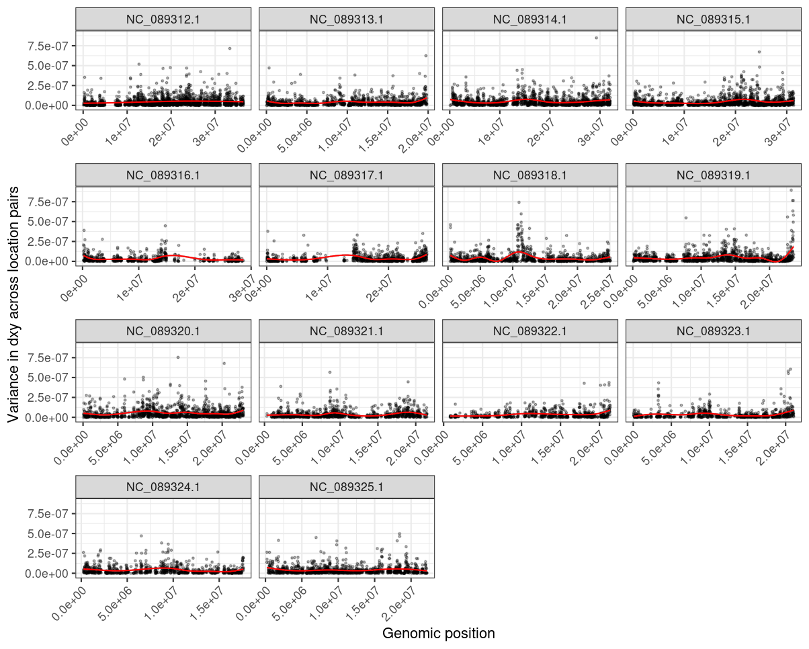

<br>

```r
# plot max dxy
ggplot(dxy_window_sum_location, aes(x = window_pos_1, y = max_dxy)) +
  geom_point(alpha = 0.3, size = 0.5) +
  geom_smooth(span = 0.1, color = "red", linewidth = 0.5) +
  facet_wrap(~ chromosome, scales = "free_x") +
  labs(
    x = "Genomic position",
    y = "Max dxy across location pairs"
  ) +
  theme_bw() +
  theme(axis.text.x = element_text(angle = 45, hjust = 1))
```
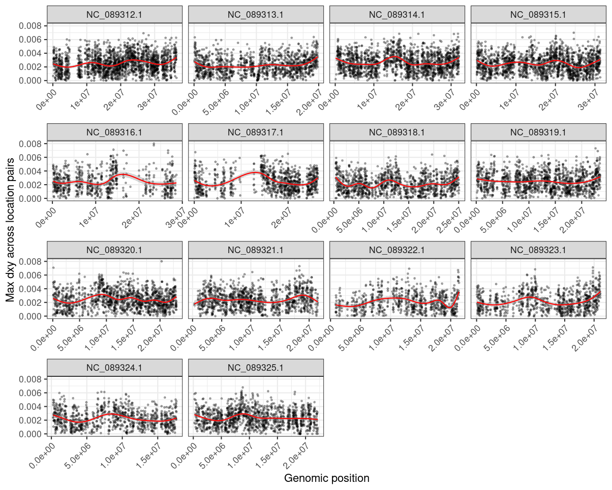

<br>

```r
# plot all three as tracks
# transform into one long format
dxy_window_sum_long <- dxy_window_sum_location %>%
  select(chromosome, window_pos_1, mean_dxy, var_dxy, max_dxy) %>%
  pivot_longer(
    cols = c(mean_dxy, var_dxy, max_dxy),
    names_to = "metric",
    values_to = "value"
  ) %>% 
  mutate(metric = as.factor(metric))

# reorder so pooled dxy is on top
dxy_window_sum_long$metric <- factor(
  dxy_window_sum_long$metric,
  levels = c("mean_dxy", "var_dxy", "max_dxy")
)

# plot tracks
ggplot(dxy_window_sum_long, aes(x = window_pos_1, y = value)) +
  geom_point(alpha = 0.3, size = 0.4) +
  geom_smooth(span = 0.1, color = "red", linewidth = 0.4) +
  facet_grid(metric ~ chromosome, scales = "free", switch = "y") +
  labs(
    x = "Genomic position",
    y = NULL
  ) +
  theme_bw() +
  theme(
    axis.text.x = element_text(angle = 45, hjust = 1),
    strip.placement = "outside",
    strip.background = element_blank()
  )
```
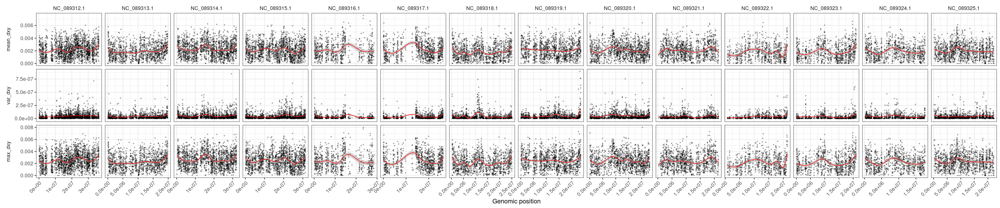

<br>
<br>

#### Now Fst

```r
# Load in files
fst_location_files <- list.files(
  "./location/",
  pattern = "_fst.txt$",
  full.names = TRUE
)

# name the vector for use in .id column in next step
names(fst_location_files) <- fst_location_files

# import and combine location fst files while creating new column with file path/name
fst_location_raw <- map_dfr(fst_location_files, read_tsv, .id = "source_file")

#reformatting
fst_location <- fst_location_raw %>%
  mutate(
    chromosome = str_remove(chromosome, "_Pverrucosa$") %>% as.factor(),
    pop1 = as.factor(pop1),
    pop2 = as.factor(pop2),
    comparison = as.factor(paste(pop1, pop2, sep = "_"))
  )

str(fst_location)
```
```
tibble [1,136,160 × 9] (S3: tbl_df/tbl/data.frame)
 $ source_file   : chr [1:1136160] "./location//NC_089312.1_Pverrucosa.location_fst.txt" "./location//NC_089312.1_Pverrucosa.location_fst.txt" "./location//NC_089312.1_Pverrucosa.location_fst.txt" "./location//NC_089312.1_Pverrucosa.location_fst.txt" ...
 $ pop1          : Factor w/ 9 levels "ALOF","AOAA",..: 1 1 1 1 1 5 5 5 5 6 ...
 $ pop2          : Factor w/ 9 levels "AOAA","FALU",..: 1 2 3 4 5 6 7 8 9 6 ...
 $ chromosome    : Factor w/ 18 levels "NC_089312.1",..: 1 1 1 1 1 1 1 1 1 1 ...
 $ window_pos_1  : num [1:1136160] 30001 30001 30001 30001 30001 ...
 $ window_pos_2  : num [1:1136160] 40000 40000 40000 40000 40000 40000 40000 40000 40000 40000 ...
 $ avg_hudson_fst: num [1:1136160] 0.00276 0.01294 0.11625 0.17629 -0.01482 ...
 $ no_snps       : num [1:1136160] 15 15 15 15 15 15 15 15 15 15 ...
 $ comparison    : Factor w/ 45 levels "ALOF_AOAA","ALOF_FALU",..: 1 2 3 4 5 32 33 34 35 36 ...
```

<br>

```r
# plot distribution of SNPs per 10kb window (no_sites is not included in pixy output for Fst)
ggplot(fst_location, aes(x = no_snps)) +
  geom_histogram(bins = 50) +
  labs(
    x = "Number of SNPs per 10 kb window",
    y = "Number of windows"
  ) +
  scale_x_continuous(breaks = seq(from=0, to = 800, by = 100)) +
  theme_bw() +
  theme(axis.text.x = element_text(angle = 45, hjust = 1))

# log-scaled x-axis version for better visual clarity at low SNP numbers
ggplot(fst_location, aes(x = no_snps)) +
  geom_histogram() +
  labs(
    x = "Number of SNPs per 10 kb window (log scale)",
    y = "Number of windows"
  ) +
  scale_x_log10() +
  theme_bw() +
  theme(axis.text.x = element_text(angle = 45, hjust = 1))
```
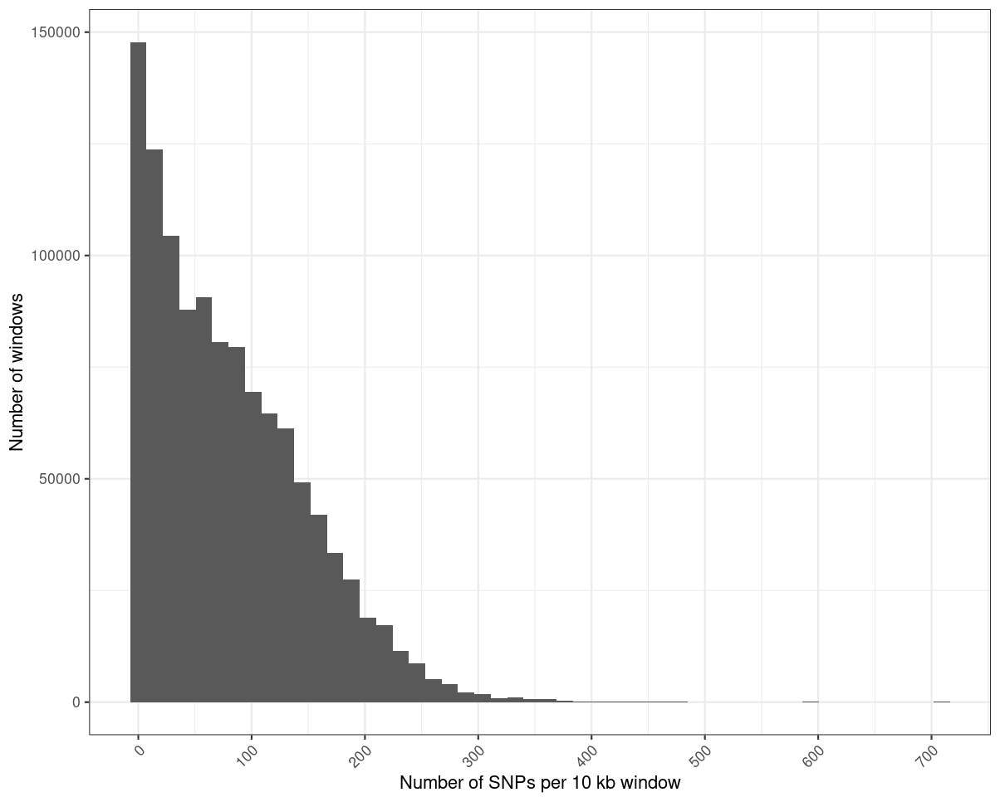
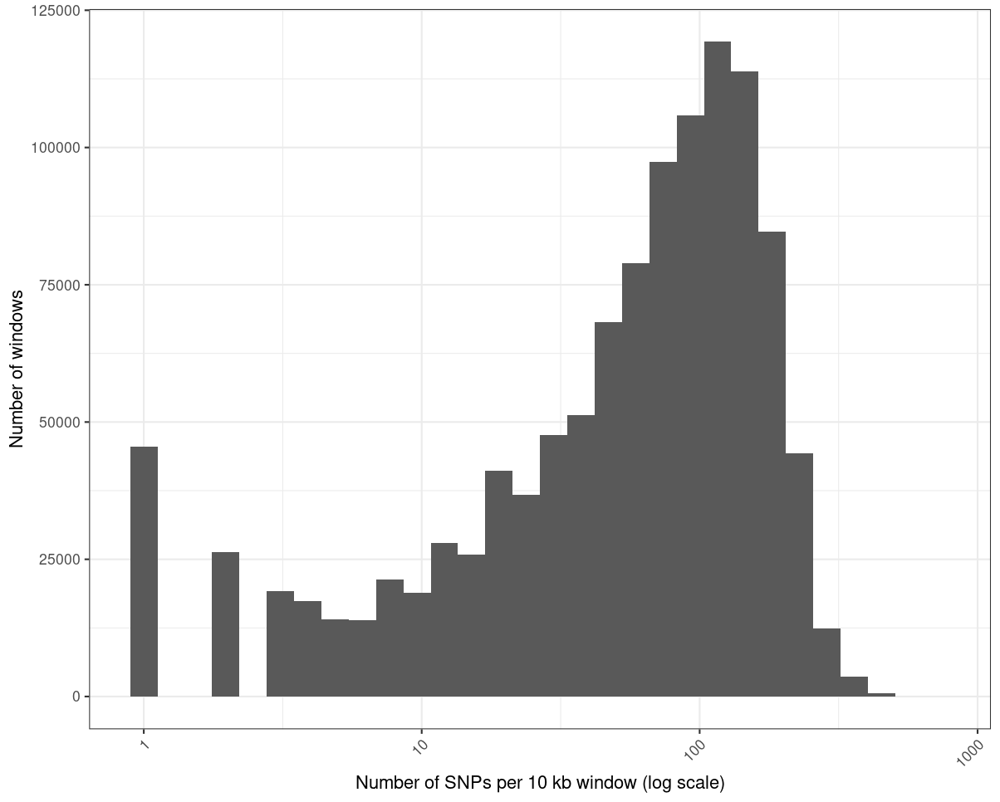

<br>

```r
# summarize remaining windows if we filter for windows with at least 10 SNPs
fst_location %>%
  summarise(
    total = n(),
    retained = sum(no_snps >= 10),
    prop = retained / total
  )

# sensitivity check: try other cutoffs to see how it changes number of retained windows
fst_location %>%
  summarise(
    prop_05 = mean(no_snps >= 5),
    prop_10 = mean(no_snps >= 10),
    prop_20 = mean(no_snps >= 20),
    prop_30 = mean(no_snps >= 30)
  )
```
```
    total retained  prop
  1136160   968580 0.853

  prop_05 prop_10 prop_20 prop_30
    0.905   0.853   0.776   0.711
```
This means we could use a cutoff value of >= 10 SNPs, but this leaves 968,580 windows which is more than the 763,245 windows kept for dxy (after filtering for no_sites >= 7000), so Fst and Dxy would not be directly comparable.

<br>

Instead, let's use the same windows we kept for the Dxy analysis:
```r
keep_windows_location <- dxy_location %>%
  filter(no_sites >= 7000) %>%
  select(chromosome, window_pos_1, window_pos_2, comparison)

fst_location_filt <- fst_location %>%
  inner_join(keep_windows_location, by = c("chromosome", "window_pos_1", "window_pos_2", "comparison"))

# summarize remaining windows after keeping sites used in dxy analysis
nrow(fst_location)
nrow(fst_location_filt)
nrow(fst_location_filt)/nrow(fst_location)

nrow(dxy_location_filt) - nrow(fst_location_filt)
```
```
> nrow(fst_location)
[1] 1136160
> nrow(fst_location_filt)
[1] 760995
> nrow(fst_location_filt)/nrow(fst_location)
[1] 0.669795627376426
> nrow(dxy_location_filt) - nrow(fst_location_filt)
[1] 2250
```
So only 2250 windows are missing (across all pairwise location comparisons) that did not have enough polymorphism to calculate Fst but were included in the dxy analysis.

<br>

Now filter based on low SNP number (low SNP number creates unreliable Fst estimates):
```r
fst_location_filt_snpfilt <- fst_location_filt %>% 
  filter(no_snps >= 10) %>% 
  filter(!is.na(avg_hudson_fst))  # also remove the 5 rows that remain with NAs for Fst values
                                  # (These can occur if the SNPs in the window are variable in the full dataset,
                                  # but not variable/informative for that specific population pair)

nrow(fst_location_filt_snpfilt)
nrow(fst_location_filt) - nrow(fst_location_filt_snpfilt)
```
```
> nrow(fst_location_filt_snpfilt)
[1] 745465
> nrow(fst_location_filt) - nrow(fst_location_filt_snpfilt)
[1] 15530
```
This removes an additional 15,530 windows.

<br>

```r
# plot distribution of average fst across filtered 10kb windows
ggplot(fst_location_filt_snpfilt, aes(x = avg_hudson_fst)) +
  geom_histogram(bins = 50, alpha = 0.5, position = "identity") +
  labs(
    x = "avg_hudson_fst (Mean per-site Hudson's Fst across SNPs in 10 kb window)",
    y = "Number of 10 kb windows"
  ) +
  theme_bw()
```
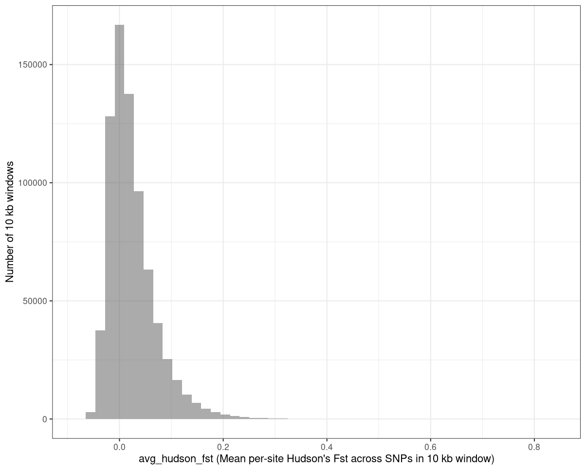
Actually looks somewhat different from distribution for island-level comparison. Peak is at zero.

<br>

```r
# calculate full summary stats for genome-wide Fst between locations
fst_sum_location <- fst_location_filt_snpfilt %>% 
  group_by(comparison) %>% 
  summarise(
    w_mean = weighted.mean(avg_hudson_fst, no_snps),  # pixy output doesn't give separate numerator and denominator values, so pooling isn't possible. Next best option is mean weighted by no_snps in window.
    median = median(avg_hudson_fst),
    sd = sd(avg_hudson_fst),
    q05 = quantile(avg_hudson_fst, 0.05),
    q95 = quantile(avg_hudson_fst, 0.95)
  ) %>% 
  arrange(desc(w_mean))
```
```
# A tibble: 45 × 6
   comparison w_mean median     sd      q05   q95
   <fct>       <dbl>  <dbl>  <dbl>    <dbl> <dbl>
 1 OFU3_VATI  0.0540 0.0425 0.0547 -0.00996 0.159
 2 MALO_OFU3  0.0503 0.0385 0.0594 -0.0186  0.163
 3 FTEL_OFU3  0.0497 0.0394 0.0474 -0.00443 0.142
 4 FASA_OFU3  0.0497 0.0378 0.0618 -0.0224  0.168
 5 AOAA_OFU3  0.0414 0.0318 0.0502 -0.0153  0.140
 6 ALOF_OFU3  0.0407 0.0317 0.0461 -0.0119  0.130
 7 LEON_OFU3  0.0396 0.0308 0.0475 -0.0131  0.131
 8 FALU_OFU3  0.0367 0.0272 0.0455 -0.0131  0.127
 9 FTEL_VATI  0.0333 0.0245 0.0395 -0.0130  0.109
10 FASA_FTEL  0.0297 0.0193 0.0475 -0.0247  0.119
# ℹ 35 more rows
```

<br>

```r
# convert to matrix for easier visualization
pop_order <- c("ALOF","AOAA","FALU","FASA","FTEL","LEON","MALO","OFU3","OFU6","VATI")

fst_matrix <- fst_sum_location %>%
  separate(comparison, into = c("pop1", "pop2"), sep = "_") %>%  # split comparison back into pop1 and pop2
  select(pop1, pop2, w_mean) %>%
  mutate(pop1 = factor(pop1, levels = pop_order)) %>%
  pivot_wider(names_from = pop2, values_from = w_mean) %>%  # cast to matrix format
  arrange(pop1) %>% 
  select(pop1, all_of(pop_order[-1])) %>%   # reorder columns to match row order
  column_to_rownames("pop1") %>%
  as.matrix() %>% 
  t() %>% 
  round(5)

fst_matrix
```
```
        ALOF    AOAA    FALU    FASA    FTEL    LEON    MALO    OFU3    OFU6
AOAA 0.01439      NA      NA      NA      NA      NA      NA      NA      NA
FALU 0.00906 0.01461      NA      NA      NA      NA      NA      NA      NA
FASA 0.02178 0.01804 0.01793      NA      NA      NA      NA      NA      NA
FTEL 0.02223 0.01920 0.02082 0.02966      NA      NA      NA      NA      NA
LEON 0.01224 0.01386 0.00640 0.01751 0.01983      NA      NA      NA      NA
MALO 0.01738 0.01620 0.01762 0.01732 0.01981 0.01565      NA      NA      NA
OFU3 0.04070 0.04143 0.03668 0.04970 0.04972 0.03956 0.05030      NA      NA
OFU6 0.01308 0.01788 0.00935 0.02134 0.02379 0.01240 0.02229 0.01437      NA
VATI 0.02768 0.02488 0.02365 0.01647 0.03329 0.02344 0.02475 0.05398 0.02722
```

<br>

```r
# fill out full symmetrical matrix to enable reorder of locations

# original pairwise dataframe
fst_pairs <- fst_sum_location %>%
  separate(comparison, into = c("pop1", "pop2"), sep = "_") %>%
  select(pop1, pop2, w_mean)

# reversed copy to bind
fst_pairs_rev <- fst_pairs %>%
  rename(new_pop1 = pop2, new_pop2 = pop1) %>% 
  rename(pop1 = new_pop1, pop2 = new_pop2)

# bind together and convert to full matrix
fst_matrix_full <- bind_rows(fst_pairs, fst_pairs_rev) %>% 
  mutate(
    pop1 = factor(pop1, levels = pop_order),
    pop2 = factor(pop2, levels = pop_order)
  ) %>%
  pivot_wider(
    names_from = pop2,
    values_from = w_mean,
    names_expand = TRUE
  ) %>%
  arrange(pop1) %>%
  select(pop1, all_of(pop_order)) %>%
  column_to_rownames("pop1") %>%
  as.matrix() %>%
  round(5)


# now reorder locations by island
new_order <- c("ALOF","AOAA","FALU","FASA","FTEL","LEON","MALO","VATI","OFU3","OFU6")

fst_matrix_full_reordered <- fst_matrix_full[new_order, new_order]


# trim to lower triangle only
fst_matrix_lower <- fst_matrix_full_reordered
fst_matrix_lower[upper.tri(fst_matrix_lower, diag = TRUE)] <- NA
fst_matrix_lower

# also create upper triangle in case I want it later
fst_matrix_upper <- fst_matrix_full_reordered
fst_matrix_upper[lower.tri(fst_matrix_upper, diag = TRUE)] <- NA
```
```
> fst_matrix_lower
        ALOF    AOAA    FALU    FASA    FTEL    LEON    MALO    VATI    OFU3 OFU6
ALOF      NA      NA      NA      NA      NA      NA      NA      NA      NA   NA
AOAA 0.01439      NA      NA      NA      NA      NA      NA      NA      NA   NA
FALU 0.00906 0.01461      NA      NA      NA      NA      NA      NA      NA   NA
FASA 0.02178 0.01804 0.01793      NA      NA      NA      NA      NA      NA   NA
FTEL 0.02223 0.01920 0.02082 0.02966      NA      NA      NA      NA      NA   NA
LEON 0.01224 0.01386 0.00640 0.01751 0.01983      NA      NA      NA      NA   NA
MALO 0.01738 0.01620 0.01762 0.01732 0.01981 0.01565      NA      NA      NA   NA
VATI 0.02768 0.02488 0.02365 0.01647 0.03329 0.02344 0.02475      NA      NA   NA
OFU3 0.04070 0.04143 0.03668 0.04970 0.04972 0.03956 0.05030 0.05398      NA   NA
OFU6 0.01308 0.01788 0.00935 0.02134 0.02379 0.01240 0.02229 0.02722 0.01437   NA
```

<br>

Visualize as heatmap:
```r
# convert back to long format
fst_heatmap_df <- fst_matrix_lower %>%
  as.data.frame() %>%
  rownames_to_column("pop1") %>%
  pivot_longer(
    cols = -pop1,
    names_to = "pop2",
    values_to = "fst"
  ) %>%
  mutate(
    pop1 = factor(pop1, levels = new_order),
    pop2 = factor(pop2, levels = new_order)
  )

# plot heatmap!
ggplot(fst_heatmap_df, aes(x = pop2, y = pop1, fill = fst)) +
  geom_tile(color = "white") +
  geom_text(aes(label = ifelse(is.na(fst), "", sprintf("%.5f", fst))), size = 3) +
  scale_fill_viridis_c(na.value = "white") +
  scale_y_discrete(limits = rev(levels(fst_heatmap_df$pop1))) +
  coord_fixed() +
  labs(
    x = NULL,
    y = NULL,
    fill = "Fst"
  ) +
  theme_bw() +
  theme(
    axis.text.x = element_text(angle = 45, hjust = 1),
    panel.grid = element_blank()
  )
```
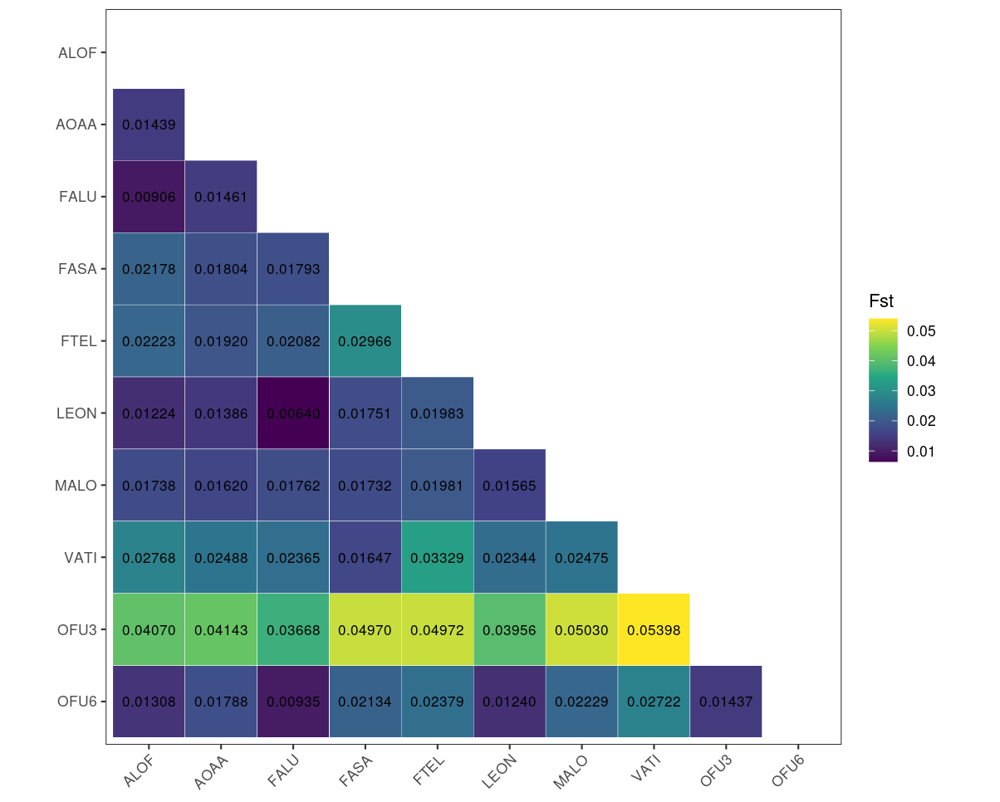

<br>

```r
# calculate mean pairwise Fst across all comparisons
mean_pairwise_fst <- mean(fst_sum_location$w_mean)

# excluding Ofu locations
mean_pairwise_fst_tutuila <- fst_sum_location %>% 
  filter(!str_detect(comparison, "OFU")) %>% 
  pull(w_mean) %>% 
  mean()
```
```
> mean_pairwise_fst
[1] 0.0235434697957818

> mean_pairwise_fst_tutuila
[1] 0.0191314855098116
```

<br>

```r
# replot distribution with mean pairwise fst between all locations
ggplot(fst_location_filt_snpfilt, aes(x = avg_hudson_fst)) +
  geom_histogram(bins = 50, alpha = 0.5, position = "identity") +
  geom_vline(xintercept = mean_pairwise_fst, linetype = "dashed") +
  labs(
    x = "avg_hudson_fst (Mean per-site Hudson's Fst across SNPs in 10 kb window)",
    y = "Count of 10 kb windows"
  ) +
  theme_bw()
```
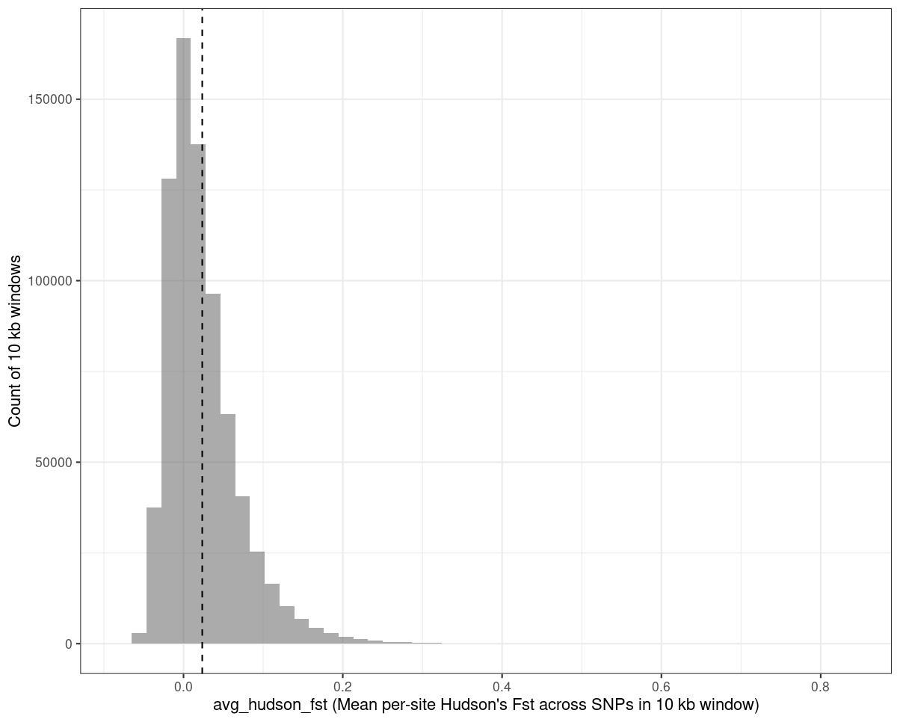

<br>

```r
# facet by chromosome (using mean_pairwise_dxy as x-intercept for reference)
ggplot(fst_location_filt_snpfilt, aes(x = avg_hudson_fst)) +
  geom_histogram(bins = 50, alpha = 0.5, position = "identity") +
  geom_vline(xintercept = mean_pairwise_fst, linetype = "dashed") +
  facet_grid(~ chromosome) +
  labs(
    x = "avg_hudson_fst (Mean per-site Hudson's Fst across SNPs in 10 kb window)",
    y = "Count of 10 kb windows"
  ) +
  theme_bw() +
  theme(axis.text.x = element_text(angle = 45, hjust = 1))
```
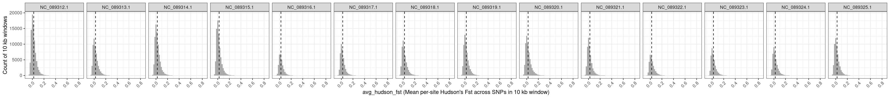

<br>

```r
# calculate mean pairwise fst for each location across all comparisons
mean_pairwise_fst_by_location <- tibble(
  pop = new_order,
  mean_pairwise_fst = map_dbl(new_order, function(loc) {
    fst_sum_location %>% 
      filter(str_detect(comparison, loc)) %>% 
      pull(w_mean) %>% 
      mean(na.rm = TRUE)
  }
  )
)

mean_pairwise_fst_by_location %>% arrange(desc(mean_pairwise_fst))
```
```
   pop   mean_pairwise_fst
 1 OFU3             0.0418
 2 VATI             0.0284
 3 FTEL             0.0265
 4 FASA             0.0233
 5 MALO             0.0224
 6 AOAA             0.0201
 7 ALOF             0.0198
 8 OFU6             0.0180
 9 LEON             0.0179
10 FALU             0.0173
```
So the difference between Ofu and Tutuila is really driven by the differentiation of OFU3 location. OFU6 is not very divergent from other sites (mean Fst actually less than the overall mean pairwise Fst across all comparisons), but it is important to note that OFU6 has the lowest sample size of any location.

<br>

```r
# plot "average" per-window fst across genome
# calculate weighted mean fst (across location comparisons) for each window
fst_window_sum_location <- fst_location_filt_snpfilt %>% 
  group_by(chromosome, window_pos_1) %>%
  summarise(
    mean_fst = mean(avg_hudson_fst, na.rm = TRUE),
    var_fst  = var(avg_hudson_fst, na.rm = TRUE),
    max_fst  = max(avg_hudson_fst, na.rm = TRUE),
    n_pairs  = n(),
    .groups = "drop"
  )

# plot mean
ggplot(fst_window_sum_location, aes(x = window_pos_1, y = mean_fst)) +
  geom_point(alpha = 0.3, size = 0.5) +
  geom_smooth(span = 0.1, color = "red", linewidth = 0.5) +
  facet_wrap(~ chromosome, scales = "free_x") +
  labs(
    x = "Genomic position",
    y = "Mean Fst across location pairs"
  ) +
  theme_bw() +
  theme(axis.text.x = element_text(angle = 45, hjust = 1))

```
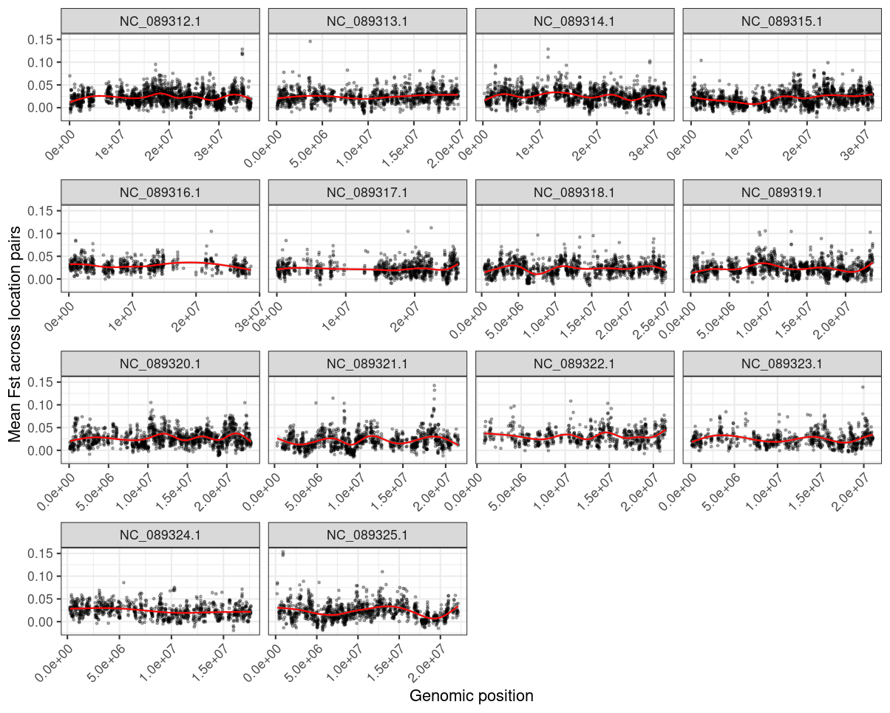

<br>

```r
# plot variance
ggplot(fst_window_sum_location, aes(x = window_pos_1, y = var_fst)) +
  geom_point(alpha = 0.3, size = 0.5) +
  geom_smooth(span = 0.1, color = "red", linewidth = 0.5) +
  facet_wrap(~ chromosome, scales = "free_x") +
  labs(
    x = "Genomic position",
    y = "Variance in Fst across location pairs"
  ) +
  theme_bw() +
  theme(axis.text.x = element_text(angle = 45, hjust = 1))
```
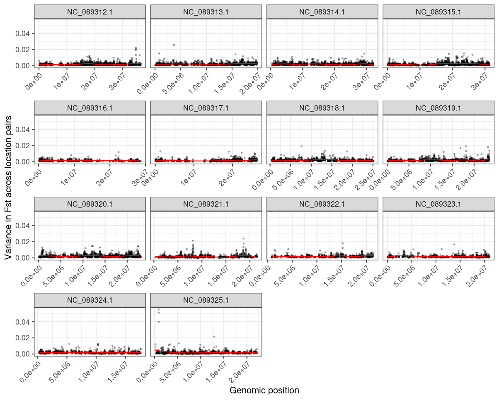

<br>

```r
# plot max fst
ggplot(fst_window_sum_location, aes(x = window_pos_1, y = max_fst)) +
  geom_point(alpha = 0.3, size = 0.5) +
  geom_smooth(span = 0.1, color = "red", linewidth = 0.5) +
  facet_wrap(~ chromosome, scales = "free_x") +
  labs(
    x = "Genomic position",
    y = "Max Fst across location pairs"
  ) +
  theme_bw() +
  theme(axis.text.x = element_text(angle = 45, hjust = 1))
```
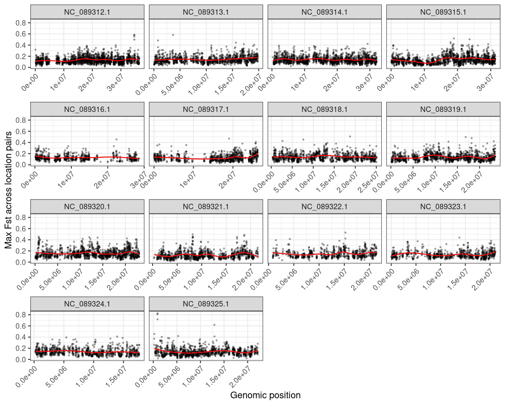

<br>

```r
# plot all three as tracks
# transform into one long format
fst_window_sum_long <- fst_window_sum_location %>%
  select(chromosome, window_pos_1, mean_fst, var_fst, max_fst) %>%
  pivot_longer(
    cols = c(mean_fst, var_fst, max_fst),
    names_to = "metric",
    values_to = "value"
  ) %>% 
  mutate(metric = as.factor(metric))

# reorder so mean_fst is on top
fst_window_sum_long$metric <- factor(
  fst_window_sum_long$metric,
  levels = c("mean_fst", "var_fst", "max_fst")
)

# plot tracks
ggplot(fst_window_sum_long, aes(x = window_pos_1, y = value)) +
  geom_point(alpha = 0.3, size = 0.4) +
  geom_smooth(span = 0.1, color = "red", linewidth = 0.4) +
  facet_grid(metric ~ chromosome, scales = "free", switch = "y") +
  labs(
    x = "Genomic position",
    y = NULL
  ) +
  theme_bw() +
  theme(
    axis.text.x = element_text(angle = 45, hjust = 1),
    strip.placement = "outside",
    strip.background = element_blank()
  )
```
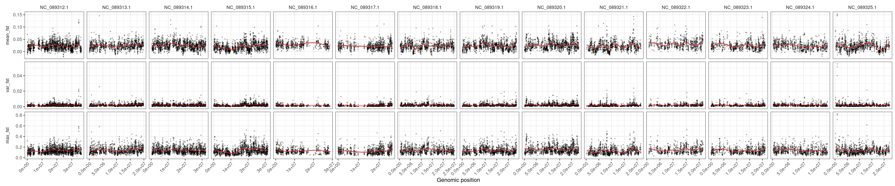


#### Now let's zoom in on the OFU3 vs. OFU6 comparison specifically 
```r
ofu_comp <- fst_location_filt_snpfilt %>% 
  filter(str_detect(comparison, "OFU\\d_OFU\\d"))


# plot Fst per window across the genome for the OFU3/OFU6 comparison
ggplot(ofu_comp, aes(x = window_pos_1, y = avg_hudson_fst)) +
  geom_point(alpha = 0.3, size = 0.5) +
  geom_smooth(span = 0.1, color = "red", linewidth = 0.5) +
  facet_wrap(~ chromosome, scales = "free_x") +
  labs(
    x = "Genomic position",
    y = "Average Hudson Fst"
  ) +
  theme_bw() +
  theme(axis.text.x = element_text(angle = 45, hjust = 1))
```
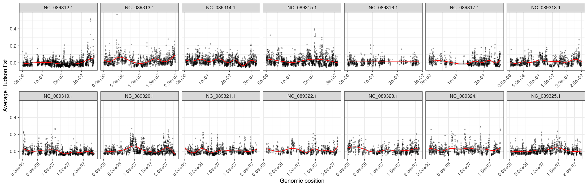
Some notable peaks among otherwise low baseline divergence.

<br>

```r
# summarize genome-wide weighted Fst for this comparison
ofu_fst_summary <- ofu_comp %>%
  summarise(
    w_mean = weighted.mean(avg_hudson_fst, no_snps, na.rm = TRUE),
    median = median(avg_hudson_fst, na.rm = TRUE),
    q95 = quantile(avg_hudson_fst, 0.95, na.rm = TRUE),
    q99 = quantile(avg_hudson_fst, 0.99, na.rm = TRUE),
    max = max(avg_hudson_fst, na.rm = TRUE),
    n_windows = n()
  )

ofu_fst_summary
```
```
  w_mean  median   q95   q99   max n_windows
  0.0144 0.00395 0.103 0.169 0.566     16566
```

<br>

```r
# identify outliers based on 99th percentile or 99.9th percentile
ofu_fst_outliers_q99 <- ofu_comp %>%
  mutate(
    fst_q99 = quantile(avg_hudson_fst, 0.99, na.rm = TRUE),
    window_id = paste(chromosome, window_pos_1, window_pos_2, sep = "_") # make unique window identifier
  ) %>%
  filter(avg_hudson_fst >= fst_q99) %>%
  arrange(desc(avg_hudson_fst))

ofu_fst_outliers_q999 <- ofu_comp %>%
  mutate(
    fst_q999 = quantile(avg_hudson_fst, 0.999, na.rm = TRUE),
    window_id = paste(chromosome, window_pos_1, window_pos_2, sep = "_") # madke unique window identifier
  ) %>%
  filter(avg_hudson_fst >= fst_q999) %>%
  arrange(desc(avg_hudson_fst))
```

```r
str(ofu_fst_outliers_q99)
```
```
tibble [166 × 11] (S3: tbl_df/tbl/data.frame)
 $ source_file   : chr [1:166] "./location//NC_089313.1_Pverrucosa.location_fst.txt" "./location//NC_089312.1_Pverrucosa.location_fst.txt" "./location//NC_089312.1_Pverrucosa.location_fst.txt" "./location//NC_089312.1_Pverrucosa.location_fst.txt" ...
 $ pop1          : Factor w/ 9 levels "ALOF","AOAA",..: 8 8 8 8 8 8 8 8 8 8 ...
 $ pop2          : Factor w/ 9 levels "AOAA","FALU",..: 8 8 8 8 8 8 8 8 8 8 ...
 $ chromosome    : Factor w/ 27 levels "NC_089312.1",..: 2 1 1 1 4 4 4 1 4 4 ...
 $ window_pos_1  : num [1:166] 3680001 34690001 34680001 34700001 21220001 ...
 $ window_pos_2  : num [1:166] 3690000 34700000 34690000 34710000 21230000 ...
 $ avg_hudson_fst: num [1:166] 0.566 0.521 0.506 0.486 0.404 ...
 $ no_snps       : num [1:166] 32 67 70 47 30 59 118 93 65 117 ...
 $ comparison    : Factor w/ 45 levels "ALOF_AOAA","ALOF_FALU",..: 43 43 43 43 43 43 43 43 43 43 ...
 $ fst_q99       : Named num [1:166] 0.169 0.169 0.169 0.169 0.169 ...
  ..- attr(*, "names")= chr [1:166] "99%" "99%" "99%" "99%" ...
 $ window_id     : chr [1:166] "NC_089313.1_3680001_3690000" "NC_089312.1_34690001_34700000" "NC_089312.1_34680001_34690000" "NC_089312.1_34700001_34710000" ...
```

<br>

```r
str(ofu_fst_outliers_q999)
```
```
tibble [17 × 11] (S3: tbl_df/tbl/data.frame)
 $ source_file   : chr [1:17] "./location//NC_089313.1_Pverrucosa.location_fst.txt" "./location//NC_089312.1_Pverrucosa.location_fst.txt" "./location//NC_089312.1_Pverrucosa.location_fst.txt" "./location//NC_089312.1_Pverrucosa.location_fst.txt" ...
 $ pop1          : Factor w/ 9 levels "ALOF","AOAA",..: 8 8 8 8 8 8 8 8 8 8 ...
 $ pop2          : Factor w/ 9 levels "AOAA","FALU",..: 8 8 8 8 8 8 8 8 8 8 ...
 $ chromosome    : Factor w/ 27 levels "NC_089312.1",..: 2 1 1 1 4 4 4 1 4 4 ...
 $ window_pos_1  : num [1:17] 3680001 34690001 34680001 34700001 21220001 ...
 $ window_pos_2  : num [1:17] 3690000 34700000 34690000 34710000 21230000 ...
 $ avg_hudson_fst: num [1:17] 0.566 0.521 0.506 0.486 0.404 ...
 $ no_snps       : num [1:17] 32 67 70 47 30 59 118 93 65 117 ...
 $ comparison    : Factor w/ 45 levels "ALOF_AOAA","ALOF_FALU",..: 43 43 43 43 43 43 43 43 43 43 ...
 $ fst_q999      : Named num [1:17] 0.271 0.271 0.271 0.271 0.271 ...
  ..- attr(*, "names")= chr [1:17] "99.9%" "99.9%" "99.9%" "99.9%" ...
 $ window_id     : chr [1:17] "NC_089313.1_3680001_3690000" "NC_089312.1_34690001_34700000" "NC_089312.1_34680001_34690000" "NC_089312.1_34700001_34710000" ...
```
The q99 and q999 "outliers" consist of 166 and 17 windows, respectively.

<br>

```r
# plot these cutoffs on the genome-wide Fst plot
q99 <- quantile(ofu_comp$avg_hudson_fst, 0.99, na.rm = TRUE)
q999 <- quantile(ofu_comp$avg_hudson_fst, 0.999, na.rm = TRUE)
```
```
> q99
              99% 
0.168517564203822 
> q999
            99.9% 
0.270558441438258 
```
Fst 99th and 99.9th percentile cutoffs are 0.169 and 0.271, respectively.

<br>

```r
# plot Fst per window across the genome for the OFU3/OFU6 comparison
ggplot(ofu_comp, aes(x = window_pos_1, y = avg_hudson_fst)) +
  geom_point(alpha = 0.3, size = 0.5) +
  geom_smooth(span = 0.1, color = "red", linewidth = 0.5) +
  geom_hline(yintercept = q99, color = "darkblue", linetype = "dashed", linewidth = 0.5) +
  geom_hline(yintercept = q999, color = "lightblue", linetype = "dashed", linewidth = 0.5) +
  facet_wrap(~ chromosome, scales = "free_x") +
  labs(
    x = "Genomic position",
    y = "Average Hudson Fst"
  ) +
  theme_bw() +
  theme(axis.text.x = element_text(angle = 45, hjust = 1))
```
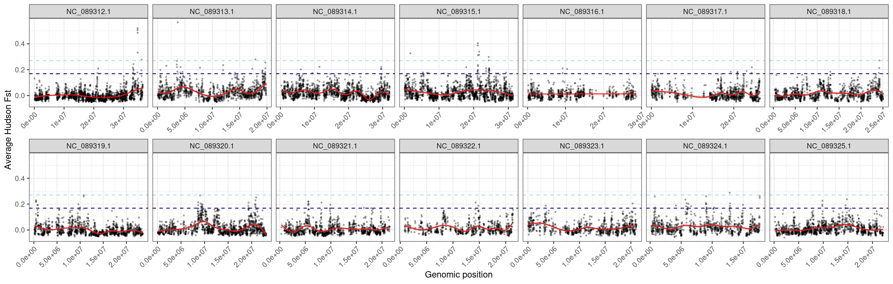

<br>

```r
# check if outliers are robust to SNP count
ggplot(ofu_comp, aes(x = no_snps, y = avg_hudson_fst)) +
  geom_point(alpha = 0.3, size = 0.6) +
  geom_smooth(method = "lm", se = TRUE) +
  geom_hline(yintercept = q99, color = "darkblue", linetype = "dashed", linewidth = 0.5) +
  geom_hline(yintercept = q999, color = "lightblue", linetype = "dashed", linewidth = 0.5) +
  labs(
    x = "Number of SNPs per window",
    y = "Hudson Fst"
  ) +
  theme_bw()
  ```
  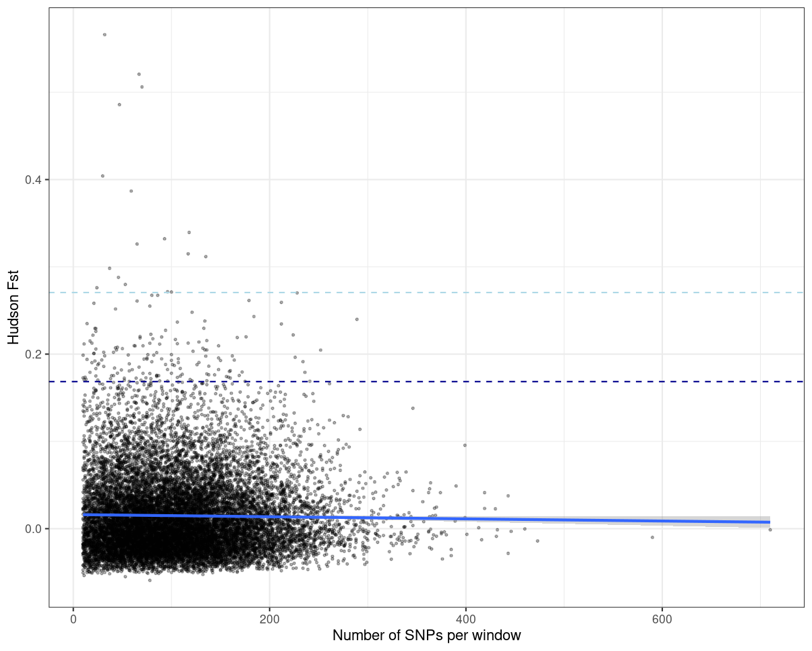
The windows with the highest Fst tend to have fewer SNPs, but most still seem to have a reasonable amount (10-300).

<br>

```r
# Combine metrics for outlier windows into one dataframe to plot metrics against each other
# first subset out relevant Ofu data into individual dataframes
ofu3_pi <- pi_location_filt %>% 
  mutate(
    window_id = paste(chromosome, window_pos_1, window_pos_2, sep = "_")
    ) %>% 
  filter(pop == "OFU3")

ofu6_pi <- pi_location_filt %>% 
  mutate(
    window_id = paste(chromosome, window_pos_1, window_pos_2, sep = "_")
  ) %>% 
  filter(pop == "OFU6")


ofu36_dxy <- dxy_location_filt %>% 
  mutate(
    window_id = paste(chromosome, window_pos_1, window_pos_2, sep = "_")
  ) %>% 
  filter(str_detect(comparison, "OFU\\d_OFU\\d"))


ofu3_tajimad <- tajimad_location_filt %>% 
  mutate(
    window_id = paste(chromosome, window_pos_1, window_pos_2, sep = "_")
  ) %>% 
  filter(pop == "OFU3")

ofu6_tajimad <- tajimad_location_filt %>% 
  mutate(
    window_id = paste(chromosome, window_pos_1, window_pos_2, sep = "_")
  ) %>% 
  filter(pop == "OFU6")
  ```

  <br>

```r
# then combine with fst outlier dataframe
q99_outlier_all_metrics <- ofu_fst_outliers_q99 %>% 
  select(pop1, pop2, chromosome, window_pos_1, window_pos_2, window_id, comparison, no_snps, avg_hudson_fst) %>% 
  left_join(ofu3_pi %>% 
              select(window_id, avg_pi, no_sites) %>% 
              rename(avg_pi_OFU3 = avg_pi, 
                     no_sites_pi_OFU3 = no_sites),
            by = "window_id") %>% 
  left_join(ofu6_pi %>% 
              select(window_id, avg_pi, no_sites) %>% 
              rename(avg_pi_OFU6 = avg_pi, 
                     no_sites_pi_OFU6 = no_sites),
            by = "window_id") %>% 
  left_join(ofu36_dxy %>% 
              select(window_id, avg_dxy, no_sites) %>% 
              rename(no_sites_dxy = no_sites),
            by = "window_id") %>% 
  left_join(ofu3_tajimad %>% 
              select(window_id, tajima_d, no_sites) %>% 
              rename(tajima_d_OFU3 = tajima_d, 
                     no_sites_tajimad_OFU3 = no_sites),
            by = "window_id") %>% 
  left_join(ofu6_tajimad %>% 
              select(window_id, tajima_d, no_sites) %>% 
              rename(tajima_d_OFU6 = tajima_d, 
                     no_sites_tajimad_OFU6 = no_sites),
            by = "window_id") %>% 
  mutate(delta_pi = avg_pi_OFU3 - avg_pi_OFU6) %>% 
  mutate(delta_td = tajima_d_OFU3 - tajima_d_OFU6)
  ```

  <br>

  ```r
  # repeat for all windows as reference set
ofu36_all_metrics <- ofu_comp %>%
  mutate(
    window_id = paste(chromosome, window_pos_1, window_pos_2, sep = "_") # make unique window identifier
  ) %>%
  arrange(desc(avg_hudson_fst))%>% 
  select(pop1, pop2, chromosome, window_pos_1, window_pos_2, window_id, comparison, no_snps, avg_hudson_fst) %>% 
  left_join(ofu3_pi %>% 
              select(window_id, avg_pi, no_sites) %>% 
              rename(avg_pi_OFU3 = avg_pi, 
                     no_sites_pi_OFU3 = no_sites),
            by = "window_id") %>% 
  left_join(ofu6_pi %>% 
              select(window_id, avg_pi, no_sites) %>% 
              rename(avg_pi_OFU6 = avg_pi, 
                     no_sites_pi_OFU6 = no_sites),
            by = "window_id") %>% 
  left_join(ofu36_dxy %>% 
              select(window_id, avg_dxy, no_sites) %>% 
              rename(no_sites_dxy = no_sites),
            by = "window_id") %>% 
  left_join(ofu3_tajimad %>% 
              select(window_id, tajima_d, no_sites) %>% 
              rename(tajima_d_OFU3 = tajima_d, 
                     no_sites_tajimad_OFU3 = no_sites),
            by = "window_id") %>% 
  left_join(ofu6_tajimad %>% 
              select(window_id, tajima_d, no_sites) %>% 
              rename(tajima_d_OFU6 = tajima_d, 
                     no_sites_tajimad_OFU6 = no_sites),
            by = "window_id") %>% 
  mutate(delta_pi = avg_pi_OFU3 - avg_pi_OFU6) %>% 
  mutate(delta_td = tajima_d_OFU3 - tajima_d_OFU6)
  ```

  <br>

  ```r
# plot metrics for q99 set over full window set

# fst vs no_snps
p0_q99 <- ggplot() +
  geom_point(data = ofu36_all_metrics, aes(x = no_snps, y = avg_hudson_fst), alpha = 0.5) +
  geom_point(data = q99_outlier_all_metrics, aes(x = no_snps, y = avg_hudson_fst), color = "red") +
  theme_bw()

# fst vs OFU3 pi
p1_q99 <- ggplot() +
  geom_point(data = ofu36_all_metrics, aes(x = avg_pi_OFU3, y = avg_hudson_fst), alpha = 0.5) +
  geom_point(data = q99_outlier_all_metrics, aes(x = avg_pi_OFU3, y = avg_hudson_fst), color = "red") +
  theme_bw()

# fst vs OFU6 pi
p2_q99 <- ggplot() +
  geom_point(data = ofu36_all_metrics, aes(x = avg_pi_OFU6, y = avg_hudson_fst), alpha = 0.5) +
  geom_point(data = q99_outlier_all_metrics, aes(x = avg_pi_OFU6, y = avg_hudson_fst), color = "red") +
  theme_bw()

# fst vs delta_pi
p3_q99 <- ggplot() +
  geom_vline(xintercept = 0, linetype = "dashed") +
  geom_point(data = ofu36_all_metrics, aes(x = delta_pi, y = avg_hudson_fst), alpha = 0.5) +
  geom_point(data = q99_outlier_all_metrics, aes(x = delta_pi, y = avg_hudson_fst), color = "red") +
  theme_bw()

# fst vs OFU3 tajimad
p4_q99 <- ggplot() +
  geom_vline(xintercept = 0, linetype = "dashed") +
  geom_point(data = ofu36_all_metrics, aes(x = tajima_d_OFU3, y = avg_hudson_fst), alpha = 0.5) +
  geom_point(data = q99_outlier_all_metrics, aes(x = tajima_d_OFU3, y = avg_hudson_fst), color = "red") +
  theme_bw()

# fst vs OFU6 tajimad
p5_q99 <- ggplot() +
  geom_vline(xintercept = 0, linetype = "dashed") +
  geom_point(data = ofu36_all_metrics, aes(x = tajima_d_OFU6, y = avg_hudson_fst), alpha = 0.5) +
  geom_point(data = q99_outlier_all_metrics, aes(x = tajima_d_OFU6, y = avg_hudson_fst), color = "red") +
  theme_bw()

# fst vs delta_tajimad
p6_q99 <- ggplot() +
  geom_vline(xintercept = 0, linetype = "dashed") +
  geom_point(data = ofu36_all_metrics, aes(x = delta_td, y = avg_hudson_fst), alpha = 0.5) +
  geom_point(data = q99_outlier_all_metrics, aes(x = delta_td, y = avg_hudson_fst), color = "red") +
  theme_bw()

# fst vs dxy
p7_q99 <- ggplot() +
  geom_point(data = ofu36_all_metrics, aes(x = avg_dxy, y = avg_hudson_fst), alpha = 0.5) +
  geom_point(data = q99_outlier_all_metrics, aes(x = avg_dxy, y = avg_hudson_fst), color = "red") +
  theme_bw()
```

<br>

```r
plot_grid(p0_q99, p1_q99, p2_q99, p3_q99, nrow = 2)
```
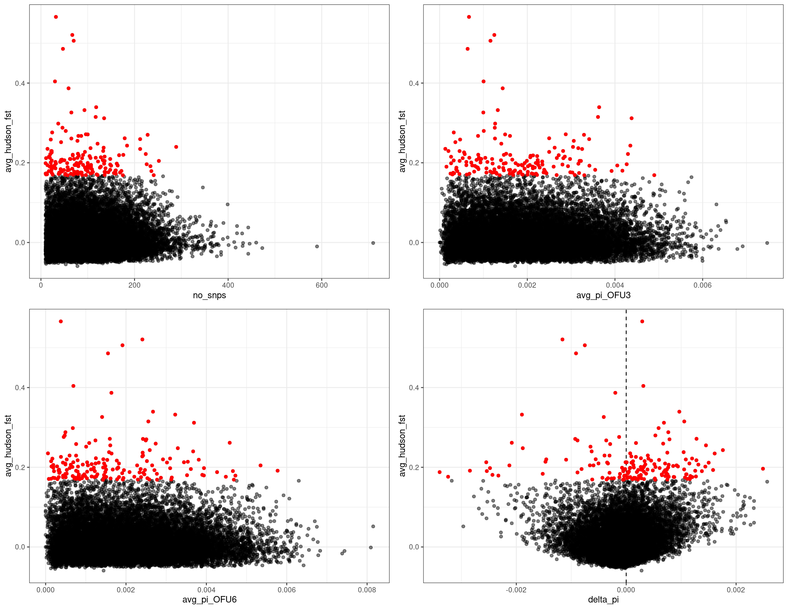

Interpretation:
- <u>Fst vs. no_snps</u> - highest Fst windows have lower SNP counts, but overall outliers are pretty evenly spread across SNP count range.
- <u>Fst vs. pi_OFU3</u> - mixed bag; some outliers have reduced nucleotide diversity, but no general trend towards low pi that you would expect if there was a strong selective sweep driving Fst outliers. Outlier windows have mostly low-moderate pi, and none fall among the highest-pi windows.
- <u>Fst vs. pi_OFU6</u> - similar to pi for OFU3; mixed bag.
- <u>Fst vs. delta_pi</u> - outlier windows are both positive and negative, with maybe slightly more positive (OFU3 pi > OF6 pi), so elevated Fst is not being driven by reductions in diversity in one site or another. If high-FST windows were mainly being driven by OFU3-specific selective sweeps, we would expect most of them to have lower pi in OFU3 than OFU6 (delta_pi < 0).


<br>

```r
plot_grid(p7_q99, p4_q99, p5_q99, p6_q99, nrow = 2)
```
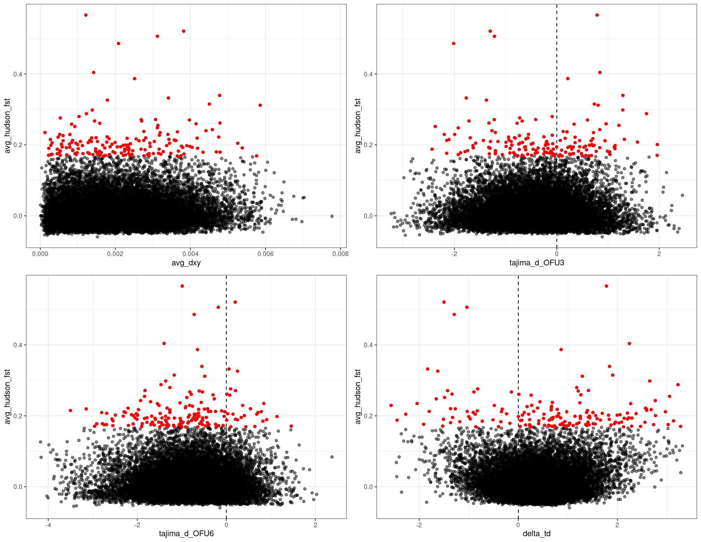

Interpretation:
- <u>Fst vs. dxy</u> - highest Fst windows are mostly at low to moderate Dxy, not concentrated at the extreme highest Dxy values. If there were deep absolute divergence between the two sites in these windows (e.g., from prolonged isolation, restricted gene flow), we'd expect to see outlier windows with high Fst and high Dxy. We don't see that here.
- <u>Fst vs. tajima_d_OFU3</u> - highest Fst windows skewed slightly negative as in the full dataset, but there are both positive and negative values. If elevated Fst were being driven by a selective sweep/directional selection in OFU3, we'd expect strongly negative tajima's D values for the outlier windows. Again, we have a mixed bag here.
- <u>Fst vs. tajima_d_OFU6</u> - full dataset and outliers both skewed even more negative compared to the OFU3 distribution, indicating more interesting demographic or selection dynamics at this location, but the low sample size for OFU6 necessitates some caution. Shouldn't read too much into it.
- <u>Fst vs. delta_td</u> - full dataset and outliers both skewed positive (Tajima's D greater in OFU3 than OFU6). Together with the positive-skewed delta_pi, this would actually be more indicative of directional selection in OFU6 than OFU3, but again, the lower sample size of OFU6 (n=7) compared to OFU3 (n=17) suggests caution in reading too much into this.


<br>

```r
# Repeat for q999 set
q999_outlier_all_metrics <- ofu_fst_outliers_q999 %>% 
  select(pop1, pop2, chromosome, window_pos_1, window_pos_2, window_id, comparison, no_snps, avg_hudson_fst) %>% 
  left_join(ofu3_pi %>% 
              select(window_id, avg_pi, no_sites) %>% 
              rename(avg_pi_OFU3 = avg_pi, 
                     no_sites_pi_OFU3 = no_sites),
            by = "window_id") %>% 
  left_join(ofu6_pi %>% 
              select(window_id, avg_pi, no_sites) %>% 
              rename(avg_pi_OFU6 = avg_pi, 
                     no_sites_pi_OFU6 = no_sites),
            by = "window_id") %>% 
  left_join(ofu36_dxy %>% 
              select(window_id, avg_dxy, no_sites) %>% 
              rename(no_sites_dxy = no_sites),
            by = "window_id") %>% 
  left_join(ofu3_tajimad %>% 
              select(window_id, tajima_d, no_sites) %>% 
              rename(tajima_d_OFU3 = tajima_d, 
                     no_sites_tajimad_OFU3 = no_sites),
            by = "window_id") %>% 
  left_join(ofu6_tajimad %>% 
              select(window_id, tajima_d, no_sites) %>% 
              rename(tajima_d_OFU6 = tajima_d, 
                     no_sites_tajimad_OFU6 = no_sites),
            by = "window_id") %>% 
  mutate(delta_pi = avg_pi_OFU3 - avg_pi_OFU6) %>% 
  mutate(delta_td = tajima_d_OFU3 - tajima_d_OFU6)
```

<br>

```r
# plot metrics for q999 set over full window set

# fst vs no_snps
p0_q999 <- ggplot() +
  geom_point(data = ofu36_all_metrics, aes(x = no_snps, y = avg_hudson_fst), alpha = 0.5) +
  geom_point(data = q999_outlier_all_metrics, aes(x = no_snps, y = avg_hudson_fst), color = "red") +
  theme_bw()

# fst vs OFU3 pi
p1_q999 <- ggplot() +
  geom_point(data = ofu36_all_metrics, aes(x = avg_pi_OFU3, y = avg_hudson_fst), alpha = 0.5) +
  geom_point(data = q999_outlier_all_metrics, aes(x = avg_pi_OFU3, y = avg_hudson_fst), color = "red") +
  theme_bw()

# fst vs OFU6 pi
p2_q999 <- ggplot() +
  geom_point(data = ofu36_all_metrics, aes(x = avg_pi_OFU6, y = avg_hudson_fst), alpha = 0.5) +
  geom_point(data = q999_outlier_all_metrics, aes(x = avg_pi_OFU6, y = avg_hudson_fst), color = "red") +
  theme_bw()

# fst vs delta_pi
p3_q999 <- ggplot() +
  geom_vline(xintercept = 0, linetype = "dashed") +
  geom_point(data = ofu36_all_metrics, aes(x = delta_pi, y = avg_hudson_fst), alpha = 0.5) +
  geom_point(data = q999_outlier_all_metrics, aes(x = delta_pi, y = avg_hudson_fst), color = "red") +
  theme_bw()

# fst vs OFU3 tajimad
p4_q999 <- ggplot() +
  geom_vline(xintercept = 0, linetype = "dashed") +
  geom_point(data = ofu36_all_metrics, aes(x = tajima_d_OFU3, y = avg_hudson_fst), alpha = 0.5) +
  geom_point(data = q999_outlier_all_metrics, aes(x = tajima_d_OFU3, y = avg_hudson_fst), color = "red") +
  theme_bw()

# fst vs OFU6 tajimad
p5_q999 <- ggplot() +
  geom_vline(xintercept = 0, linetype = "dashed") +
  geom_point(data = ofu36_all_metrics, aes(x = tajima_d_OFU6, y = avg_hudson_fst), alpha = 0.5) +
  geom_point(data = q999_outlier_all_metrics, aes(x = tajima_d_OFU6, y = avg_hudson_fst), color = "red") +
  theme_bw()

# fst vs delta_tajimad
p6_q999 <- ggplot() +
  geom_vline(xintercept = 0, linetype = "dashed") +
  geom_point(data = ofu36_all_metrics, aes(x = delta_td, y = avg_hudson_fst), alpha = 0.5) +
  geom_point(data = q999_outlier_all_metrics, aes(x = delta_td, y = avg_hudson_fst), color = "red") +
  theme_bw()

# fst vs dxy
p7_q999 <- ggplot() +
  geom_point(data = ofu36_all_metrics, aes(x = avg_dxy, y = avg_hudson_fst), alpha = 0.5) +
  geom_point(data = q999_outlier_all_metrics, aes(x = avg_dxy, y = avg_hudson_fst), color = "red") +
  theme_bw()
```

<br>

```r
plot_grid(p0_q999, p1_q999, p2_q999, p3_q999, nrow = 2)
```
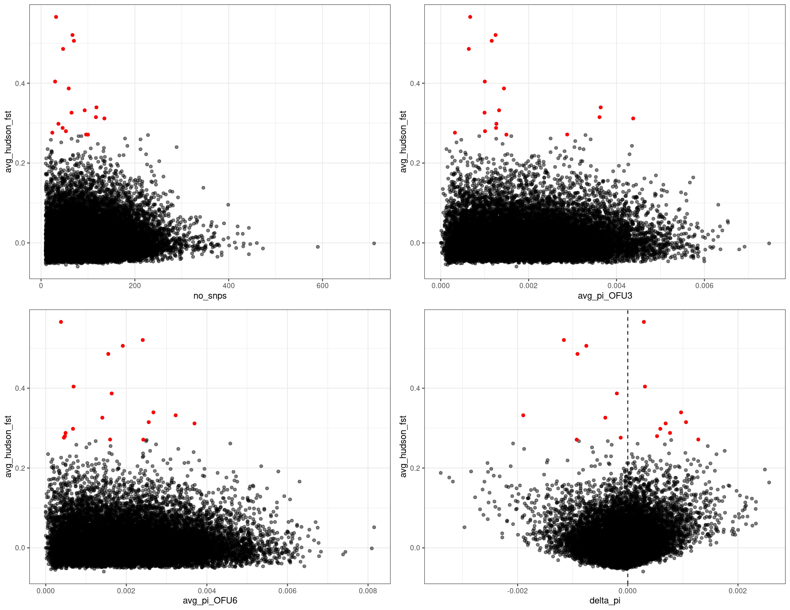
Interpretation:
- <u>Fst vs. no_snps</u> - The q999 set is enriched for lower-SNP windows relative to q99, so the most extreme tail may be more sensitive to stochasticity; however, not all q999 windows are low-SNP.
- <u>Fst vs. pi_OFU3</u> - Similar trend as with SNP number - remaining outlier windows at q999 are predominantly lower pi windows (<0.002). Only 4 outlier windows have moderate pi (>0.002). This greater skew toward low pi is consistent with signatures of selection in these windows, but could also be a result of other factors like low SNP count.
- <u>Fst vs. pi_OFU6</u> - similar to pi for OFU3, but less skewed toward low pi.
- <u>Fst vs. delta_pi</u> - outlier windows are still both positive and negative, and pretty evenly split. It is interesting to note, however, that 3 of the 4 greatest outlier windows have lower pi in OFU3 than OFU6. If these high-FST windows were being driven by OFU3-specific selective sweeps, this is what we would expect (delta_pi < 0).

<br>

```r
plot_grid(p7_q999, p4_q999, p5_q999, p6_q999, nrow = 2)
```
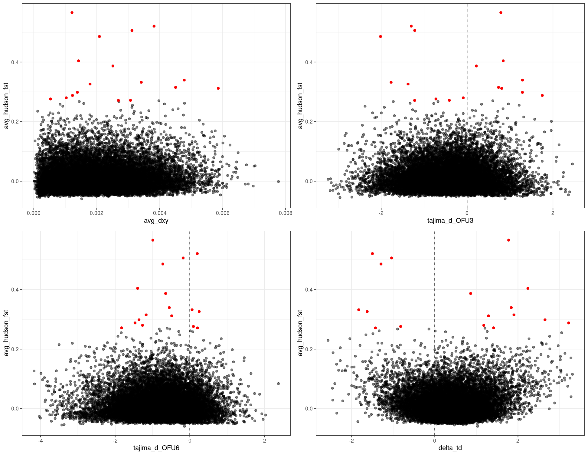
Interpretation:
- <u>Fst vs. dxy</u> - Not much change from q99 outlier set. The highest Fst windows are still fairly evenly spread at low to moderate Dxy, not concentrated at the extreme highest Dxy values.
- <u>Fst vs. tajima_d_OFU3</u> - Outliers pretty evenly split between positive and negative Tajima's D. But interesting to note that 3 of the 4 highest Fst windows have fairly negative Tajima's D (-1 to -2). Again, if elevated Fst in these 3 windows were being driven by a selective sweep/directional selection in OFU3, this is what we'd expect.
- <u>Fst vs. tajima_d_OFU6</u> - full dataset and outliers both still skewed more negative compared to the OFU3 distribution. The 3 Fst outlier windows mentioned above with fairly negative D in OFU3 are fairly close to 0 in OFU6 (-1 to +1).
- <u>Fst vs. delta_td</u> - Fst outlier windows are no longer skewed positive. 7 are negative and 10 positive. The 3 outlier windows mentioned above are all fairly negative (delta_D < -1), again consistent with OFU3-driven selection.

**Synthesis**: The q999 outlier set remains heterogeneous overall and does not show elevated Dxy, so it does not support a genome-wide pattern of deep divergence or a uniform OFU3-selection signature. However, **3 of the top 4 FST windows stand out as stronger OFU3-specific candidate regions** because they combine very high FST with lower OFU3 π, more negative OFU3 Tajima’s D, and non-elevated Dxy.


