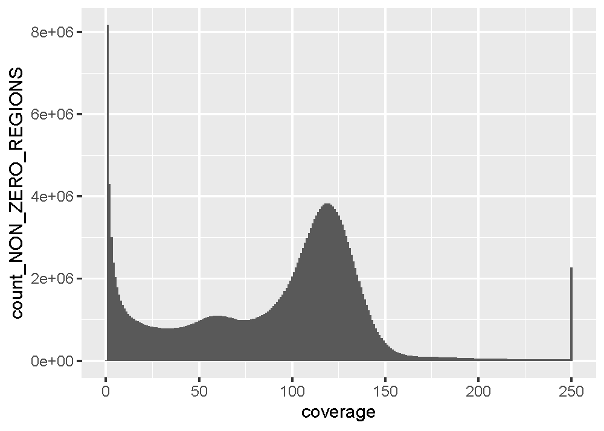

Processing of 2024 P. verrucosa WGS data from American Samoa using GATK4 tools and best practices
================
Jason Toy
2024-08-08

## 0. A note on GATK syntax

GATK4 and Picard (both created and maintained by the Broad Institute)
are installed as java packages (GATK4 now comes with Picard included),
but can now be invoked without the java -jar command. Instead they are
invoked with the simple “gatk” command and any java arguments can
immediately follow the command, placed in quotation marks. The general
syntax looks like this:

``` bash
gatk [--java-options "jvm args like -Xmx4G go here"] ToolName [GATK args go here]
```

 

An example command:

``` bash
gatk --java-options "-Xmx100G" HaplotypeCaller -R reference.fasta -I input.bam -O output.vcf
```

Note that this is different from traditional Picard syntax which instead
uses the `Input=input.bam` syntax.  

## 1. Start with raw mapped SAMs from Bowtie2

Do **not** sort output SAMs with samtools! (see Step 2)  

Run ValidateSamFile before continuing to the next step:

``` bash
crun.gatk gatk ValidateSamFile \
  -I input.bam \
  -MODE SUMMARY
```

 

Array script for validation:

``` bash
#!/bin/bash
#SBATCH --job-name validate_bams_array_2024-08-09
#SBATCH --output=%A_%a_%x.out
#SBATCH --error=%A_%a_%x.err
#SBATCH --mail-type=ALL
#SBATCH --mail-user=jtoy@odu.edu
#SBATCH --partition=main
#SBATCH --array=1-16%16
#SBATCH --ntasks=1
#SBATCH --mem=100G
#SBATCH --time 5-00:00:00
#SBATCH --cpus-per-task=20


## Load modules
module load container_env gatk

BASEDIR=/cm/shared/courses/dbarshis/barshislab/jtoy
BAMLIST=$BASEDIR/pver_gwas_pilot/sample_lists/reheadered_bams_list.txt
GATK='crun.gatk gatk'


## Loop over each sample
# for SAMPLEBAM in `cat $BAMLIST`; do

SAMPLEBAM=$(sed -n "${SLURM_ARRAY_TASK_ID},1p" $BAMLIST)
echo Slurm array task ID is: $SLURM_ARRAY_TASK_ID
echo Sample bam is $SAMPLEBAM


## Run validation of BAM file
$GATK --java-options "-Xmx100G" ValidateSamFile \
  -I $BASEDIR'/pver_gwas_pilot/bam/'$SAMPLEBAM \
  -O $BASEDIR'/pver_gwas_pilot/bam/'${SAMPLEBAM%.*}'.val' \
  -M VERBOSE

echo 'done-zo woot!'
```

 

To obtain more detailed information about specific warnings and errors,
rerun the command with the MODE option set to “VERBOSE”. See
documentation for ValidateSamFile
[here](https://gatk.broadinstitute.org/hc/en-us/articles/360036351112-ValidateSamFile-Picard).

It is a recommended best practice to run ValidateSamFile on alignment
files after every step of processes, so that errors can be identified
sooner rather than later.  

## 2. Sort (by query) and convert to BAM using SortSam (Picard/GATK4)

Picard’s MarkDuplicates can more exhaustively look for duplicates if the
file is sorted by read-name (query-sorted). Query-sorted BAM/SAM files
are sorted based upon their read names and ordered lexiographically.
Coordinate-sorted BAM/SAM files are sorted by their aligned sequence
name (chromosome/linkage group/scaffold) and position. Picard can mark
and remove duplicates in either coordinate-sorted or query-sorted
BAM/SAM files, however, if the alignments are query-sorted it can test
secondary alignments for duplicates and mark unmapped mates of reads
identified as duplicates
([source](https://hbctraining.github.io/variant_analysis/lessons/04_alignment_file_processing.html)).
From Picard’s [MarkDuplicates
documentation](https://gatk.broadinstitute.org/hc/en-us/articles/360037052812-MarkDuplicates-Picard):

“The program can take either coordinate-sorted or query-sorted inputs,
however the behavior is slightly different. When the input is
coordinate-sorted, unmapped mates of mapped records and
supplementary/secondary alignments are not marked as duplicates.
However, when the input is query-sorted (actually query-grouped), then
unmapped mates and secondary/supplementary reads are not excluded from
the duplication test and can be marked as duplicate reads.”

From experience, it seems like running MarkDuplicates on
coordinate-sorted BAMs (done with Samtools sort) can results in
“ERROR:MATE_NOT_FOUND” errors when running ValidateSamFile to check file
formatting and integrity. Based on the above information, it seems
likely that unmapped mates of mapped duplicates that are not filtered
out are the cause. Because of this, it makes sense to first query-sort
our SAM file and convert it to a BAM file with SamSort if the data will
eventually be run through GATK.  

``` bash
crun.gatk gatk SortSam \
  --INPUT $SAM_FILE \
  --OUTPUT $QUERY_SORTED_BAM_FILE \
  --SORT_ORDER queryname
```

 

Array script for query-sorting:

``` bash
#!/bin/bash
#SBATCH --job-name query_sort_array_2024-08-09
#SBATCH --output=%A_%a_%x.out
#SBATCH --error=%A_%a_%x.err
#SBATCH --mail-type=ALL
#SBATCH --mail-user=jtoy@odu.edu
#SBATCH --partition=main
#SBATCH --array=1-16%16
#SBATCH --ntasks=1
#SBATCH --mem=100G
#SBATCH --time 5-00:00:00
#SBATCH --cpus-per-task=20


## Load modules
module load container_env gatk

BASEDIR=/cm/shared/courses/dbarshis/barshislab/jtoy
BAMLIST=$BASEDIR/pver_gwas_pilot/sample_lists/reheadered_bams_list.txt
GATK='crun.gatk gatk'


## Loop over each sample
# for SAMPLEBAM in `cat $BAMLIST`; do

SAMPLEBAM=$(sed -n "${SLURM_ARRAY_TASK_ID},1p" $BAMLIST)
echo Slurm array task ID is: $SLURM_ARRAY_TASK_ID
echo Sample bam is $SAMPLEBAM


## Run SortSam to sort by query name
$GATK --java-options "-Xmx100G" SortSam \
  --INPUT $BASEDIR'/pver_gwas_pilot/bam/'$SAMPLEBAM \
  --OUTPUT $BASEDIR'/pver_gwas_pilot/bam/'${SAMPLEBAM%.*}'_qsorted.bam' \
  --SORT_ORDER queryname

echo 'done-zo woot!'
```

### Validate BAMS before moving to next step:

Array script for validations:

``` bash
#!/bin/bash
#SBATCH --job-name validate_bams_array_2024-08-09
#SBATCH --output=%A_%a_%x.out
#SBATCH --error=%A_%a_%x.err
#SBATCH --mail-type=ALL
#SBATCH --mail-user=jtoy@odu.edu
#SBATCH --partition=main
#SBATCH --array=1-16%16
#SBATCH --ntasks=1
#SBATCH --mem=100G
#SBATCH --time 5-00:00:00
#SBATCH --cpus-per-task=20


## Load modules
module load container_env gatk

BASEDIR=/cm/shared/courses/dbarshis/barshislab/jtoy
BAMLIST=$BASEDIR/pver_gwas_pilot/sample_lists/reheadered_qsorted_bams_list.txt
GATK='crun.gatk gatk'


## Loop over each sample
# for SAMPLEBAM in `cat $BAMLIST`; do

SAMPLEBAM=$(sed -n "${SLURM_ARRAY_TASK_ID},1p" $BAMLIST)
echo Slurm array task ID is: $SLURM_ARRAY_TASK_ID
echo Sample bam is $SAMPLEBAM


## Run validation of BAM file
$GATK --java-options "-Xmx100G" ValidateSamFile \
  -I $BASEDIR'/pver_gwas_pilot/bam/'$SAMPLEBAM \
  -O $BASEDIR'/pver_gwas_pilot/bam/'${SAMPLEBAM%.*}'.val' \
  -M VERBOSE

echo 'done-zo woot!'
```

 

## 3. Mark and remove duplicates using MarkDuplicates

``` bash
crun.gatk gatk MarkDuplicates \
  --INPUT $QUERY_SORTED_BAM_FILE \
  --OUTPUT $DEDUPED_BAM_FILE \
  --METRICS_FILE $METRICS_FILE \
  --REMOVE_DUPLICATES true
```

 

Array script for marking and removing duplicates

``` bash
#!/bin/bash
#SBATCH --job-name mark_remove_duplicates_array_2024-08-10
#SBATCH --output=%A_%a_%x.out
#SBATCH --error=%A_%a_%x.err
#SBATCH --mail-type=ALL
#SBATCH --mail-user=jtoy@odu.edu
#SBATCH --partition=main
#SBATCH --array=1-16%16
#SBATCH --ntasks=1
#SBATCH --mem=100G
#SBATCH --time 5-00:00:00
#SBATCH --cpus-per-task=20


## Load modules
module load container_env gatk

BASEDIR=/cm/shared/courses/dbarshis/barshislab/jtoy
BAMLIST=$BASEDIR/pver_gwas_pilot/sample_lists/reheadered_qsorted_bams_list.txt
GATK='crun.gatk gatk'


## Loop over each sample
# for SAMPLEBAM in `cat $BAMLIST`; do

SAMPLEBAM=$(sed -n "${SLURM_ARRAY_TASK_ID},1p" $BAMLIST)
echo Slurm array task ID is: $SLURM_ARRAY_TASK_ID
echo Sample bam is $SAMPLEBAM


## Mark and remove duplicates
$GATK --java-options "-Xmx100G" MarkDuplicates \
  -I $BASEDIR'/pver_gwas_pilot/bam/'$SAMPLEBAM \
  -O $BASEDIR'/pver_gwas_pilot/bam/dedup_bams2/'${SAMPLEBAM%.*}'_dedup.bam' \
  --METRICS_FILE $BASEDIR'/pver_gwas_pilot/bam/dedup_bams2/'${SAMPLEBAM%.*}'_dupstat.txt' \
  --REMOVE_DUPLICATES true

echo 'done-zo woot!'
```

 

### Validate BAMS before moving to next step:

Array script for validations:

``` bash
#!/bin/bash
#SBATCH --job-name validate_dedup_bams_array_2024-08-10
#SBATCH --output=%A_%a_%x.out
#SBATCH --error=%A_%a_%x.err
#SBATCH --mail-type=ALL
#SBATCH --mail-user=jtoy@odu.edu
#SBATCH --partition=main
#SBATCH --array=1-16%16
#SBATCH --ntasks=1
#SBATCH --mem=100G
#SBATCH --time 5-00:00:00
#SBATCH --cpus-per-task=20


## Load modules
module load container_env gatk

BASEDIR=/cm/shared/courses/dbarshis/barshislab/jtoy
BAMLIST=$BASEDIR/pver_gwas_pilot/sample_lists/dedup_bams_list.txt
GATK='crun.gatk gatk'


## Loop over each sample
# for SAMPLEBAM in `cat $BAMLIST`; do

SAMPLEBAM=$(sed -n "${SLURM_ARRAY_TASK_ID},1p" $BAMLIST)
echo Slurm array task ID is: $SLURM_ARRAY_TASK_ID
echo Sample bam is $SAMPLEBAM


## Run validation of BAM file
$GATK --java-options "-Xmx100G" ValidateSamFile \
  -I $BASEDIR'/pver_gwas_pilot/bam/dedup_bams2/'$SAMPLEBAM \
  -O $BASEDIR'/pver_gwas_pilot/bam/dedup_bams2/'${SAMPLEBAM%.*}'.val' \
  -M VERBOSE

echo 'done-zo woot!'
```

 

## 4. Coordinate-sort and index deduped BAM files

Downstream analyses will require BAMs to be coordinate-sorted (not
query-sorted) and indexed. Both can be done simultaneously with SortSam:

``` bash
crun.gatk gatk SortSam \
  --INPUT $DEDUPED_BAM_FILE \
  --OUTPUT $COORDINATE_SORTED_BAM_FILE \
  --SORT_ORDER coordinate \
  --CREATE_INDEX true
```

 

Array script for coordinate-sorting:

``` bash
#!/bin/bash
#SBATCH --job-name coordinate_sort_array_2024-08-12
#SBATCH --output=%A_%a_%x.out
#SBATCH --error=%A_%a_%x.err
#SBATCH --mail-type=ALL
#SBATCH --mail-user=jtoy@odu.edu
#SBATCH --partition=main
#SBATCH --array=1-16%16
#SBATCH --ntasks=1
#SBATCH --mem=100G
#SBATCH --time 5-00:00:00
#SBATCH --cpus-per-task=20


## Load modules
module load container_env gatk

BASEDIR=/cm/shared/courses/dbarshis/barshislab/jtoy
BAMLIST=$BASEDIR/pver_gwas_pilot/sample_lists/dedup_bams_list.txt
GATK='crun.gatk gatk'


## Loop over each sample
# for SAMPLEBAM in `cat $BAMLIST`; do

SAMPLEBAM=$(sed -n "${SLURM_ARRAY_TASK_ID},1p" $BAMLIST)
echo Slurm array task ID is: $SLURM_ARRAY_TASK_ID
echo Sample bam is $SAMPLEBAM


## Run SortSam to sort by coordinate
$GATK --java-options "-Xmx100G" SortSam \
  --INPUT $BASEDIR'/pver_gwas_pilot/bam/dedup_bams2/'$SAMPLEBAM \
  --OUTPUT $BASEDIR'/pver_gwas_pilot/bam/dedup_bams2/'${SAMPLEBAM%.*}'_coordsorted.bam' \
  --SORT_ORDER coordinate
  --CREATE_INDEX true

echo 'done-zo woot!'
```

 

### Count alignments remaining post-dedup

``` bash
#!/bin/bash
#SBATCH --job-name count_postdedup_reads_array_2024-08-14
#SBATCH --output=%A_%a_%x.out
#SBATCH --error=%A_%a_%x.err
#SBATCH --mail-type=ALL
#SBATCH --mail-user=jtoy@odu.edu
#SBATCH --partition=main
#SBATCH --array=1-16%16
#SBATCH --ntasks=1
#SBATCH --mem=100G
#SBATCH --time 5-00:00:00
#SBATCH --cpus-per-task=20


## Load modules
module load container_env samtools

BASEDIR=/cm/shared/courses/dbarshis/barshislab/jtoy
BAMLIST=$BASEDIR/pver_gwas_pilot/sample_lists/dedup_bams_coordsorted_list.txt

## Change working directory
cd $BASEDIR/pver_gwas_pilot/bam/dedup_bams2

## Loop over each sample
# for SAMPLEBAM in `cat $BAMLIST`; do

SAMPLEBAM=$(sed -n "${SLURM_ARRAY_TASK_ID},1p" $BAMLIST)
echo Slurm array task ID is: $SLURM_ARRAY_TASK_ID
echo Sample bam is $SAMPLEBAM


COUNT=`crun.samtools samtools view $SAMPLEBAM | wc -l`

echo -e "$SAMPLEBAM\t$COUNT" >> postdedup_read_counts.txt


echo "done-zo woot!"
```

 

## 5. Calculate depth/coverage statistics with CollectWgsMetrics:

``` bash
crun.gatk gatk CollectWgsMetrics \
    --INPUT $COORDINATE_SORTED_BAM_FILE \
    --OUTPUT $METRICS_OUTPUT_FILE \
    --REFERENCE_SEQUENCE $REFERENCE
```

 

Array script for CollectWgsMetrics:

``` bash
#!/bin/bash
#SBATCH --job-name CollectWgsMetrics_array_2024-08-12
#SBATCH --output=%A_%a_%x.out
#SBATCH --error=%A_%a_%x.err
#SBATCH --mail-type=ALL
#SBATCH --mail-user=jtoy@odu.edu
#SBATCH --partition=main
#SBATCH --array=1-16%16
#SBATCH --ntasks=1
#SBATCH --mem=100G
#SBATCH --time 5-00:00:00
#SBATCH --cpus-per-task=20


## Load modules
module load container_env gatk

BASEDIR=/cm/shared/courses/dbarshis/barshislab/jtoy
BAMLIST=$BASEDIR/pver_gwas_pilot/sample_lists/dedup_bams_coordsorted_list.txt
GATK='crun.gatk gatk'
REFERENCE=$BASEDIR/references/genomes/combined_pver_cd_hologenome.fa


## Loop over each sample
# for SAMPLEBAM in `cat $BAMLIST`; do

SAMPLEBAM=$(sed -n "${SLURM_ARRAY_TASK_ID},1p" $BAMLIST)
echo Slurm array task ID is: $SLURM_ARRAY_TASK_ID
echo Sample bam is $SAMPLEBAM


## Run CollectWgsMetrics
$GATK --java-options "-Xmx100G" CollectWgsMetrics \
  --INPUT $BASEDIR'/pver_gwas_pilot/bam/dedup_bams2/'$SAMPLEBAM \
  --OUTPUT $BASEDIR'/pver_gwas_pilot/bam/dedup_bams2/'${SAMPLEBAM%.*}'_metrics.txt' \
  --REFERENCE_SEQUENCE $REFERENCE

echo 'done-zo woot!'
```

 

## 6. Extract only host (Pver) alignments

Filter bams using `select_host_alignments_array.slurm` script:

``` bash
#!/bin/bash

#SBATCH --job-name select_host_alignments_array_2024-08-12
#SBATCH --output=%A_%a_%x.out
#SBATCH --error=%A_%a_%x.err
#SBATCH --mail-type=ALL
#SBATCH --mail-user=jtoy@odu.edu
#SBATCH --partition=main
#SBATCH --array=1-16%16
#SBATCH --ntasks=1
#SBATCH --mem=100G
#SBATCH --time 5-00:00:00
#SBATCH --cpus-per-task=20


## Define some variables
BASEDIR=/cm/shared/courses/dbarshis/barshislab/jtoy
OUTDIR=$BASEDIR/pver_gwas_pilot/bam/dedup_bams2/pver_bams
SAMPLELIST=$BASEDIR/pver_gwas_pilot/sample_lists/dedup_bams_coordsorted_list.txt # Path to a bam list
REFBASENAME=PverCD
SCAFLIST=$BASEDIR/references/genomes/Pver_scaffold_names_singleline.txt


# Make new directory
mkdir $OUTDIR

## Keep a record of the Job ID
echo $SLURM_JOB_ID

## Select the SAMPLE from the SAMPLELIST
SAMPLEFILE=`head $SAMPLELIST -n $SLURM_ARRAY_TASK_ID | tail -n 1`

## Keep record of sample file
echo $SAMPLEFILE

## Define the output file name
HOSTOUT=${SAMPLEFILE%combined_pver_cd_hologenome_sorted_reheadered_qsorted_dedup_coordsorted.bam}$REFBASENAME'_dedup_primary_minq20_mlen20_pver.bam'

# Load module
module load container_env samtools


#index sorted BAM
crun.samtools samtools index -@ 20 $BASEDIR/pver_gwas_pilot/bam/dedup_bams2/$SAMPLEFILE

# Extract mappings that are primary alignments only (no unmapped or secondary/supplementary reads), with mapping score > 20, mapping length (CIGAR) > 20, and only on host scaffolds
crun.samtools samtools view -b -F 260 -q 20 -m 20 -@ 28 $BASEDIR/pver_gwas_pilot/bam/dedup_bams2/$SAMPLEFILE `cat $SCAFLIST`> $OUTDIR/$HOSTOUT
```

 

### Count host reads

``` bash
#!/bin/bash
#SBATCH --job-name count_host_reads_array_2024-08-14
#SBATCH --output=%A_%a_%x.out
#SBATCH --error=%A_%a_%x.err
#SBATCH --mail-type=ALL
#SBATCH --mail-user=jtoy@odu.edu
#SBATCH --partition=main
#SBATCH --array=1-16%16
#SBATCH --ntasks=1
#SBATCH --mem=100G
#SBATCH --time 5-00:00:00
#SBATCH --cpus-per-task=20


## Load modules
module load container_env samtools

BASEDIR=/cm/shared/courses/dbarshis/barshislab/jtoy
BAMLIST=$BASEDIR/pver_gwas_pilot/sample_lists/pver_bams_list.txt

## Change working directory
cd $BASEDIR/pver_gwas_pilot/bam/dedup_bams2/pver_bams

## Loop over each sample
# for SAMPLEBAM in `cat $BAMLIST`; do

SAMPLEBAM=$(sed -n "${SLURM_ARRAY_TASK_ID},1p" $BAMLIST)
echo Slurm array task ID is: $SLURM_ARRAY_TASK_ID
echo Sample bam is $SAMPLEBAM


COUNT=`crun.samtools samtools view $SAMPLEBAM | wc -l`

echo -e "$SAMPLEBAM\t$COUNT" >> pver_read_counts.txt


echo "done-zo woot!"
```

### Calculate percent host reads

```bash
BASEDIR=/cm/shared/courses/dbarshis/barshislab/jtoy

# first sort counts files
sort -k1,1 $BASEDIR/pver_gwas_pilot/bam/dedup_bams2/postdedup_read_counts.txt >  $BASEDIR/pver_gwas_pilot/bam/dedup_bams2/postdedup_read_counts_sorted.txt
sort -k1,1 $BASEDIR/pver_gwas_pilot/bam/dedup_bams2/pver_bams/pver_read_counts.txt > $BASEDIR/pver_gwas_pilot/bam/dedup_bams2/pver_bams/pver_read_counts_sorted.txt

# paste columns together
paste <(cut -f1 "$BASEDIR/pver_gwas_pilot/bam/dedup_bams2/pver_bams/pver_read_counts_sorted.txt") \
      <(cut -f2 "$BASEDIR/pver_gwas_pilot/bam/dedup_bams2/pver_bams/pver_read_counts_sorted.txt") \
      <(cut -f2 "$BASEDIR/pver_gwas_pilot/bam/dedup_bams2/postdedup_read_counts_sorted.txt") \
      > "$BASEDIR/pver_gwas_pilot/bam/dedup_bams2/pver_bams/pver_and_total_read_counts.txt"

# calculate percentages
awk '{print $0, $2/$3}' \
    "$BASEDIR/pver_gwas_pilot/bam/dedup_bams2/pver_bams/pver_and_total_read_counts.txt" \
    > "$BASEDIR/pver_gwas_pilot/bam/dedup_bams2/pver_bams/pver_read_percents.txt"
```

| Sample | Post-processing_total_read_count | Post-processing_Pver_read_count | Percent_Pver_reads |
| --- | --- | --- | --- |
| 2024_VATI_Pver_21_1_227H3WLT4-L008_bt2_PverCDdedup_primary_minq20_mlen20_pver.bam | 193559589 | 391304080 | 0.494653 |
| 2024_VATI_Pver_22_1_227H3WLT4-L008_bt2_PverCDdedup_primary_minq20_mlen20_pver.bam | 186626711 | 382997872 | 0.487279 |
| 2024_VATI_Pver_23_1_227H3WLT4-L008_bt2_PverCDdedup_primary_minq20_mlen20_pver.bam | 167826399 | 342971808 | 0.48933 |
| 2024_VATI_Pver_24_1_227H3WLT4-L008_bt2_PverCDdedup_primary_minq20_mlen20_pver.bam | 154342775 | 320073616 | 0.48221 |
| 2024_VATI_Pver_25_1_227H3WLT4-L008_bt2_PverCDdedup_primary_minq20_mlen20_pver.bam | 130268414 | 271652826 | 0.47954 |
| 2024_VATI_Pver_26_1_227H3WLT4-L008_bt2_PverCDdedup_primary_minq20_mlen20_pver.bam | 122646699 | 253683358 | 0.483464 |
| 2024_VATI_Pver_27_1_227H3WLT4-L008_bt2_PverCDdedup_primary_minq20_mlen20_pver.bam | 126849038 | 261762888 | 0.484595 |
| 2024_VATI_Pver_28_1_227H3WLT4-L008_bt2_PverCDdedup_primary_minq20_mlen20_pver.bam | 134053746 | 276011764 | 0.485681 |
| 2024_VATI_Pver_29_1_227H3WLT4-L008_bt2_PverCDdedup_primary_minq20_mlen20_pver.bam | 155086527 | 325343822 | 0.476685 |
| 2024_VATI_Pver_30_1_227H3WLT4-L008_bt2_PverCDdedup_primary_minq20_mlen20_pver.bam | 110833016 | 231446692 | 0.478871 |
| 2024_VATI_Pver_31_1_227H3WLT4-L008_bt2_PverCDdedup_primary_minq20_mlen20_pver.bam | 143627384 | 299238960 | 0.479976 |
| 2024_VATI_Pver_32_1_227H3WLT4-L008_bt2_PverCDdedup_primary_minq20_mlen20_pver.bam | 170350984 | 351492214 | 0.484651 |
| 2024_VATI_Pver_33_1_227H3WLT4-L008_bt2_PverCDdedup_primary_minq20_mlen20_pver.bam | 81842347 | 168179902 | 0.486636 |
| 2024_VATI_Pver_34_1_227H3WLT4-L008_bt2_PverCDdedup_primary_minq20_mlen20_pver.bam | 152873596 | 315951282 | 0.483852 |
| 2024_VATI_Pver_35_1_227H3WLT4-L008_bt2_PverCDdedup_primary_minq20_mlen20_pver.bam | 77758059 | 160741570 | 0.483746 |
| 2024_VATI_Pver_36_1_227H3WLT4-L008_bt2_PverCDdedup_primary_minq20_mlen20_pver.bam | 79256376 | 165617090 | 0.478552 |


## 7. Calculate depth/coverage statistics for host with CollectWgsMetricsWithNonZeroCoverage:

``` bash
crun.gatk gatk CollectWgsMetricsWithNonZeroCoverage \
    --INPUT $COORDINATE_SORTED_BAM_FILE \
    --OUTPUT $METRICS_OUTPUT_FILE \
    --CHART $CHART_OUTPUT_FILE \
    --REFERENCE_SEQUENCE $REFERENCE
```

 

Array script for CollectWgsMetricsWithNonZeroCoverage:

``` bash
#!/bin/bash
#SBATCH --job-name CollectWgsMetrics_array_pver_only_nonzero_2024-08-12
#SBATCH --output=%A_%a_%x.out
#SBATCH --error=%A_%a_%x.err
#SBATCH --mail-type=ALL
#SBATCH --mail-user=jtoy@odu.edu
#SBATCH --partition=main
#SBATCH --array=1-16%16
#SBATCH --ntasks=1
#SBATCH --mem=100G
#SBATCH --time 5-00:00:00
#SBATCH --cpus-per-task=20


## Load modules
module load container_env gatk

BASEDIR=/cm/shared/courses/dbarshis/barshislab/jtoy
BAMLIST=$BASEDIR/pver_gwas_pilot/sample_lists/pver_bams_list.txt
GATK='crun.gatk gatk'
REFERENCE=$BASEDIR/references/genomes/combined_pver_cd_hologenome.fa


## Loop over each sample
# for SAMPLEBAM in `cat $BAMLIST`; do

SAMPLEBAM=$(sed -n "${SLURM_ARRAY_TASK_ID},1p" $BAMLIST)
echo Slurm array task ID is: $SLURM_ARRAY_TASK_ID
echo Sample bam is $SAMPLEBAM


## Run CollectWgsMetrics
$GATK --java-options "-Xmx100G" CollectWgsMetricsWithNonZeroCoverage \
  --INPUT $BASEDIR'/pver_gwas_pilot/bam/dedup_bams2/pver_bams/'$SAMPLEBAM \
  --OUTPUT $BASEDIR'/pver_gwas_pilot/bam/dedup_bams2/pver_bams/'${SAMPLEBAM%.*}'_metrics_nonzero.txt' \
  --CHART $BASEDIR'/pver_gwas_pilot/bam/dedup_bams2/pver_bams/'${SAMPLEBAM%.*}'_metrics_nonzero_chart.pdf' \
  --REFERENCE_SEQUENCE $REFERENCE

echo 'done-zo woot!'
```

 

### Plot histograms of coverage depth and summarise coverage statistics using R script `summarize_coverage_stats.R`

First extract histogram data from output files and save to new files:

``` bash
for FILE in `ls *nonzero.txt`; do
    tail -n +12 $FILE > ${FILE%.*}_histdata.tsv
done
```


 

Then run R script:

``` r
setwd("/cm/shared/courses/dbarshis/barshislab/jtoy/pver_gwas_pilot/bam/dedup_bams2/pver_bams/")

file_list <- list.files(pattern = "histdata\\.tsv$")

for (FILE in file_list) {
  
  # extract sample name
  sample <- substr(FILE, 1, 34)
  print(sample)
  
  # load data
  histdat <- read_tsv(file = FILE, col_names = TRUE) %>% 
    mutate(coverage_count = coverage * count_NON_ZERO_REGIONS)

  # plot non-zero depth histogram
  cov_plot <- ggplot(histdat) + 
    geom_col(aes(x = coverage, y = count_NON_ZERO_REGIONS))

  ggsave(cov_plot, filename = paste0(sample, "_coverage_hist.pdf"), device = "pdf")
  
  # calculate mean depth
  mean_depth = sum(histdat$coverage_count)/sum(histdat$count_NON_ZERO_REGIONS)

  # calculate median depth  
  expanded_dataset <- rep(histdat$coverage, histdat$count_NON_ZERO_REGIONS)
  median_depth <- median(expanded_dataset)

  # calculate % of genome covered
  pver_genome_size <- 353416094
  coverage <- sum(histdat$count_NON_ZERO_REGIONS)/pver_genome_size

  # write stats to file
  header <- "Sample\tMean_Depth\tMedian_Depth\tProportion_Genome_Covered"
  
  if (!file.exists("coverage_summary.tsv") || file.info("coverage_summary.tsv")$size == 0) {
    # If the file doesn't exist or is empty, write the header and the first line of data
    write(header, file="coverage_summary.tsv")
    write(paste(sample, mean_depth, median_depth, coverage, sep="\t"), file="coverage_summary.tsv", append=TRUE)
  } else {
    # If the file exists and is not empty, append the new line of data
    write(paste(sample, mean_depth, median_depth, coverage, sep="\t"), file="coverage_summary.tsv", append=TRUE)
  }
}
```

 

Example depth histogram:  

VATI_PVER_21


Example summary table:

| Sample                             | Mean_Depth | Median_Depth | Proportion_Genome_Covered |
|:-----------------------------------|-----------:|-------------:|--------------------------:|
| 2024_VATI_Pver_21_1_227H3WLT4-L008 |   94.81713 |          111 |                 0.7364288 |
| 2024_VATI_Pver_22_1_227H3WLT4-L008 |   93.02360 |          108 |                 0.7365599 |
| 2024_VATI_Pver_23_1_227H3WLT4-L008 |   81.77988 |           95 |                 0.7340132 |
| 2024_VATI_Pver_24_1_227H3WLT4-L008 |   76.71155 |           88 |                 0.7305818 |
| 2024_VATI_Pver_25_1_227H3WLT4-L008 |   64.89864 |           74 |                 0.7303289 |
| 2024_VATI_Pver_26_1_227H3WLT4-L008 |   62.38221 |           71 |                 0.7294545 |
| 2024_VATI_Pver_27_1_227H3WLT4-L008 |   64.35863 |           72 |                 0.7274978 |
| 2024_VATI_Pver_28_1_227H3WLT4-L008 |   66.78361 |           76 |                 0.7265293 |
| 2024_VATI_Pver_29_1_227H3WLT4-L008 |   76.69105 |           89 |                 0.7293642 |
| 2024_VATI_Pver_30_1_227H3WLT4-L008 |   55.97674 |           63 |                 0.7250165 |
| 2024_VATI_Pver_31_1_227H3WLT4-L008 |   68.60851 |           79 |                 0.7305352 |
| 2024_VATI_Pver_32_1_227H3WLT4-L008 |   83.56679 |           97 |                 0.7329579 |
| 2024_VATI_Pver_33_1_227H3WLT4-L008 |   43.28716 |           48 |                 0.7184286 |
| 2024_VATI_Pver_34_1_227H3WLT4-L008 |   75.49679 |           87 |                 0.7302426 |
| 2024_VATI_Pver_35_1_227H3WLT4-L008 |   40.70095 |           45 |                 0.7165315 |
| 2024_VATI_Pver_36_1_227H3WLT4-L008 |   41.65848 |           46 |                 0.7173758 |

 

## 8. **OPTIONAL** - Base quality score recalibration (BQSR):  (**SKIP FOR NOW**)

This step is performed per-sample and consists of applying machine
learning to detect and correct for patterns of systematic errors in the
base quality scores, which are confidence scores emitted by the
sequencer for each base. In a nutshell, it is a data pre-processing step
that detects systematic errors made by the sequencing machine when it
estimates the accuracy of each base call.

This step requires a database of known variants to be included as input,
which often does not exist for non-model species. In these cases it is
recommended to bootstrap your own set of variants by doing an initial
round of variant calling and using only the high-confidence variants as
the known set.

From the GATK Documentation:

“Here’s how you would bootstrap a set of known variants:

- First do an initial round of variant calling on your original,
  unrecalibrated data.
- Then take the variants that you have the highest confidence in and use
  that set as the database of known variants by feeding it as a VCF file
  to the BaseRecalibrator.
- Finally, do a real round of variant calling with the recalibrated
  data. These steps could be repeated several times until convergence.”


## 9. Call variants per sample with HaplotypeCaller (in GVCF mode)

``` bash
crun.gatk gatk HaplotypeCaller \
    --INPUT $COORDINATE_SORTED_BAM_FILE \
    --OUTPUT $GVCF_OUTPUT_FILE \
    --REFERENCE_SEQUENCE $REFERENCE
    -ERC GVCF
```

First index the P. verrucosa reference fasta:

    module load samtools

    cd /cm/shared/courses/dbarshis/barshislab/jtoy/references/genomes/pocillopora_verrucosa/ncbi_dataset/data/GCF_036669915.1
    
    crun.samtools samtools faidx GCF_036669915.1_ASM3666991v2_genomic.fna


    module load gatk
    GATK='crun.gatk gatk'
    $GATK --java-options "-Xmx100G" CreateSequenceDictionary --REFERENCE GCF_036669915.1_ASM3666991v2_genomic.fna
         
    


Array script for HaplotypeCaller:

``` bash
#!/bin/bash
#SBATCH --job-name CollectWgsMetrics_array_pver_only_nonzero_2024-08-12
#SBATCH --output=%A_%a_%x.out
#SBATCH --error=%A_%a_%x.err
#SBATCH --mail-type=ALL
#SBATCH --mail-user=jtoy@odu.edu
#SBATCH --partition=main
#SBATCH --array=1-16%16
#SBATCH --ntasks=1
#SBATCH --mem=100G
#SBATCH --time 5-00:00:00
#SBATCH --cpus-per-task=20


## Load modules
module load container_env gatk

BASEDIR=/cm/shared/courses/dbarshis/barshislab/jtoy
BAMLIST=$BASEDIR/pver_gwas_pilot/sample_lists/pver_bams_list.txt
GATK='crun.gatk gatk'
REFERENCE=$BASEDIR/references/genomes/pocillopora_verrucosa/ncbi_dataset/data/GCF_036669915.1/GCF_036669915.1_ASM3666991v2_genomic.fna


## Loop over each sample
# for SAMPLEBAM in `cat $BAMLIST`; do

SAMPLEBAM=$(sed -n "${SLURM_ARRAY_TASK_ID},1p" $BAMLIST)
echo Slurm array task ID is: $SLURM_ARRAY_TASK_ID
echo Sample bam is $SAMPLEBAM


## Run CollectWgsMetrics
$GATK --java-options "-Xmx100G" CollectWgsMetricsWithNonZeroCoverage \
  --INPUT $BASEDIR'/pver_gwas_pilot/bam/dedup_bams2/pver_bams/'$SAMPLEBAM \
  --OUTPUT $BASEDIR'/pver_gwas_pilot/bam/dedup_bams2/pver_bams/'${SAMPLEBAM%.*}'_metrics_nonzero.txt' \
  --CHART $BASEDIR'/pver_gwas_pilot/bam/dedup_bams2/pver_bams/'${SAMPLEBAM%.*}'_metrics_nonzero_chart.pdf' \
  --REFERENCE_SEQUENCE $REFERENCE

echo 'done-zo woot!'
```


## 10. Consolidate per sample GVCFs with GenomicsDBImport


## 11. Joint genotyping with GenotypeGVCFs

